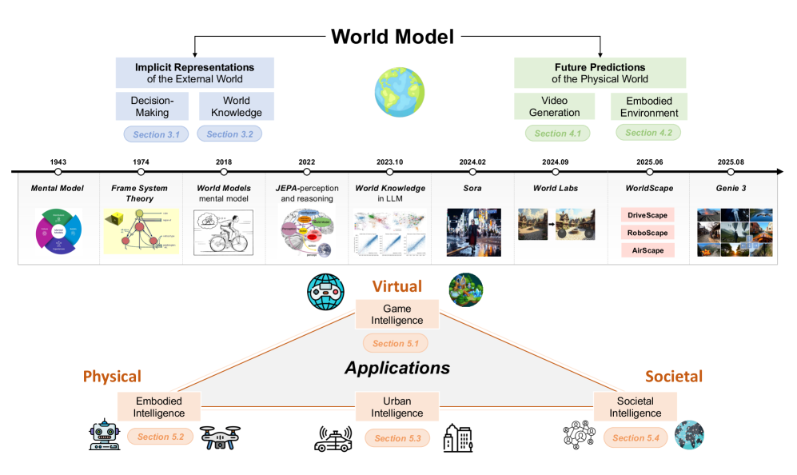
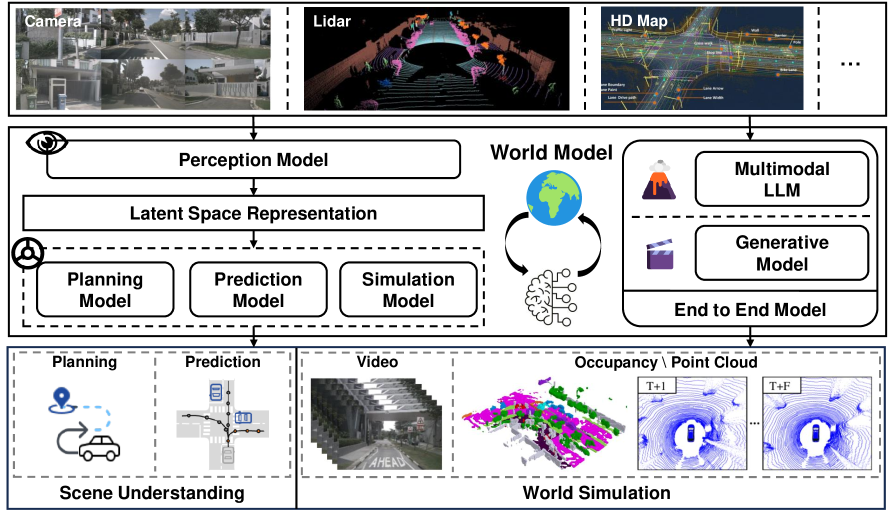
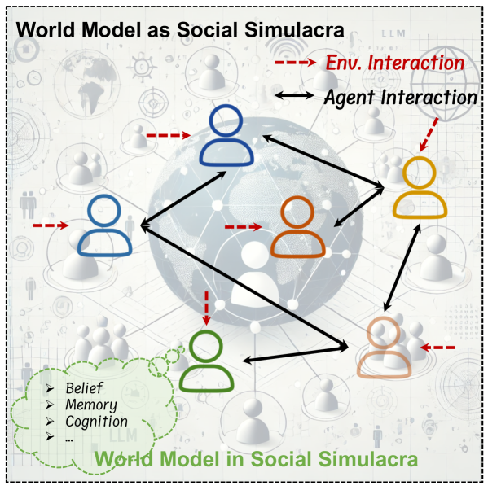

# How AI Learns to Understand the World

_Understanding and prediction — the two paths of world models, drawn as one map_

## Executive Summary

> [!callout]
> Under the single phrase "world model" sit two camps that want very different things. The ACM Computing Surveys review assembled by Yong Li's group at Tsinghua makes that split its title: **Understanding World or Predicting Future?** One path treats the world as something to be _understood_, compressing external reality into an internal representation. The other treats it as something to be _predicted_ and _generated_, painting the next scene in convincing detail. This article folds both into one map.

> They share a word but not a philosophy. LeCun's JEPA and Hafner's Dreamer try to grasp the structure of the world in a latent space without drawing every pixel. OpenAI's Sora and DeepMind's Genie go the other way, rendering the future frame by frame and using that rendering as a simulator in itself. The fork between them has a clear date. In February 2024, Sora and Genie arrived in the same month, and world models spilled out of the lab into public view.

> Following the survey's own axes, this guide walks through the definition, the two paths, the leading models, four applications, and three limits. To go deeper, start with our piece on LeCun's non-generative path, [The Man Who Threw Away Pixels](/blog/yann-lecun-jepa-world-models/en/), or, if this is new to you, the five-level primer in [PebbloPedia: World Model](/pebblopedia/world-model/en/).

### World Models, in Numbers

Every figure below is discussed in the body. Source: Ding et al. (2024) _Understanding World or Predicting Future?_, ACM Computing Surveys (arXiv:2411.14499).

<!-- stat-card -->
**1M → 0** — V-JEPA 2 transfer — Pre-trained on 1M+ hours of internet video, then controls robots zero-shot

<!-- stat-card -->
**11B** — Genie parameters — Generates controllable virtual worlds from unlabeled video alone

<!-- stat-card -->
**0** — Standard benchmarks — No accepted metric yet to prove a model "understood" the world

<!-- stat-card -->
**2018 → 2024** — Concept to mainstream — Ha & Schmidhuber's idea exploded into Sora and Genie in six years

## What Is a World Model — Defining "Understanding the World"

"World model" sounds intuitive, and that intuition is exactly the trap, because the picture each person conjures up is different. One reader thinks of a one-minute clip from Sora; another pictures a self-driving car rehearsing the road in its head before it gets there. The survey meets this confusion head-on and pins the essence to a single line: the core purpose of a world model is "to understand the dynamics of the world and to predict future scenarios."

The idea itself is not new. Back in 1971, psychology had already established the "mental model" — the notion that people build a scaled-down copy of reality in their heads and reason on top of it. We know a cup will shatter before we drop it, and we can guess which way a ball will roll, because we carry a model of how the world works. The researchers who carried this idea seriously into AI were Ha and Schmidhuber in 2018. They learned a compressed spatiotemporal representation of the environment and then trained an agent inside that "dream."

Here a key distinction appears. To "understand" the world and to "predict" the next scene aim at the same goal by different means. Understanding is the work of building an internal representation of how the world operates; prediction is the work of drawing what comes next, either on top of that representation or without one at all. This is why the survey can place a multimodal model like GPT-4 and a video generator like Sora under the same "world model" umbrella while still drawing a firm line between them.

*▲ The "world knowledge" a model learns is layered: common sense, global physics, local physics, and human society | Source: [Ding et al. (2024), ACM CSUR (arXiv:2411.14499), Fig.](https://arxiv.org/abs/2411.14499)*

> [!callout]
> A world model is "an AI's ability to carry the workings of the world inside itself, then reason on top of that or render what comes next." With it, a model can guess the next step in situations it has never seen, and imagine the consequences of an action before actually taking it. That is why the survey places world models at the center of the pursuit of AGI.

## The Two Paths — Representation for Understanding, Generation for Prediction

The survey's title, _Understanding World or Predicting Future?_, is not a rhetorical flourish; it is the classification axis itself. World model research splits broadly into two paths. One compresses the external world into latent variables in order to "understand" it; the other renders the next scene of the physical world in convincing detail in order to "predict and generate." What people usually call "video generation" and "embodied environments" are not separate axes — they are sub-branches of the second path.

### 2.1. The First Path — Implicit Representation of the External World (Understanding)

The first path concentrates on understanding the current state of the world. In the survey's words, it is the route that "builds a model of environmental change to enable more informed decision-making." Rather than reconstructing external reality pixel by pixel, it compresses only what decision-making needs into a latent representation. The Dreamer family of model-based reinforcement learning is the canonical example, and LeCun's JEPA pushes the non-generative line that "predicts features in a latent space without reconstructing pixels." For this camp, to understand the world is simply to hold a good representation of it.

### 2.2. The Second Path — Predicting the Future of the Physical World (Generation, Simulation)

The second path does not stop at representing a static state; it "models dynamic world change in a realistic way." This is the route that uses generative models to simulate the evolution of the world itself. It splits again into two branches. One is the "world model as video generation," which, like Sora, generates video to render the next scene of the physical world. The other is the "world model as embodied environment," which builds the virtual spaces in which robots and agents act and learn. The latter subdivides further into indoor, outdoor, and dynamic environments.

The tension between the two paths is not a mere engineering choice but a clash of philosophies. The Sora and Genie camp holds that "if you can render the world realistically enough, that rendering _is_ knowing the world." The V-JEPA camp counters that "rendering pixels accurately and understanding the world are two different things," and chooses instead to capture the invisible abstraction in a latent space. Two camps that share a word but head toward different destinations — that disagreement makes for the most interesting debate around world models.

*▲ The survey's core axis: implicit representation of the external world (understanding) vs future prediction (generation, simulation), with physical, virtual, and social applications below | Source: [Ding et al. (2024), ACM CSUR (arXiv:2411.14499), Fig.](https://arxiv.org/abs/2411.14499)*

> [!callout]
> In one line: the first path "compresses the world to understand it" (JEPA, Dreamer); the second "renders the world to predict it" (Sora, Genie). Video generation and embodied environments are the two sub-branches of the second path. Once you hold this axis in hand, the flood of model names suddenly snaps into place, and you can see where each one belongs.

## The Model Landscape — Placing the Names on the Map

With the two axes from the previous section in hand, the model landscape becomes legible. The table below places the survey's leading models onto the classification axis. The left half belongs to the first path, which "understands" the world; the right half belongs to the second, which "predicts and generates" the future. The table makes plain just how differently models that share a single word can be aimed.

| Model | Category | One-line description |
| --- | --- | --- |
| World Models (2018) | Understanding · decision-making | Learns a compressed representation of the environment with an RNN and trains the agent inside its "dream." The field's starting point. |
| DreamerV3 | Understanding · model-based RL | Learns policies through latent imagination. Masters many domains with fixed settings and was first to mine a diamond in Minecraft. Published in Nature. |
| JEPA / V-JEPA | Understanding · self-supervised representation | Predicts features in a latent space without reconstructing pixels. LeCun's non-generative "understanding" line. |
| V-JEPA 2 | Understanding + prediction + planning | Self-supervised pre-training on more than a million hours of video, with zero-shot control from only a small amount of robot footage (V-JEPA 2-AC). |
| Sora | Prediction · video generation | A diffusion transformer over spacetime patches that generates a minute of high-resolution video. Cast as a "general-purpose simulator of the physical world." |
| Genie | Prediction · generative game environments | Learns unsupervised from unlabeled internet video to generate action-controllable virtual worlds; an 11-billion-parameter foundation model. |
| GAIA-1 | Prediction · autonomous driving | Tokenizes inputs into discrete tokens, then generates driving scenes through next-token prediction — an autonomous-driving world model. |
| DayDreamer | Prediction · robotics | Learns a world model directly on a physical robot — the Dreamer family applied to real hardware. |
| Cosmos | Prediction · Physical AI | NVIDIA's world foundation model platform for Physical AI. |

One thing to watch as you read the map: models that walk both paths at once, like V-JEPA 2, are becoming more common. They first build a representation for understanding, then predict the future and even plan on top of it. Rather than two roads that diverge forever, the two paths show a tendency to meet again at a single point. That convergence is one of the defining traits of world model research in 2025.

*▲ The world-model research landscape along a timeline — from model-based RL and self-supervised learning to video generation, embodied environments, and applications | Source: [Ding et al. (2024), ACM CSUR (arXiv:2411.14499), Fig.](https://arxiv.org/abs/2411.14499)*

If you want to compare this landscape in more detail, a good companion is [Three World Models for Next-Generation AI](/project/World%20Model/world-model-comparison/en/), which lines up the Hawkins, LeCun, and Schmidhuber approaches across seven axes. For the historical context of representation learning, [The Man Who Threw Away Pixels](/blog/yann-lecun-jepa-world-models/en/) goes deeper still.

## Where It's Used — Driving, Robotics, Video Generation, and Society

World models moved from a research topic to an industry talking point because of their applications. The survey sorts them into four domains. Autonomous driving, robotics, and video generation are the three that come up most often, and the survey adds a fourth axis stamped with the author group's own signature: social simulation.

### 4.1. Generative Game Intelligence — Building Playable Worlds

The most intuitive application is games. A world model generates the playable environment itself, replacing the game engine with a neural network. Genie and its successors, along with GameNGen, which simulates DOOM in real time using only a neural network, are the standout cases. The moment "controllability" is added to the ability to generate video, video stops being mere content and becomes an interactive world.

### 4.2. Autonomous Driving — Urban Intelligence

In autonomous driving, prediction is tied directly to safety. A world model realistically predicts and generates the driving scenes about to unfold, and is used for policy learning, simulation, and safety validation. Wayve's GAIA-1 is the leading case: it tokenizes inputs and then generates the next scene. Its core value is that dangerous scenarios can be replayed countless times in simulation without ever being faced on a real road.

*▲ Autonomous-driving world model: camera perception → latent-space representation → planning, prediction, simulation → occupancy grids and point clouds | Source: [Ding et al. (2024), ACM CSUR (arXiv:2411.14499), Fig.](https://arxiv.org/abs/2411.14499)*

### 4.3. Robotics — Embodied Intelligence

For a robot, a world model is the ability to "imagine the consequences of an action in advance." Before grasping, it pictures whether its hand will slip; before pushing, whether the object will topple — and then it plans. DayDreamer, which learns a world model directly on a physical robot, and V-JEPA 2-AC, which achieves zero-shot control from only a small amount of robot footage, point in this direction. The biggest hurdle is closing the gap between simulation and reality (sim-to-real).

*▲ The world model as an embodied environment — indoor, outdoor, and dynamic virtual spaces where robots and agents act and learn | Source: [Ding et al. (2024), ACM CSUR (arXiv:2411.14499), Fig.](https://arxiv.org/abs/2411.14499)*

### 4.4. Social Simulation — The Fourth Axis

This is where the survey parts ways with other summaries. Yong Li's group at Tsinghua treats not only the physical world but also social dynamics as a target for world models. Drawing on agent-based modeling and Theory of Mind, this line simulates human interactions and social phenomena. The view that the world is not only physics but also the space between people widens the scope of world models by a notch.

*▲ The world model as social simulacra — agents with belief, memory, and cognition interact with their environment and each other to model society | Source: [Ding et al. (2024), ACM CSUR (arXiv:2411.14499), Fig.](https://arxiv.org/abs/2411.14499)*

One more note. Pure video generation models such as Sora and Cosmos belong directly to the second path's "world model as video generation," rather than being tied to a single domain like driving or games. Add controllability and they touch game intelligence; specialize them to driving scenes and they touch autonomous driving. Video generation is closer to a common engine that cuts across applications. Why world models are discussed as the step beyond VLM and VLA is something we cover in more detail in [Eyes, but No World](/project/AgenticAI/world-model-rise/en/).

## What It Can't Do — The Hard Problems the Survey Names

Watch only the flashy demos and it feels as though world models already understand the world. The survey calmly strips that illusion away. The limits it raises in its "open problems and future directions" section are clear, and three of them are structural problems that hold the whole field back.

### 5.1. We Can't Measure What It Did Well — No Benchmarks

The most painful limit is evaluation. There is essentially no standard metric or benchmark for measuring "how well a world model understood the world." A video looking convincing and a model understanding physics are two different things, yet the rulers to tell them apart are missing. An ability that cannot be measured has only a blurry direction for improvement. That is why the survey lists evaluation as the first hard problem.

### 5.2. It Breaks Physics Too Often — Physics Violations and Counterfactuals

Sora-style generative models look realistic, but they cannot consistently honor basic physics such as gravity, collision, or object permanence. A cup passes through a surface; an object vanishes and reappears. More fundamentally, they are weak at the counterfactual simulation that asks "what if?" Positing a condition never seen and rendering its consequence requires genuinely understanding the world, whereas today's models are closer to mimicking the statistics of their training data.

### 5.3. Crossing from Virtual to Real Is Hard — Sim-to-Real and Efficiency

The sim-to-real gap, where a model that worked well in simulation collapses in reality; the limits of generalization to unseen situations; and the enormous compute and data appetite are all tangled together. Building a good world model takes vast amounts of video, and the cost of collecting and curating that data is far from trivial. The survey adds the social dimension and the ethics and safety of generated worlds to the list of future challenges as well.

> [!callout]
> One question runs through all three. How do you prove that a model "understood the world"? There is no ruler (evaluation), it breaks physics (counterfactuals), and it can't cross from virtual to real (generalization). All three ultimately converge on the same issue: what the model learned, and how well that learning matches reality.

## The Pebblous View — A World Model Is, in the End, a Question of Data Lineage

**Editor's note.** This section is not a sales pitch. It is closer to a memo on what caught the eye of a company that works on data quality while reading a world model survey. We do not build models. We diagnose the data that models learn from. From that vantage point, the survey's list of hard problems reads again as a set of questions about data.

Look at the three hard problems through a data lens and the scenery changes. Part of why evaluation is hard is that you cannot trace what was learned. Part of why physics gets broken is that the training video is physically inconsistent or biased. Part of why generalization fails is that the training distribution is misaligned with the real distribution. Much of what looks like a model's limit actually traces back to the provenance and quality of its data.

A world model is hungrier for data than almost any other kind of model. V-JEPA 2 was pre-trained on more than a million hours of video. At that scale, questions like "which videos went in," "is that video physically correct," and "is some situation undersampled" directly shape what the model can do. If a second-path generative model produces a scene that breaks gravity, the first thing to suspect is that such inconsistencies were mixed into the training data.

The dimensions Pebblous uses to define AI-Ready Data — accuracy, completeness, consistency, provenance, and bias — overlap curiously well with the world model's list of hard problems. Provenance is a precondition for evaluation; consistency is a precondition for honoring physics; freedom from bias is a precondition for generalization. The DataClinic we build is a tool for diagnosing training data along these dimensions. Even without building world models ourselves, the work of looking into what a model was fed and raised on sits squarely in our territory.

So instead of assertions we leave questions. Can the physical correctness of a single video be diagnosed automatically? Can undersampled situations be found within a million hours of training footage? Can a metric be built that verifies "the model understood the world" from the data side? These questions remain open for us too. What did grow clearer in reading the survey is that a good share of the problems holding world models back sit in the place where data lives.

## So What Should You Watch Now

World models will stay one of the noisiest words for a while. To keep from getting lost in the noise, it helps to ask two questions of every new model first. One: is this the first path that "understands" the world, or the second path that "predicts and generates" it? Two: what did this model learn, and how was that learning verified? Those two questions alone give you the eye to separate inflated demos from real progress.

If you're a practitioner, it's faster to fix on an application domain and work backward. For autonomous driving, start with GAIA-1-style driving scene generation; for robotics, with zero-shot control like V-JEPA 2-AC; for content, with the generative power of Sora and Genie. Whichever way you go, you hit the same wall in the end: can you collect enough data, and the right data? The survey listing efficiency and data appetite as future challenges is its way of saying this wall is common to everyone.

Three currents are worth watching now: the shift from pixel-level reconstruction to latent-space prediction, the multimodal integration of vision, language, and action, and the move from static simulation to dynamic, interactive environment generation. And, as V-JEPA 2 shows, signs of convergence as the two paths try to meet again at a single point. This survey is the standard ACM CSUR reference that organized the 2024 explosion in real time, and it serves as a starting point for gauging how the map of the next few years gets redrawn.

Thank you for reading to the end. This piece tried to fit an enormous terrain onto a single page, and so it had to leave out a great deal of detail. For readers who want to go deeper, we have gathered four series pieces below. Whichever door you open first, it leads somewhere along the two paths an AI takes to understand the world.

**Pebblous Data Communication Team**  
June 7, 2026

## World Model Series

This field guide is the hub that ties together the world model series on the Pebblous blog into a single map. Each piece digs deeper into one region of this terrain.

<!-- stat-card -->
**[The Man Who Threw Away Pixels](/blog/yann-lecun-jepa-world-models/en/)The first path (understanding). The history of LeCun's JEPA and self-supervised learning, how it solves representation collapse, and zero-shot robotics.**

<!-- stat-card -->
**[Three World Models for Next-Generation AI](/project/World%20Model/world-model-comparison/en/)A comparison of approaches. The Hawkins, LeCun, and Li camps laid out side by side across seven axes.**

<!-- stat-card -->
**[Eyes, but No World — Beyond VLM and VLA](/project/AgenticAI/world-model-rise/en/)Definition and necessity. The three limits of VLM and VLA, and why world models are discussed as the next step.**

<!-- stat-card -->
**[World Model [PebbloPedia]](/pebblopedia/world-model/en/)An introduction. The same concept unpacked across five difficulty levels. If this is new to you, start here.**

## Frequently Asked Questions (FAQ)

Here are the questions readers most often ask about world models — the definition, the difference between the two paths, whether Sora counts, the JEPA-versus-Sora split, applications in driving and robotics, the biggest limits, and the role of training data. Faced with a flood of model names, the first move is to hold a single classification axis in your hand.

## References

### The Survey Itself

- 1.Ding, J., Zhang, Y., Shang, Y., Feng, J., Gao, C., Xu, F., & Li, Y. (2024). "Understanding World or Predicting Future? A Comprehensive Survey of World Models." _ACM Computing Surveys_. arXiv:2411.14499 v4 (2025-12-10), 49pp. [arxiv.org/abs/2411.14499](https://arxiv.org/abs/2411.14499)

### Primary Papers — The Understanding (Implicit Representation) Path

- 2.Ha, D., & Schmidhuber, J. (2018). "World Models." _NeurIPS_. arXiv:1803.10122. [arxiv.org/abs/1803.10122](https://arxiv.org/abs/1803.10122)
- 3.Hafner, D., Pasukonis, J., Ba, J., & Lillicrap, T. (2023). "Mastering Diverse Domains through World Models (DreamerV3)." _Nature_. arXiv:2301.04104. [arxiv.org/abs/2301.04104](https://arxiv.org/abs/2301.04104)
- 4.LeCun, Y. (2022). "A Path Towards Autonomous Machine Intelligence (JEPA)." _OpenReview / Meta AI_. [openreview.net](https://openreview.net/forum?id=BZ5a1r-kVsf)
- 5.Bardes, A., Garrido, Q., Ponce, J., Chen, X., Rabbat, M., LeCun, Y., Assran, M., & Ballas, N. (2024). "Revisiting Feature Prediction for Learning Visual Representations from Video (V-JEPA)." _TMLR_. arXiv:2404.08471. [arxiv.org/abs/2404.08471](https://arxiv.org/abs/2404.08471)
- 6.Assran, M., Bardes, A., Fan, D., Garrido, Q., LeCun, Y., Rabbat, M., & Ballas, N. (2025). "V-JEPA 2: Self-Supervised Video Models Enable Understanding, Prediction and Planning." _arXiv preprint_. arXiv:2506.09985. [arxiv.org/abs/2506.09985](https://arxiv.org/abs/2506.09985)

### Primary Papers — The Prediction (Generation, Simulation) Path

- 7.OpenAI. (2024). "Video generation models as world simulators (Sora)." _OpenAI Technical Report_. [openai.com](https://openai.com/index/video-generation-models-as-world-simulators/)
- 8.Bruce, J., Dennis, M., Edwards, A., Parker-Holder, J., et al. (2024). "Genie: Generative Interactive Environments." _ICML_. arXiv:2402.15391. [arxiv.org/abs/2402.15391](https://arxiv.org/abs/2402.15391)
- 9.Hu, A., Russell, L., Yeo, H., Murez, Z., Kendall, A., Shotton, J., & Corrado, G. (2023). "GAIA-1: A Generative World Model for Autonomous Driving." _arXiv preprint_. arXiv:2309.17080. [arxiv.org/abs/2309.17080](https://arxiv.org/abs/2309.17080)
