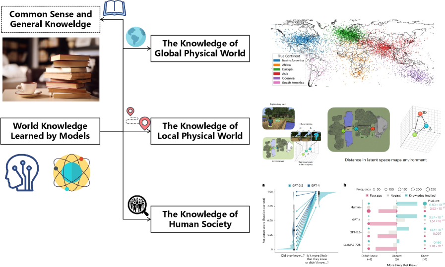
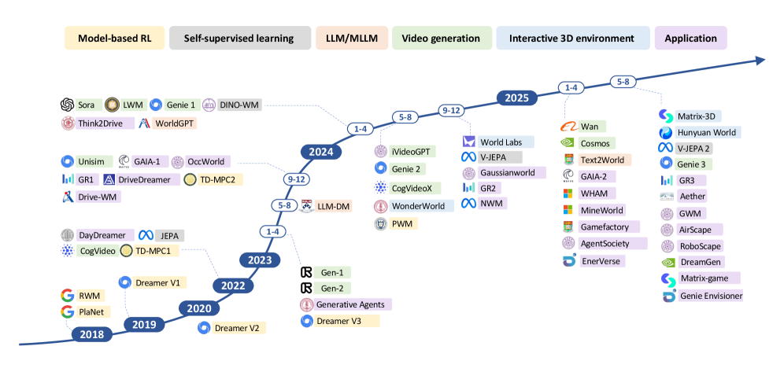
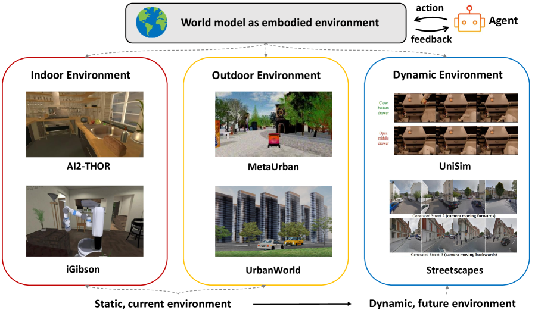

# AI는 어떻게 세계를 이해하는가

_이해와 예측, 월드 모델의 두 갈래 길을 한 장의 지도로_

## Executive Summary

> [!callout]
> "월드 모델"이라는 한 단어 아래 사실은 서로 다른 두 진영이 서 있다. 칭화대 Yong Li 그룹이 정리한 ACM Computing Surveys 서베이는 그 사실을 제목에서부터 못 박는다. **《세계를 이해할 것인가, 미래를 예측할 것인가》**. AI가 세계를 다루는 방식은 외부 현실을 압축한 내부 표상으로 "이해"하는 길과, 다음 장면을 사실적으로 그려내 "예측·생성"하는 길로 갈린다. 이 글은 그 두 갈래를 한 장의 지도로 묶는다.

> 같은 단어를 쓰지만 철학은 다르다. LeCun의 JEPA와 Hafner의 Dreamer는 픽셀을 일일이 그리지 않고 잠재 공간에서 세계의 구조를 붙잡으려 한다. OpenAI의 Sora와 DeepMind의 Genie는 반대로, 한 프레임씩 미래를 그려내 그 자체를 시뮬레이터로 쓴다. 두 노선이 갈라지는 분기점은 분명하다. 2024년 2월, Sora와 Genie가 같은 달에 등장하면서 월드 모델은 연구실 밖으로 터져 나왔다.

> 이 글은 서베이의 분류 축을 따라 정의·두 갈래·대표 모델·네 가지 응용·세 가지 한계를 차례로 짚는다. 더 깊이 들어가려면 LeCun의 비생성 노선을 다룬 [픽셀을 버린 남자의 10억 달러 베팅](/blog/yann-lecun-jepa-world-models/ko/), 처음 접한다면 다섯 난이도로 풀어 쓴 [페블로피디아 월드 모델](/pebblopedia/world-model/ko/)부터 읽어도 좋다.

### 월드 모델, 숫자로 보면

아래 수치는 모두 본문에서 다룬다. 출처: Ding et al. (2024) _Understanding World or Predicting Future?_, ACM Computing Surveys (arXiv:2411.14499).

<!-- stat-card -->
**100만 → 0** — V-JEPA 2의 전이 — 인터넷 영상 100만 시간으로 사전학습 후, 로봇 작업은 제로샷으로 수행

<!-- stat-card -->
**110억** — Genie 파라미터 — 라벨 없는 영상만으로 조작 가능한 가상 세계를 생성

<!-- stat-card -->
**0개** — 표준 평가 지표 — "세계를 이해했다"를 증명할 공인 벤치마크가 아직 없다

<!-- stat-card -->
**2018 → 2024** — 개념에서 대중화까지 — Ha·Schmidhuber의 발상이 6년 만에 Sora·Genie로 폭발

## 월드 모델이란 무엇인가 — "세계를 이해한다"의 정의

월드 모델이라는 말은 직관적이지만, 그 직관이 오히려 함정이다. 사람마다 떠올리는 그림이 다르기 때문이다. 누군가는 Sora가 만든 1분짜리 영상을 떠올리고, 누군가는 자율주행차가 도로를 머릿속으로 미리 그려보는 장면을 떠올린다. 서베이는 이 혼란을 정면으로 다루며 한 문장으로 본질을 정리한다. 월드 모델의 본질적 목적은 "세계의 동역학을 이해하고 미래 시나리오를 예측하는 것"이다.

개념 자체는 새롭지 않다. 심리학은 1971년에 이미 사람이 머릿속에 현실의 축소판을 짓고 그 위에서 추론한다는 "정신 모델(mental model)"을 정립했다. 우리가 컵을 떨어뜨리기 전에 깨질 것을 아는 이유, 공이 굴러가는 방향을 미리 가늠하는 이유는 머릿속에 세계의 작동 방식을 담은 모델이 있기 때문이다. AI에 이 발상을 본격적으로 들여온 것은 2018년 Ha와 Schmidhuber였다. 이들은 환경을 압축한 시공간 표상을 학습한 뒤, 에이전트를 그 "꿈(dream)" 안에서 훈련시켰다.

여기서 핵심 구분이 생긴다. 세계를 "이해"한다는 것과 다음 장면을 "예측"한다는 것은 같은 목표를 향하지만 방법이 다르다. 이해는 세계가 어떻게 돌아가는지에 대한 내부 표상을 세우는 일이고, 예측은 그 표상 위에서 또는 그것 없이도 다음에 무엇이 올지를 그려내는 일이다. 서베이가 GPT-4 같은 멀티모달 모델과 Sora 같은 비디오 생성 모델을 같은 "월드 모델" 우산 아래 두면서도 둘을 명확히 구분하는 이유가 여기에 있다.

*▲ 모델이 학습하는 "세계 지식"은 상식·전역 물리·지역 물리·인간 사회로 층층이 나뉜다 | Source: [Ding et al. (2024), ACM CSUR (arXiv:2411.14499), Fig.](https://arxiv.org/abs/2411.14499)*

> [!callout]
> 월드 모델은 "AI가 세계의 작동 방식을 내부에 담아, 그 위에서 추론하거나 미래를 그려내는 능력"이다. 이 능력이 있으면 모델은 본 적 없는 상황에서도 다음을 가늠할 수 있고, 행동의 결과를 실제로 해보기 전에 상상할 수 있다. 서베이가 이를 AGI 추구의 중심에 두는 까닭이다.

## 두 갈래의 길 — 이해의 표상과 예측의 생성

서베이의 제목 《세계를 이해할 것인가, 미래를 예측할 것인가》는 수사가 아니라 분류축 그 자체다. 월드 모델 연구는 크게 두 갈래로 나뉜다. 하나는 외부 세계를 잠재 변수로 압축해 "이해"하는 길이고, 다른 하나는 물리 세계의 다음 장면을 사실적으로 그려 "예측·생성"하는 길이다. 흔히 말하는 "비디오 생성"과 "구현형 환경"은 별개의 축이 아니라, 두 번째 길의 하위 갈래다.

### 2.1. 첫 번째 길 — 외부 세계의 암묵적 표상(이해)

첫 번째 길은 세계의 현재 상태를 이해하는 데 집중한다. 서베이의 표현으로는 "환경 변화의 모델을 구축해 더 정보에 입각한 의사결정을 가능케 하는" 노선이다. 외부 현실을 픽셀 단위로 복원하는 대신, 의사결정에 필요한 핵심만 잠재 변수 표상으로 압축한다. 모델 기반 강화학습(model-based RL)의 Dreamer 계열이 대표적이고, LeCun의 JEPA는 "픽셀을 재구성하지 않고 잠재 공간에서 특징을 예측한다"는 비생성형 노선을 밀고 나간다. 이 진영에게 세계를 이해한다는 것은 곧 좋은 표상을 갖는다는 뜻이다.

### 2.2. 두 번째 길 — 물리 세계의 미래 예측(생성·시뮬레이션)

두 번째 길은 정적인 상태를 표상하는 데 그치지 않고, "동적인 세계 변화를 사실적으로 모델링"한다. 생성 모델로 세계의 진화 자체를 시뮬레이션하는 노선이다. 이 길은 다시 두 갈래로 나뉜다. 하나는 Sora처럼 비디오를 생성해 물리 세계의 다음 장면을 그려내는 "비디오 생성으로서의 월드 모델"이고, 다른 하나는 로봇·에이전트가 행동하고 학습할 가상 환경을 만드는 "구현형 환경으로서의 월드 모델"이다. 후자는 다시 실내·실외·동적 환경으로 세분된다.

두 길의 긴장은 단순한 기술 선택이 아니라 철학의 대립이다. Sora·Genie 진영은 "세계를 충분히 사실적으로 그려낼 수 있다면 그것이 곧 세계를 아는 것"이라고 본다. V-JEPA 진영은 "픽셀을 정확히 그리는 일과 세계를 이해하는 일은 다르다"며, 보이지 않는 추상을 잠재 공간에서 붙잡는 쪽을 택한다. 같은 단어를 공유하지만 향하는 곳이 다른 두 진영의 대립은, 월드 모델을 둘러싼 가장 흥미로운 논쟁을 만든다.

*▲ 서베이의 핵심 분류축: 외부 세계의 암묵적 표상(이해) vs 미래 예측(생성·시뮬레이션), 그 아래 물리·가상·사회 응용 | Source: [Ding et al. (2024), ACM CSUR (arXiv:2411.14499), Fig.](https://arxiv.org/abs/2411.14499)*

> [!callout]
> 한 문장으로 요약하면 이렇다. 첫 번째 길은 "세계를 압축해 이해한다"(JEPA·Dreamer), 두 번째 길은 "세계를 그려내 예측한다"(Sora·Genie). 비디오 생성과 구현형 환경은 두 번째 길의 두 하위 갈래다. 이 분류축을 손에 쥐면, 쏟아지는 월드 모델 모델 이름들이 어디에 속하는지가 즉시 보인다.

## 대표 모델 지형도 — 이름들을 좌표 위에 올린다

앞 절의 두 축을 손에 쥐면 모델 지형도를 읽을 수 있다. 아래 표는 서베이가 다루는 대표 모델을 분류축 위에 올린 것이다. 왼쪽 절반은 세계를 "이해"하는 첫 번째 길, 오른쪽 절반은 미래를 "예측·생성"하는 두 번째 길에 속한다. 같은 단어를 쓰는 모델들이 실제로는 얼마나 다른 곳을 향하는지가 이 표에서 드러난다.

| 모델 | 분류 | 한 줄 설명 |
| --- | --- | --- |
| World Models (2018) | 이해 · 의사결정 | RNN으로 환경의 압축 표상을 학습해 "꿈" 안에서 에이전트 훈련. 분야의 출발점. |
| DreamerV3 | 이해 · model-based RL | 잠재 상상으로 정책을 학습. 고정 설정으로 다영역을 마스터하고 마인크래프트 다이아몬드를 최초로 채굴. Nature 게재. |
| JEPA / V-JEPA | 이해 · 자기지도 표상 | 픽셀 재구성 없이 잠재 공간에서 특징을 예측. LeCun의 비생성형 "이해" 노선. |
| V-JEPA 2 | 이해 + 예측 + 계획 | 100만 시간 넘는 영상으로 자기지도 사전학습, 소량 로봇 영상만으로 제로샷 제어(V-JEPA 2-AC). |
| Sora | 예측 · 비디오 생성 | 시공간 패치 기반 디퓨전 트랜스포머로 1분 고해상도 영상 생성. "물리 세계 범용 시뮬레이터" 노선. |
| Genie | 예측 · 생성형 게임 환경 | 라벨 없는 인터넷 영상에서 비지도 학습, 액션 제어가 가능한 가상 세계를 생성하는 110억 파라미터 기반 모델. |
| GAIA-1 | 예측 · 자율주행 | 입력을 이산 토큰화한 뒤 다음 토큰 예측으로 주행 장면을 생성하는 자율주행 월드 모델. |
| DayDreamer | 예측 · 로보틱스 | 실제 로봇 위에서 월드 모델을 학습. Dreamer 계열을 실로봇에 적용한 사례. |
| Cosmos | 예측 · Physical AI | NVIDIA의 Physical AI용 월드 파운데이션 모델 플랫폼. |

지형도를 읽을 때 주의할 점이 하나 있다. V-JEPA 2처럼 두 길을 동시에 밟는 모델이 늘고 있다는 사실이다. 이해를 위한 표상을 먼저 세우고, 그 위에서 미래를 예측하고 계획까지 수행한다. 두 갈래는 영원히 갈라지는 길이라기보다, 결국 한 지점에서 다시 만나려는 경향을 보인다. 이 수렴의 흐름이 2025년 월드 모델 연구의 한 특징이다.

*▲ 월드 모델 연구의 시간축 지형도 — 모델 기반 RL·자기지도학습에서 비디오 생성·구현형 환경·응용으로 | Source: [Ding et al. (2024), ACM CSUR (arXiv:2411.14499), Fig.](https://arxiv.org/abs/2411.14499)*

이 지형도를 더 자세히 비교하고 싶다면, Hawkins·LeCun·Schmidhuber 세 접근을 일곱 가지 축으로 나란히 놓은 [차세대 AI를 위한 세 가지 월드 모델 비교](/project/World%20Model/world-model-comparison/ko/)가 좋은 동반 문서다. 표상 학습의 역사적 맥락은 [픽셀을 버린 남자의 10억 달러 베팅](/blog/yann-lecun-jepa-world-models/ko/)에서 더 깊게 다룬다.

## 어디에 쓰이나 — 자율주행·로봇·영상생성 + 사회

월드 모델이 연구 주제를 넘어 산업의 화두가 된 이유는 응용 때문이다. 서베이는 응용을 네 가지 도메인으로 나눈다. 자율주행·로봇·영상생성은 자주 거론되는 셋이고, 서베이는 여기에 저자 그룹의 색깔이 짙게 묻은 네 번째 축, 사회 시뮬레이션을 더한다.

### 4.1. 생성형 게임 지능 — 플레이 가능한 세계를 만든다

가장 직관적인 응용은 게임이다. 월드 모델은 플레이 가능한 환경 자체를 생성하며, 게임 엔진을 신경망으로 치환한다. Genie와 그 후속 계열, 신경망만으로 DOOM을 실시간 시뮬레이션한 GameNGen이 대표적이다. 영상을 생성하는 능력에 "조작 가능성"이 더해지는 순간, 영상은 콘텐츠를 넘어 인터랙티브한 세계가 된다.

### 4.2. 자율주행 — 도시 지능

자율주행은 미래 예측이 곧 안전과 직결되는 영역이다. 월드 모델은 다음에 펼쳐질 주행 장면을 사실적으로 예측·생성해 정책 학습과 시뮬레이션, 안전 검증에 쓰인다. Wayve의 GAIA-1이 대표 사례로, 입력을 토큰화한 뒤 다음 장면을 생성한다. 위험한 시나리오를 실제 도로에서 겪지 않고도 가상으로 무수히 반복할 수 있다는 점이 핵심 가치다.

*▲ 자율주행 월드 모델: 카메라 인식 → 잠재 공간 표상 → 계획·예측·시뮬레이션 → 점유 격자·포인트 클라우드 | Source: [Ding et al. (2024), ACM CSUR (arXiv:2411.14499), Fig.](https://arxiv.org/abs/2411.14499)*

### 4.3. 로보틱스 — 구현형 지능

로봇에게 월드 모델은 "행동의 결과를 미리 상상하는" 능력이다. 집기 전에 손이 미끄러질지, 밀기 전에 물체가 넘어질지를 머릿속에서 그려보고 계획한다. 실제 로봇 위에서 월드 모델을 학습한 DayDreamer, 소량의 로봇 영상만으로 제로샷 제어를 해낸 V-JEPA 2-AC가 이 방향의 사례다. 가장 큰 난제는 시뮬레이션과 현실 사이의 격차(sim-to-real)를 줄이는 일이다.

*▲ 구현형 환경으로서의 월드 모델 — 로봇·에이전트가 행동·학습하는 실내·실외·동적 가상 환경 | Source: [Ding et al. (2024), ACM CSUR (arXiv:2411.14499), Fig.](https://arxiv.org/abs/2411.14499)*

### 4.4. 사회 시뮬레이션 — 네 번째 축

서베이가 다른 요약과 갈라지는 지점이 여기다. 칭화대 Yong Li 그룹은 물리 세계뿐 아니라 사회적 동역학도 월드 모델의 대상으로 본다. 에이전트 기반 모델과 마음 이론(Theory of Mind)을 동원해 사람들의 상호작용과 사회 현상을 시뮬레이션하는 노선이다. 물리만 세계가 아니라 사람과 사람 사이도 세계라는 관점은, 월드 모델의 범위를 한 단계 넓힌다.

*▲ 사회 시뮬라크라로서의 월드 모델 — 신념·기억·인지를 가진 에이전트들의 환경·상호 작용으로 사회를 모사한다 | Source: [Ding et al. (2024), ACM CSUR (arXiv:2411.14499), Fig.](https://arxiv.org/abs/2411.14499)*

한 가지 더. 순수 비디오 생성 모델(Sora, Cosmos 등)은 자율주행이나 게임 같은 특정 도메인에 묶이기보다, 두 번째 길의 "비디오 생성으로서의 월드 모델"에 직접 속한다. 거기에 조작 가능성이 더해지면 게임 지능과 맞닿고, 주행 장면에 특화되면 자율주행과 맞닿는다. 영상생성은 응용을 가로지르는 공통 엔진에 가깝다. 월드 모델이 왜 VLM·VLA를 넘어서는 다음 단계로 거론되는지는 [눈이 있어도 세계를 모른다](/project/AgenticAI/world-model-rise/ko/)에서 더 자세히 다룬다.

## 못 하는 것들 — 서베이가 지목한 난제

화려한 데모만 보면 월드 모델이 이미 세계를 이해한 것처럼 느껴진다. 서베이는 차분하게 그 환상을 걷어낸다. "열린 문제와 향후 방향" 절에서 짚는 한계는 분명하고, 그중 셋은 분야 전체의 발목을 잡는 구조적 난제다.

### 5.1. 무엇을 잘했는지 잴 수가 없다 — 평가·벤치마크 부재

가장 뼈아픈 한계는 평가다. 월드 모델이 "세계를 얼마나 이해했는가"를 측정할 표준 지표와 벤치마크가 사실상 없다. 영상이 그럴듯해 보인다는 것과 모델이 물리를 이해했다는 것은 다른 문제인데, 둘을 구분할 자가 부족하다. 측정할 수 없는 능력은 개선 방향도 흐릿해진다. 서베이가 평가 문제를 첫 번째 난제로 올린 이유다.

### 5.2. 물리를 자주 어긴다 — 물리 위반과 반사실 시뮬레이션

Sora류 생성 모델은 보기에 사실적이지만, 중력·충돌·물체의 항상성 같은 기본 물리를 일관되게 지키지 못한다. 컵이 통과하거나, 물체가 사라졌다 다시 나타나는 식이다. 더 근본적으로는 "만약 ~라면"을 묻는 반사실 시뮬레이션 능력이 부족하다. 본 적 없는 조건을 가정하고 그 결과를 그려내는 일은 세계를 진짜로 이해해야 가능한데, 현재 모델은 학습 데이터의 통계를 흉내 내는 데 가깝다.

### 5.3. 가상에서 현실로 건너가기 어렵다 — sim-to-real과 효율

시뮬레이션에서 잘 작동한 모델이 현실에서 무너지는 sim-to-real 격차, 본 적 없는 상황으로 넘어가는 일반화의 한계, 그리고 막대한 연산·데이터 요구량이 한데 얽혀 있다. 좋은 월드 모델을 만들려면 방대한 영상이 필요한데, 그 데이터를 모으고 정제하는 비용이 만만치 않다. 서베이는 여기에 사회 차원의 보강과 생성 세계의 윤리·안전까지 향후 과제로 덧붙인다.

> [!callout]
> 세 난제를 관통하는 공통 질문이 있다. "세계를 이해했다"를 어떻게 증명할 것인가. 잴 지표가 없고(평가), 물리를 어기며(반사실), 가상에서 현실로 못 건너간다(일반화). 셋 모두 결국 모델이 무엇을 학습했고 그 학습이 현실과 얼마나 들어맞는가의 문제로 수렴한다.

## 페블러스 관점 — 월드 모델은 결국 데이터의 계보 문제다

**편집자의 노트.** 이 절은 영업 제안이 아니다. 데이터 품질을 다루는 회사가 월드 모델 서베이를 읽으며 무엇에 눈이 갔는지를 적은 메모에 가깝다. 우리는 모델을 만들지 않는다. 다만 모델이 학습하는 데이터를 진단한다. 그 자리에서 보면, 서베이의 난제 목록은 데이터에 대한 질문으로 다시 읽힌다.

서베이가 짚은 세 난제를 데이터의 눈으로 다시 보면 풍경이 달라진다. 평가가 어려운 이유의 일부는, 무엇을 학습했는지를 추적할 수 없기 때문이다. 물리를 어기는 이유의 일부는, 학습 영상이 물리적으로 일관되지 않거나 편향되어 있기 때문이다. 일반화가 안 되는 이유의 일부는, 학습 분포가 현실 분포와 어긋나 있기 때문이다. 모델의 한계로 보이는 많은 것이, 실은 데이터의 계보(provenance)와 품질에서 비롯된다.

월드 모델은 다른 어떤 모델보다 데이터에 굶주린 모델이다. V-JEPA 2는 100만 시간이 넘는 영상으로 사전학습했다. 그 정도 규모의 데이터에서는 "어떤 영상이 들어갔는가", "그 영상이 물리적으로 올바른가", "특정 상황이 과소 표집되지 않았는가" 같은 질문이 모델의 능력을 직접 좌우한다. 두 번째 길의 생성 모델이 중력을 어기는 장면을 만든다면, 학습 데이터 안에 그런 어긋남이 섞여 있었을 가능성을 먼저 의심해야 한다.

페블러스가 정의하는 AI-Ready Data의 차원들 — 정확성·완전성·일관성·출처성·편향성 — 은 월드 모델의 난제 목록과 묘하게 겹친다. 출처성은 평가의 전제이고, 일관성은 물리 준수의 전제이며, 편향성은 일반화의 전제다. 우리가 만드는 DataClinic은 학습 데이터를 이 차원들로 진단하는 도구다. 월드 모델을 직접 만들지 않더라도, 그 모델이 무엇을 먹고 자랐는지를 들여다보는 일은 우리 영역과 정확히 맞닿아 있다.

그래서 우리는 단언 대신 질문을 남긴다. 영상 한 편이 물리적으로 올바른지를 자동으로 진단할 수 있을까. 100만 시간 규모의 학습 영상에서 과소 표집된 상황을 찾아낼 수 있을까. "세계를 이해했다"를 데이터 측면에서 검증하는 지표를 만들 수 있을까. 이 질문들은 아직 우리에게도 열려 있다. 다만 월드 모델의 발목을 잡는 난제의 상당수가 데이터의 자리에 놓여 있다는 것만은, 서베이를 읽으며 더 또렷해졌다.

## 그래서 지금 무엇을 봐야 하나

월드 모델은 한동안 가장 시끄러운 단어로 남을 것이다. 그 소음 속에서 길을 잃지 않으려면, 새 모델이 발표될 때마다 두 가지 질문을 먼저 던지는 습관이 도움이 된다. 첫째, 이것은 세계를 "이해"하는 첫 번째 길인가, "예측·생성"하는 두 번째 길인가. 둘째, 이 모델은 무엇을 학습했고 그것을 어떻게 검증했는가. 이 두 질문만으로도 과장된 데모와 실질적 진보를 가르는 눈이 생긴다.

실무자라면 응용 도메인을 먼저 정하고 거꾸로 올라가는 편이 빠르다. 자율주행이라면 GAIA-1 계열의 주행 장면 생성, 로봇이라면 V-JEPA 2-AC 같은 제로샷 제어, 콘텐츠라면 Sora·Genie의 생성 능력이 출발점이다. 어느 쪽이든 결국 부딪히는 벽은 같다. 데이터를 충분히, 그리고 올바르게 모을 수 있는가. 서베이가 효율과 데이터 요구량을 향후 과제로 올린 것은, 이 벽이 모두에게 공통이라는 뜻이다.

지금 눈여겨볼 흐름은 셋이다. 픽셀 단위 재구성에서 잠재 공간 예측으로의 이행, 시각·언어·행동을 아우르는 멀티모달 통합, 정적 시뮬레이션에서 동적·인터랙티브 환경 생성으로의 전환이다. 그리고 V-JEPA 2가 보여주듯 두 갈래 길이 다시 한 점에서 만나려는 수렴의 조짐. 이 서베이는 2024년 폭발기를 실시간으로 정리한 ACM CSUR 표준 문헌이며, 앞으로 몇 년의 지도가 어떻게 다시 그려질지를 가늠하는 출발점이 된다.

끝까지 읽어 주셔서 감사하다. 이 글은 거대한 지형을 한 장에 담으려는 시도였고, 그래서 어쩔 수 없이 많은 디테일을 생략했다. 더 깊이 들어가고 싶은 독자를 위해 아래에 시리즈 네 편을 정리해 두었다. 어느 문을 먼저 열든, 세계를 이해하려는 AI의 두 갈래 길 어딘가로 이어질 것이다.

**페블러스 데이터 커뮤니케이션팀**  
2026년 6월 7일

## 월드 모델 시리즈

이 총정리는 페블러스 블로그의 월드 모델 시리즈를 하나의 지도로 묶는 허브 글이다. 각 편은 이 지형의 한 구역을 더 깊게 파고든다.

<!-- stat-card -->
**[픽셀을 버린 남자의 10억 달러 베팅](/blog/yann-lecun-jepa-world-models/ko/)첫 번째 길(이해). LeCun의 JEPA와 자기지도학습의 역사, 표현 붕괴를 푸는 방식, 로봇 제로샷까지.**

<!-- stat-card -->
**[차세대 AI를 위한 세 가지 월드 모델 비교](/project/World%20Model/world-model-comparison/ko/)접근 비교. Hawkins·LeCun·Li 세 진영을 일곱 가지 축으로 나란히 놓고 따져 본다.**

<!-- stat-card -->
**[눈이 있어도 세계를 모른다 — VLM·VLA를 넘어](/project/AgenticAI/world-model-rise/ko/)정의와 필요성. VLM·VLA의 세 한계와, 월드 모델이 그 다음 단계로 거론되는 이유.**

<!-- stat-card -->
**[월드 모델 [페블로피디아]](/pebblopedia/world-model/ko/)입문. 같은 개념을 다섯 단계 난이도로 풀어 쓴 백과. 처음 접한다면 여기부터.**

## 자주 묻는 질문 (FAQ)

독자들이 월드 모델을 두고 자주 던지는 질문을 모았다. 정의, 두 갈래 길의 차이, Sora가 월드 모델인지, JEPA와 Sora의 노선 대립, 자율주행·로봇 응용, 가장 큰 한계, 학습 데이터의 역할까지. 쏟아지는 모델 이름들 앞에서 길을 잃지 않으려면, 분류축 하나를 손에 쥐는 일이 가장 먼저다.

## 참고문헌

### 서베이 본체

- 1.Ding, J., Zhang, Y., Shang, Y., Feng, J., Gao, C., Xu, F., & Li, Y. (2024). "Understanding World or Predicting Future? A Comprehensive Survey of World Models." _ACM Computing Surveys_. arXiv:2411.14499 v4 (2025-12-10), 49pp. [arxiv.org/abs/2411.14499](https://arxiv.org/abs/2411.14499)

### 핵심 원논문 — 이해(암묵적 표상)의 길

- 2.Ha, D., & Schmidhuber, J. (2018). "World Models." _NeurIPS_. arXiv:1803.10122. [arxiv.org/abs/1803.10122](https://arxiv.org/abs/1803.10122)
- 3.Hafner, D., Pasukonis, J., Ba, J., & Lillicrap, T. (2023). "Mastering Diverse Domains through World Models (DreamerV3)." _Nature_. arXiv:2301.04104. [arxiv.org/abs/2301.04104](https://arxiv.org/abs/2301.04104)
- 4.LeCun, Y. (2022). "A Path Towards Autonomous Machine Intelligence (JEPA)." _OpenReview / Meta AI_. [openreview.net](https://openreview.net/forum?id=BZ5a1r-kVsf)
- 5.Bardes, A., Garrido, Q., Ponce, J., Chen, X., Rabbat, M., LeCun, Y., Assran, M., & Ballas, N. (2024). "Revisiting Feature Prediction for Learning Visual Representations from Video (V-JEPA)." _TMLR_. arXiv:2404.08471. [arxiv.org/abs/2404.08471](https://arxiv.org/abs/2404.08471)
- 6.Assran, M., Bardes, A., Fan, D., Garrido, Q., LeCun, Y., Rabbat, M., & Ballas, N. (2025). "V-JEPA 2: Self-Supervised Video Models Enable Understanding, Prediction and Planning." _arXiv preprint_. arXiv:2506.09985. [arxiv.org/abs/2506.09985](https://arxiv.org/abs/2506.09985)

### 핵심 원논문 — 예측(생성·시뮬레이션)의 길

- 7.OpenAI. (2024). "Video generation models as world simulators (Sora)." _OpenAI Technical Report_. [openai.com](https://openai.com/index/video-generation-models-as-world-simulators/)
- 8.Bruce, J., Dennis, M., Edwards, A., Parker-Holder, J., et al. (2024). "Genie: Generative Interactive Environments." _ICML_. arXiv:2402.15391. [arxiv.org/abs/2402.15391](https://arxiv.org/abs/2402.15391)
- 9.Hu, A., Russell, L., Yeo, H., Murez, Z., Kendall, A., Shotton, J., & Corrado, G. (2023). "GAIA-1: A Generative World Model for Autonomous Driving." _arXiv preprint_. arXiv:2309.17080. [arxiv.org/abs/2309.17080](https://arxiv.org/abs/2309.17080)
