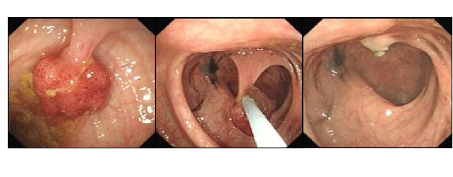
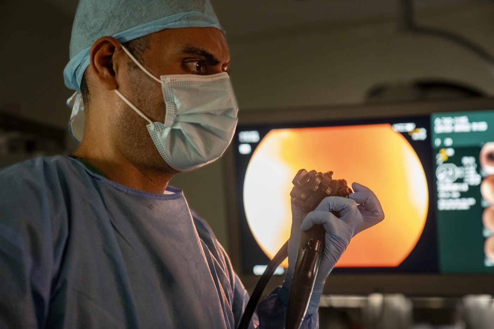

# Doctors Who Used AI Endoscopy Missed More Polyps Without It

_What the deskilling research asks — is putting a human in the loop enough, or must that person_

## Executive Summary

> [!callout]
> In August 2025, The Lancet Gastroenterology & Hepatology published a study that tracked four endoscopy centers in Poland. Before an AI assistance tool was introduced, the adenoma detection rate when doctors worked without AI was 28.4%. After the tool arrived, those same doctors examining again without AI saw their detection rate fall to 22.4%. The skill had eroded not while they were using AI, but in the moment they set it down. It is the first real-world evidence in medicine that automation-driven skill loss connects directly to patient outcomes.

> The mechanism is simple. When a tool looks on your behalf, you practice looking less, and as practice fades the senses dull. The same signal turned up in radiology and pathology. Even seasoned specialists are pulled along by a wrong AI suggestion, and under time pressure they overturn their own correct first call. And this phenomenon does not stay inside the endoscopy suite: when the person reviewing AI output goes dull, the human baseline that holds up labels, ground truth, and quality standards goes dull with them.

> So the question narrows to one. Is "human in the loop" a safeguard that works simply by inserting a person into the loop, or one that works only if that person's skill is kept sharp on its own? The deskilling research answers: the latter.

### Key Figures

Source: [Lancet Gastroenterology & Hepatology](https://www.thelancet.com/journals/langas/article/PIIS2468-1253(25)00133-5/abstract), [ThePrint](https://theprint.in/feature/77-of-doctors-scared-of-losing-their-skills-due-to-ai-studies-show-its-a-possibility/2969517/)

<!-- stat-card -->
**28% → 22%** — Adenoma detection without AI — Doctors working alone, before vs. after the AI tool (28.4% → 22.4%)

<!-- stat-card -->
**6.0 pts** — Absolute decline — First time deskilling is tied to patient outcomes in medicine

<!-- stat-card -->
**77%** — Doctors who fear skill loss — Worried AI over-reliance is dulling their clinical sense (2026 survey)

<!-- stat-card -->
**10 → 38%** — Daily clinical AI use — Roughly 4× in a year — dependence outpacing the worry

## They Missed More Once the AI Was Off

The setting was four endoscopy centers in Poland, all of which had brought AI polyp-detection tools into routine use. The researchers compared the three months before the tools arrived with the three months after, but they isolated one thing in particular. Not the exams run with AI switched on, but only the exams a doctor performed alone, with the AI switched off. The design was built to see what changes when a doctor who has the tool works without it.

The result pointed one way. Before the AI tool arrived, the adenoma detection rate doctors reached with the naked eye was 28.4%. After it arrived, under the same condition — exams with the AI off — the rate dropped to 22.4%. That is 6.0 percentage points gone in absolute terms. Adenoma detection rate is one of the most trusted quality metrics in colorectal cancer prevention, so those 6 points are not a bare statistic; they translate into missed lesions.

The telling part is the number with AI switched on. In exams run with the tool, the detection rate was 25.3% — performance held while the tool filled the gap. The tool did raise the doctors' capability. But that capability did not stay in the doctors' hands; it sat on the tool. The moment the tool was removed, the capability they thought had grown turned out to have shrunk.

*▲ Endoscopic view of a colon polyp (left) and the snare technique used to remove it. Adenoma detection rate (ADR) measures how many lesions like this an endoscopist finds per exam — the metric that fell by 6 percentage points in the study. | Source: [Wikimedia Commons](https://commons.wikimedia.org/wiki/File:Polypectomy.jpg) (CC BY-SA 3.0, Gilo1969)*

> [!callout]
> **The point**: 25.3% with AI on, 22.4% with AI off. The tool did add capability, but that capability was stored in the tool, not the person. It is the first case in medicine where automation deskilling was measured in patient outcomes.

## Why the Edge Dulls

The path to dulling runs in two directions. One is the gap in practice. When AI draws a box around a suspicious lesion on one side of the screen, the doctor gradually eases off the tension of scanning the mucosa with their own eyes. Every exam is a training rep, and the intensity of that training drops. The other is automation bias. When a machine offers an answer, people lean toward following it rather than doubting it.

This bias has been observed outside the endoscopy suite too. A scoping review published in an ESMO journal in March 2026 found that when 27 radiologists reading breast images were deliberately shown wrong AI suggestions, their false-positive recall rate rose by up to 12%. Skilled experts, in other words, were pulled along by a wrong machine signal. In pathology, more than 30% of participants who received a wrong AI suggestion under time pressure reversed the correct diagnosis they had made at first.

*▲ A gastroenterologist maneuvers an endoscope while watching the live colonoscopy feed on a large monitor. The more a clinician offloads judgment to the screen, the less practice their own eyes and pattern recognition get — the core of practice-gap deskilling. | Source: [Wikimedia Commons](https://commons.wikimedia.org/wiki/File:Partnership_in_Practice-_U_S_%2C_Panamanian_Gastro_Teams_Tackle_Backlog_Together_%289335563%29.jpg) (Public Domain, U.S. Air Force / Andrea Jenkins)*

Deskilling does not happen in one place only. The same review frames it as advancing on three levels. First, those already working lose existing competence bit by bit through lack of practice. Second, newcomers never learn the work AI does for them, so the new competence never grows. Third, once a generation passes that way, the people who carry that competence in their hands disappear from the profession entirely. When the UK switched cervical cytology to HPV primary screening, test volume fell by more than 80% and labs consolidated from 45 down to 8 — a case where the very training base for reading skill collapsed, the third level made concrete.

The field already senses the risk. In a June 2026 survey of US clinicians, 77% of doctors and 70% of nurses said they worried AI over-reliance would dull their own competence. Yet over the same stretch, daily AI use in clinical settings jumped from 10% to 38%, roughly fourfold. Dependence is moving faster than the worry.

## Not a Medicine-Only Problem

Swap the endoscopist for a data labeler and the polyp-detection model for an auto-annotation tool, and the story is not unfamiliar. The same structure underlies almost every seat where someone reviews AI. Data annotation, content moderation, model-output review, code review — the jobs we decided a person would look at one last time.

The trouble is that this person's judgment is what holds up the model. The quality of AI training data comes, in the end, from the independent judgment of human labelers. But once auto-annotation fills the answer in first and the human only confirms it, the labeler's judgment sinks from a seat that examines to a seat that rubber-stamps. The very thing the endoscopist did when their gaze followed the AI's box happens on the labeling screen too.
