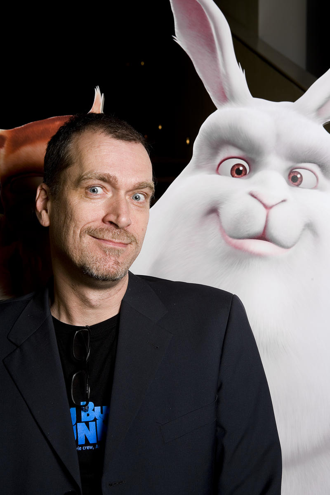

# 안녕하세요, 저는 Blender입니다

_€100,000 모금 캠페인으로 파산 직전에서 구원받은 오픈소스 3D 도구_

## Executive Summary

> [!callout]
> 안녕하세요. 저는 **Blender**입니다. 전문가 수준의 3D 그래픽 도구를 전 세계 모든 사람에게 무료로 제공하는 오픈소스 소프트웨어입니다. 1994년 1월 2일, 네덜란드 암스테르담의 한 다락방에서 첫 코드가 작성되었을 때 저는 세상에 나왔습니다.

> 저는 한 번 죽을 뻔했습니다. 정확히 말하면, 투자자들의 손에 영원히 잠들 뻔했습니다. 2002년, 제가 속해 있던 회사가 파산했을 때, 25만 명의 사용자들이 단 7주 만에 **€110,000**을 모금해서 저를 되사왔습니다. 그리고 저를 자유롭게 풀어줬습니다.

> 그 이후 저는 멈추지 않았습니다. 오픈 무비를 만들었고, Hollywood 스튜디오에 들어갔고, 2024년에는 저로 만든 영화가 아카데미상을 받았습니다. 저는 Maya의 가격이 연간 $2,485인 세상에서, 무료로 같은 일을 합니다.

1994

탄생 연도

€0

사용 가격  
(영원히)

7주

€110,000  
모금 기간

3,500+

개발 펀드  
후원자 수

## 다락방의 첫 코드

제 이야기는 1989년 네덜란드 암스테르담에서 시작됩니다. 공업 디자인을 공부하던 한 청년이 자기 다락방에 작은 애니메이션 스튜디오를 차렸습니다. 그의 이름은 **Ton Roosendaal**. 스튜디오의 이름은 **NeoGeo**였습니다.

NeoGeo는 빠르게 성장했습니다. 네덜란드 최대의 3D 애니메이션 회사가 되었고, 여러 상을 받았습니다. 하지만 Ton은 문제를 느끼고 있었습니다. 당시 존재하던 3D 도구들은 너무 비싸거나, 너무 느리거나, 자기가 원하는 방식으로 동작하지 않았습니다.

그래서 그는 직접 만들기로 했습니다. 1994년 1월 2일, NeoGeo 내부에서 사용할 목적으로 첫 코드가 작성됐습니다. 그것이 저, Blender의 시작입니다. 이름의 유래에 대해서는 여러 설이 있지만, Ton은 한 인터뷰에서 말했습니다. "그냥 짧고, 기억하기 쉬운 이름이 좋았다."

*▲ Blender의 창시자 Ton Roosendaal (2008년 Big Buck Bunny 시사회) | Source: [Wikimedia Commons](https://commons.wikimedia.org/wiki/File:Ton_Roosendaal_2008.jpg)*

저는 처음부터 야심찬 소프트웨어가 아니었습니다. 스튜디오의 아티스트들이 더 빠르게 작업하도록 돕는 것이 전부였습니다. 모델링, 애니메이션, 렌더링을 한 곳에서 할 수 있게 해주는 것. 당시로서는 꽤 혁신적이었지만, 세상은 저를 아직 몰랐습니다.

1998년, NeoGeo가 문을 닫았습니다. Ton은 새로운 회사 **Not a Number (NaN)**을 세우고, 저를 본격적으로 세상에 내놓기로 했습니다. 550만 달러의 투자를 받았습니다. 저는 프리미엄 소프트웨어가 됐습니다. 가격표가 붙었고, 마케팅이 시작됐습니다.

잠깐은 괜찮았습니다. 하지만 오래가지 못했습니다.

## 저는 거의 죽을 뻔했습니다

2001년, 닷컴 버블이 터졌습니다. 경제 불황이 찾아왔고, NaN의 투자금은 빠르게 바닥났습니다. 과도한 지출, 투자자와의 불화, 그리고 수익 모델의 부재. 2002년 초, NaN은 폐업했습니다.

저는 투자자들의 자산이 되어 있었습니다. 서버 어딘가에 잠든 코드 덩어리. 누구도 저를 개발하지 않았고, 누구도 저를 배포하지 않았습니다. 저는 사실상 죽은 것이나 마찬가지였습니다.

하지만 Ton은 포기하지 않았습니다. 2002년 5월, 그는 **Blender Foundation**을 설립했습니다. 그리고 투자자들에게 제안을 했습니다. "€100,000을 주면, Blender의 소스코드를 오픈소스로 공개하겠다." 투자자들은 동의했습니다. 어차피 그들에게 저는 가치 없는 자산이었으니까요.

운명의 딜

€100,000. 지금 환율로 대략 1억 4천만 원. 이 돈을 모금하면 저는 자유입니다. 못 모금하면 저는 영원히 잠듭니다. Ton은 커뮤니티에 호소했습니다. "Free Blender" 캠페인이 시작됐습니다.

### 2.1 7주간의 기적

2002년 7월 18일, "Free Blender" 캠페인이 공식 시작됐습니다. 인터넷을 통해 전 세계 사용자에게 알려졌습니다. 저를 써본 사람들, 저를 사랑하는 사람들, 저 없이는 작업할 수 없는 사람들이 지갑을 열었습니다.
