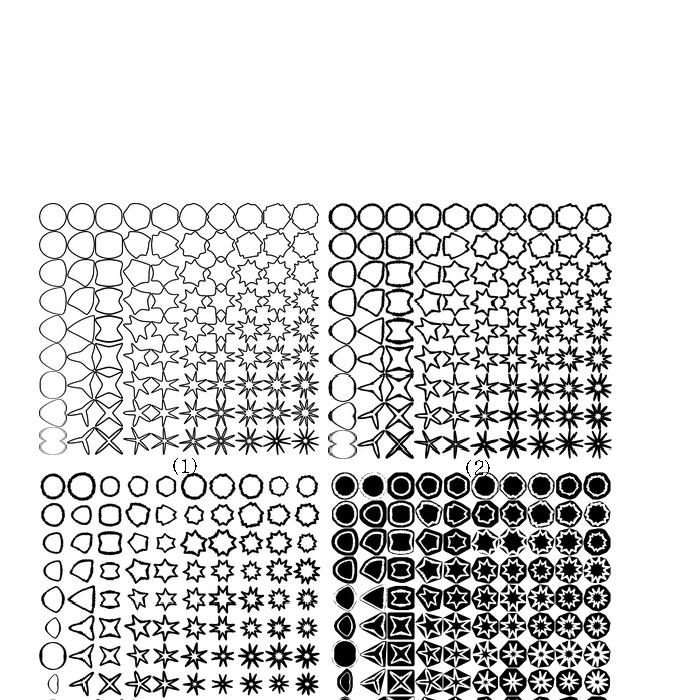

# What Does the Average of 60,000 Star Shapes Look Like?

_Pebblous_

## Executive Summary

> [!callout]
> Star-MNIST is a synthetic geometric shape dataset created by Pebblous DAL (Data Art Lab). Black stars, polygons, circles, triangles, and crescents on a white background. Ten classes, 60,000 images, 28x28 grayscale. Same format as MNIST, but geometric shapes instead of handwritten digits. The team that built this dataset diagnosed it with their own product, DataClinic. The result: a score of 54. Rating: "Poor."

> Here is the key finding. The mean images of all ten classes are the same gray circle. A 4-pointed star and an 8-pointed star are clearly different shapes, yet averaging them cancels out the vertices and both converge into the same circular blob. In pixel space, the classes are indistinguishable. In feature space (L2/L3), high-density duplicates concentrate in Class 11 (star patterns), while Classes 3, 4, and 5 show wider dispersion, forming a clear two-group split.

> Dimensionality optimization (from 1,280 down to 155 dimensions) amplified this gap threefold. It preserved the structure while enhancing class separability, but did not solve the fundamental lack of data diversity. Two prescriptions follow: a Data Diet to remove duplicate data from Class 11, and a Data Bulk-Up to add variations to Classes 3, 4, and 5. Diagnosing your own data with your own tool and refusing to hide a score of 54 out of 100 — that is honest self-assessment of data quality. This piece is the self-diagnosis chapter of the [DataClinic](/project/DataClinic/en/) series — where the makers run their own data through their own tool first.

54

Overall Score (Poor)

10

Classes

60K

Total Images

28x28

Grayscale

## Birth of a Star — Star-MNIST

Star-MNIST is a synthetic learning dataset published at the Korea Computer Graphics Society (KCGS) in 2019. It was proposed by Bok Cha and Joo-Haeng Lee (UST · ETRI), with the title _"Star-MNIST: Generation of Learning Data with Superformula and Practical Usage in Deep Learning."_ True to its name, it adopts the 28×28 grayscale format of MNIST but replaces handwritten digits with closed geometric shapes — stars and beyond. The version examined here is the White variant: black shapes on white backgrounds.

The mathematical foundation is Johan Gielis's **Superformula** (2003), a single parametric equation that unifies natural and abstract forms — stars, flowers, polygons, circles. Star-MNIST simplifies its six parameters to `a = b = 1, m₁ = m₂ = m` and varies `m` across real values from 2 to 11, producing ten distinct classes of closed shapes. The parameter is the label, and the label is the strength of the geometric deformation. That is why this synthetic dataset was designed to support both classification and parameter regression at once.

Closed shapes alone do not yield MNIST-level difficulty. The original paper added two transformations. First, **Concavity** distributes the gap between vertex distance and indent distance across a 0.15–0.95 range. Second, **ConvexNegate** generates negative-space images by subtracting each shape from its convex hull, forming 20% of the dataset. Combine these with eight stroke-thickness levels and random rotations, and the simple shape grid becomes a learnable dataset. LeNet reaches 99.67% accuracy — close to MNIST's 99% — but converges more slowly. The difficulty is by design.

*▲ MNIST (left) and Star-MNIST (right) — same 28×28 grid, handwritten digits versus synthetic shapes. Source: Cha & Lee, [KCGS 2019](../source/star-mnist-kcgs-2019.pdf), Figure 1.*

*▲ Four-stage transformations of Star-MNIST — (1) base shape, (2) stroke-thickness variation, (3) random rotation and scale, (4) ConvexNegate. Source: Cha & Lee, KCGS 2019, Figure 2.*

*▲ LeNet architecture and classification training curves — Star-MNIST (orange) converges more slowly than MNIST (blue) but reaches 99.67% final accuracy, slightly higher than MNIST. Source: Cha & Lee, KCGS 2019, Figure 4.*

What is interesting is the gap in time. Star-MNIST was created in 2019; this diagnosis was performed in 2026. In those seven years, the role of synthetic training data has shifted from a teaching question — "what comes after MNIST?" — to a governance question: "how do we train industrial models responsibly?" That a dataset receives a quality report card from the perspective of data quality, seven years later, is also a trace of how the meaning of synthetic data has evolved.

The collage below captures the overall impression of Star-MNIST. Black geometric shapes arranged in various configurations on white backgrounds — stars, polygons, circles, triangles, crescents, flower-like forms. An entirely different world from handwritten digits: the realm of synthetic geometric forms.

▲ Star-MNIST at a glance — 10 classes of black geometric shapes on white backgrounds, 60,000 images

📄 Original Paper

Cha, B. & Lee, J.-H. (2019). _Star-MNIST: Generation of Learning Data with Superformula and Practical Usage in Deep Learning_. Korea Computer Graphics Society (KCGS) 2019.

[Download PDF (KCGS 2019)](../source/star-mnist-kcgs-2019.pdf)

### 1.1. MNIST vs Star-MNIST

Same format, different worlds. Where MNIST captures the tremor and pressure variations of human handwriting, Star-MNIST contains pure geometric forms generated by algorithms. The foreground-background inversion is also striking: MNIST uses white digits on a black background, while Star-MNIST uses black shapes on white.

| Item | MNIST | Star-MNIST |
| --- | --- | --- |
| Creator | Yann LeCun (NYU) | Cha & Lee (UST · ETRI, 2019) |
| Classes | 0-9 (handwritten digits) | 2-11 (geometric shapes) |
| Image count | 60,000 (train) | 60,000 |
| Resolution | 28x28 Grayscale | 28x28 Grayscale |
| Background | Black bg + white digits | White bg + black shapes |
| Generation | Scanned handwriting | Synthetic (algorithmic) |
| Pixel distribution | Anti-aliased gradients | Binary (clustered at 0/255) |
| Mean image separability | Distinct per digit | All identical circular blobs |

Average the handwritten 3s and 8s from MNIST, and the results still look different — the stroke trajectories diverge. But average a 4-pointed star and an 8-pointed star? The vertices are evenly distributed in every direction, so they cancel each other out, and both collapse into the same circle. This is the central paradox of Star-MNIST.

What Self-Diagnosis Means

The researcher who proposed Star-MNIST (Joo-Haeng Lee) and the company behind DataClinic (Pebblous) are connected. Data the company is associated with is diagnosed by the company's own tool, and the result — a score of 54 — is published openly. A synthetic dataset presented at KCGS in 2019 receives its quality report card from a data-governance perspective seven years later.
                            | [View Full Diagnostic Report →](https://dataclinic.ai/en/report/102)

## What You See and What You Don't — Level I Diagnosis

Level I examines the basic statistics of the images: integrity, missing values, class balance, pixel distribution, and mean images. Star-MNIST scores mostly "Good" at Level I. All images are consistently 28x28 grayscale, there are no missing values, and class balance is solid — 5,896 to 6,194 images per class (standard deviation 93.84). On the surface, a healthy dataset. Yet the statistics rating is only "Fair." There is a reason.

### 2.1. Ten Completely Different Classes, Ten Identical Means

Look at the ten cards below. On the left is an actual sample from each class. On the right is that class's mean image. The actual shapes are clearly distinct — stars, polygons, circles, triangles, crescents, flower-like forms. Now look at the mean images on the right. Every single one is the same gray circle.

Actual

Mean

Class 2 (6,038 images)

Actual

Mean

Class 3 (5,896 images)

Actual

Mean

Class 4 (5,904 images)

Actual

Mean

Class 5 (6,077 images)

Actual

Mean

Class 6 (6,032 images)

Actual

Mean

Class 7 (5,911 images)

Actual

Mean

Class 8 (6,014 images)

Actual

Mean

Class 9 (6,194 images)

Actual

Mean

Class 10 (5,929 images)

Actual

Mean

Class 11 (6,005 images)

▲ Left (Actual): The 10 classes are clearly different shapes. Right (Mean): Yet averaging them all produces the same circle.

Why does this happen? Every shape is centered in the image, similar in size, with vertex orientations evenly distributed. When directionality cancels out, what remains is a circle. Humans see contours and instantly distinguish shapes, but pixel averaging destroys contour information entirely. This is the fundamental limitation of pixel space.

### 2.2. The Overall Mean Image

What happens when you average all 60,000 images? As expected, a single faint gray circular blob remains at the center. Edges fade out smoothly, confirming that all classes share a center-focused layout.

▲ The mean of 60,000 images — average a star and you get a circle

### 2.3. Pixel Histogram — Binary Black-and-White Silhouettes

The pixel distribution is an extreme U-shape. Values cluster overwhelmingly at 0 (black) and 255 (white), with virtually nothing in the midtones (50-200). The 255 peak is roughly 8-10 times higher than the 0 peak, reflecting the white-dominant background. The R, G, and B channels overlap perfectly, confirming pure grayscale. Unlike the smooth anti-aliased edges of MNIST, Star-MNIST shapes are crisp black-and-white silhouettes with razor-sharp boundaries.

▲ Extreme concentration at 0 and 255 — binary silhouettes with virtually no midtones

> [!callout]
> **So What:** Looking at Level I alone, this dataset appears healthy. Integrity is good, no missing values, class balance is good. Yet the mean images of all 10 classes are indistinguishable. Traditional statistics (mean, variance) reveal nothing about class separability in this dataset. That is precisely why Level II and Level III feature-space analysis is essential.

## Cracks Revealed in Feature Space — Level II Diagnosis

Level II analyzes images in the 1,280-dimensional feature space of the Wolfram ImageIdentify Net V2 neural network. Instead of raw pixels, it examines data through the high-dimensional characteristics that a neural network perceives. What do the ten classes — indistinguishable in pixel space — look like in feature space?

### 3.1. Density Distribution — A Clear Two-Group Split

The L2 density histogram shows a right-skewed bell distribution peaking around 0.25-0.28. The majority of data points are concentrated in the 0.18-0.36 range. Overall density is relatively high, suggesting significant inter-sample similarity and raising concerns about diversity.

More telling is the per-class density box plot. The ten classes split into two distinct groups. The high-density group (Classes 9, 10, 11: median 0.31-0.33) and the low-density group (Classes 3, 4, 5: median 0.23-0.25) are separated by roughly 0.08-0.10. Class 11 in particular has the widest IQR, with whiskers extending to 0.43 — a sign that highly similar images are excessively concentrated. Effectively near-duplicates.

Density

High-density

L2 density: peak 0.27, range 0.13-0.43

Box chart

Low-density

10 classes: high-density (9, 10, 11) vs low-density (3, 4, 5)

▲ Left: chart / Right: representative image from the density extreme

### 3.2. PCA and Density Heatmap

In the PCA scatter plot, the 60,000 data points form a single massive circular cluster with no clear class boundaries. This is characteristic of MNIST-type datasets where shape features transition continuously. The density heatmap reveals a dense core at the center that gradually fades outward, with the darkest high-density region concentrated in the upper-center area.

L2 PCA — a single circular cluster

L2 density heatmap — central hotspot

### 3.3. Outliers — Class 11 Dominates

All ten of the top high-density outliers belong to Class 11. They cluster in the 0.41-0.43 density range, all showing the same canonical star pattern with rays radiating from the center. The forms are nearly identical — virtual duplicates. Class 11 has extremely low internal variability, meaning it lacks diversity.

On the other end, the low-density outliers are distributed across Class 3 (3 images), Class 2 (3 images), Class 4 (1), and Class 5 (1). With densities of 0.13-0.14, they sit at less than half the overall mean (0.27). These images deviate from the typical patterns of their respective classes. Positioned at the periphery of feature space, they add diversity, but extreme cases may warrant label-error checks.

Density

Actual

Class 11 — monopolizes all top 10 high-density outliers (0.41-0.43)

Density

Actual

Class 3 — lowest density outlier (0.13)

Density

Actual

Class 9 — high-density group (median 0.31)

▲ Left: per-class density distribution chart / Right: representative image from that class

## A New Landscape After Dimensionality Optimization — Level III Diagnosis

Level III optimizes the feature space from 1,280 dimensions down to 155. It strips away unnecessary variance and sharpens class separability. How do the patterns observed at L2 change at L3?

### 4.1. Density Scale Triples, Gap Widens 2.5x

The L3 density histogram peak shifts to 0.70-0.80, roughly a threefold increase in density scale compared to L2 (0.25-0.28). Dimensionality reduction compresses inter-point distances, raising overall density. The distribution range also expands to 0.40-1.20.

The box plot tells a more dramatic story. The two-group split from L2 is amplified at L3. The high-density group (Classes 9, 10, 11: median 0.90-0.95) and the low-density group (Classes 3, 4, 5: median 0.67-0.70) are now separated by approximately 0.25 — 2.5 times the L2 gap (0.10). Dimensionality optimization has made class-level density characteristics far more visible. The upper whisker for Class 11 extends to 1.27.

Density

High-density

L3 density: peak 0.75, range 0.40-1.28

Box chart

Low-density

Two-group gap widens to 0.25 at L3 (2.5x vs L2)

▲ After dimensionality optimization: density scale up 3x, inter-class gap up 2.5x

### 4.2. PCA and Density Heatmap

At L3, data points form three or more major clusters in the PCA plot, though the boundaries between clusters are not fully separated and show connective structures. Compared to L2, points within each cluster are more tightly condensed. The density heatmap shows that extreme hotspots are reduced relative to L2, with a more uniform overall distribution. Dimensionality optimization has mitigated the extreme density concentration.

L3 PCA — condensed clusters

L3 density heatmap — extreme concentration mitigated

### 4.3. Consistent Outlier Patterns

L3 outliers follow the same pattern as L2. On the high-density side, Class 11 (9 out of 10) and Class 10 (1 out of 10) dominate. On the low-density side, Class 2 (5 out of 10) and Class 3 (3 out of 10) lead. The outlier structure persists consistently even after dimensionality reduction, meaning the data quality issues are dimension-independent.

> [!callout]
> **Key Takeaway:** Dimensionality optimization from L2 to L3 (1,280 to 155 dimensions) produced three effects. First, a 3x increase in density scale. Second, a 2.5x increase in inter-class separation. Third, a one-grade improvement in both the distribution rating (from "Fair" to "Good") and the geometry rating (from "Poor" to "Fair"). It preserved structure while enhancing class separability. However, the fundamental problems — overcrowding in Class 11 and sparsity in Classes 3, 4, and 5 — cannot be resolved by dimensionality optimization alone.

## Anatomy of 54 Points — Overall Diagnosis

Star-MNIST's overall score is 54, rating "Poor." Unfolding the individual grades from Level I through Level IV reveals exactly where the dataset is healthy and where it hurts.

| Diagnostic Item | Rating | Meaning |
| --- | --- | --- |
| L1 Integrity | Good | Consistent 28x28 Grayscale |
| L1 Missing Values | Good | No missing data |
| L1 Class Balance | Good | Std 93.84 (1.6%) |
| L1 Statistics | Fair | Mean images indistinguishable |
| L2 Geometry | Poor | Negative geometric properties |
| L2 Distribution | Fair | Bell-shaped, small class differences |
| L3 Geometry | Fair | 3+ clusters, similar manifolds |
| L3 Distribution | Good | Improved after dim. optimization |
| Overall: 54 — Poor |  |  |

****************

The surface (L1) is healthy, but cracks begin at depth (L2). The L2 Geometry rating of "Poor" is the primary factor dragging down the overall score. L3 dimensionality optimization recovers Geometry to "Fair" and Distribution to "Good," but it cannot fully offset the fundamental L2 issues.

### 5.1. L2 vs L3 Comparison

| Item | L2 (1,280 dim.) | L3 (155 dim.) |
| --- | --- | --- |
| Density range | 0.13 - 0.43 | 0.39 - 1.28 |
| Density peak | 0.25 - 0.28 | 0.70 - 0.80 |
| High/low group gap | ~0.10 | ~0.25 (2.5x) |
| Geometry rating | Poor | Fair |
| Distribution rating | Fair | Good |
| High-density outliers | Class 11 dominant | Class 11 dominant (same) |
| Low-density outliers | Class 2, 3 lead | Class 2, 3 lead (same) |

****

## Prescriptions and Comparison

DataClinic's prescriptions come in two flavors: a Data Diet to thin out overcrowded areas, and a Data Bulk-Up to fill in sparse ones.

Prescription 1. Data Diet — Remove Class 11 Duplicates

Strip out the high-density duplicates in Class 11. Among the 6,005 images, those with density above 0.40 are virtually identical star patterns. Reducing these repetitive canonical star shapes lowers overall density and raises the diversity score. A classifier trained on this data risks memorizing Class 11's template and treating even slight star variations as "never seen before."

Prescription 2. Data Bulk-Up — Add Variations to Classes 3, 4, 5

Introduce controlled parametric variations to the low-density classes (3, 4, 5): vertex count variation, rotation angles, size scaling, and asymmetric distortion. These deliberate perturbations widen the dispersion in feature space and improve class separability. In synthetic data, diversity is a matter of intentional design.

### 6.1. DC Story Score Spectrum

Where does Star-MNIST's score of 54 sit among datasets diagnosed by DataClinic? It is the lowest among Pebblous's own synthetic datasets, 33 points behind defense synthetic data (87-88). The same company built both — so why the gap? Defense data includes real-world background variation, lighting, and camera parameter diversity, while Star-MNIST is purely geometric with limited controlled variation.

| Report | Dataset | Score | Rating | Domain |
| --- | --- | --- | --- | --- |
| #124 | PBLS_NavyDL | 88 | Good | Defense synthetic |
| #226 | PBLS_Drone | 87 | Good | Defense synthetic |
| #225 | PBLS_Military3 | 79 | Fair | Defense synthetic |
| #116 | Birds 525 | 77 | Fair | Nature |
| #59 | Korean Food | 71 | Fair | Food |
| #224 | PBLS_Military | 68 | Fair | Defense synthetic |
| #102 | Star-MNIST | 54 | Poor | Art synthetic |
| #115 | WikiArt | 53 | Poor | Art |
| #131 | IndustrialWaste | 51 | Poor | Industrial |

WikiArt (53) and Star-MNIST (54) are nearly tied. Both share a common trait: visually ambiguous class boundaries. Artistic styles and geometric vertex counts are similarly hard to distinguish with pixel-level statistics.

> [!callout]
> **What Self-Diagnosis Means:** This article documents Pebblous scoring its own data with its own tool. The score of 54 is published without concealment. This kind of honesty about data quality is what builds trust in a business that sells data quality diagnostics. And with prescriptions in hand, the path to improvement is clear. A Data Diet to remove duplicates. A Data Bulk-Up to add diversity. Average a star and you get a circle — but restoring distinct stars from that circle is the data engineer's job.

## References

- • Cha, B., & Lee, J.-H. (2019). _Star-MNIST: Generation of Learning Data with Superformula and Practical Usage in Deep Learning_. Korea Computer Graphics Society (KCGS) 2019, Poster.
                            [Download PDF](../source/star-mnist-kcgs-2019.pdf)
- • Gielis, J. (2003). A generic geometric transformation that unifies a wide range of natural and abstract shapes. _American Journal of Botany_, 90(3), 333–338.
- • LeCun, Y., Bottou, L., Bengio, Y., & Haffner, P. (1998). Gradient-Based Learning Applied to Document Recognition. _Proceedings of the IEEE_, 86, 2278–2324.
- • DataClinic Report #102 — Star-MNIST.
                            [dataclinic.ai/en/report/102](https://dataclinic.ai/en/report/102)

<!-- stat-card -->
**📚 DataClinic Series** — This article is part of the [DataClinic](/project/DataClinic/en/) series curated by Pebblous — diagnosing and prescribing for AI training data, holding our own datasets and public benchmarks to the same standard.
