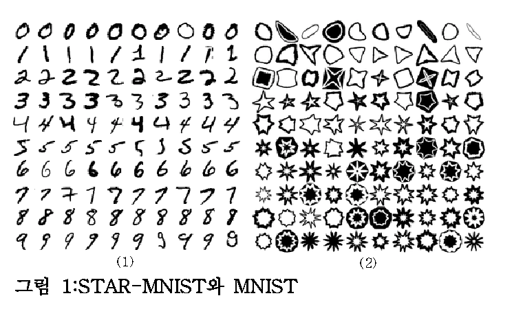
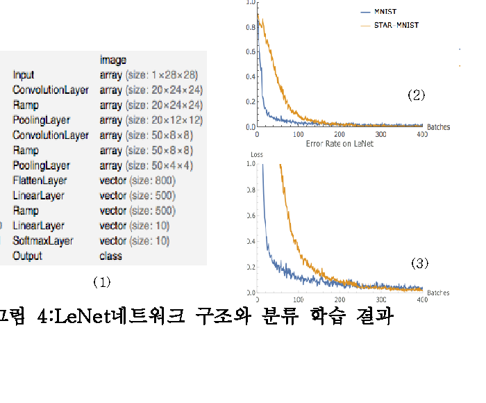

# 6만 개 별모양의 평균은 어떤 모습일까

_페블러스의 첫 합성 데이터 Star-MNIST, DataClinic 진단기_

## Executive Summary

> [!callout]
> Star-MNIST는 페블러스 DAL(Data Art Lab)이 만든 합성 기하 도형 데이터셋이다. 흰 배경 위에 검은 별, 다각형, 원, 삼각형, 반달. 10개 클래스, 60,000장, 28x28 Grayscale. MNIST와 같은 규격이지만 손글씨 대신 기하학적 도형을 담았다. 이 데이터셋을 만든 팀이, 자사 제품 DataClinic으로 직접 진단했다. 결과는 54점. "나쁨" 등급이다.

> 핵심 발견은 이것이다. 10개 클래스의 평균 이미지가 모두 같은 회색 원이다. 4꼭짓점 별과 8꼭짓점 별은 분명히 다른 도형이지만, 평균을 내면 꼭짓점이 상쇄되어 같은 원형 블롭으로 수렴한다. 픽셀 공간에서는 클래스를 구별할 수 없다. 특징 공간(L2/L3)에서는 클래스 11(별 패턴)에 고밀도 중복이 집중되고, 클래스 3, 4, 5는 상대적으로 분산이 넓어 뚜렷한 2그룹으로 분리된다.

> 차원 최적화(1,280차원에서 155차원)는 이 격차를 3배로 증폭시켰다. 구조를 보존하면서 클래스 구별력을 강화했지만, 근본적인 데이터 다양성 부족은 해결하지 못했다. 처방은 두 가지다. 클래스 11의 중복 데이터를 걷어내는 Data Diet, 클래스 3, 4, 5에 변형을 추가하는 Data Bulk-Up. 자사 데이터를 자사 도구로 진단하고, 54점이라는 결과를 숨기지 않는 것. 데이터 품질에 대한 정직한 자기 검증이다. 이 글은 [데이터클리닉](/project/DataClinic/ko/) 시리즈의 자가진단 편으로, 만든 사람이 자기 데이터를 가장 먼저 의심하는 자리다.

54점

종합 점수 (나쁨)

10

클래스 수

6만

전체 이미지

28x28

Grayscale

## 별의 탄생 — Star-MNIST

Star-MNIST는 2019년 한국컴퓨터그래픽스학회(KCGS)에서 발표된 합성 학습 데이터셋이다. 차복·이주행(UST·ETRI)이 제안했고, 논문 제목은 _"Star-MNIST: 수퍼포뮬라를 이용한 학습데이터 생성 및 기계학습 활용 예"_다. 이름 그대로, MNIST와 동일한 28×28 Grayscale 규격에 손글씨 숫자 대신 별을 비롯한 닫힌 기하 도형을 담았다. 본 진단에서 다루는 것은 흰 배경에 검은 도형이 놓인 White 변형이다.

도형 생성의 수학적 토대는 Johan Gielis(2003)의 **수퍼포뮬러(Superformula)**다. 하나의 매개변수 곡선식으로 별·꽃·다각형·원형 등 자연계의 형태를 통합해 표현하는 일반화된 변환이다. Star-MNIST는 이 식의 6개 변수 중 `a = b = 1, m₁ = m₂ = m`으로 단순화하고, `m`을 2~11 실수로 변화시켜 10종의 닫힌 도형을 만든다. 매개변수가 곧 라벨이고, 라벨이 곧 기하 변형의 강도다. 분류(classification)와 인수추정(regression)을 동시에 학습할 수 있는 합성 데이터로 설계된 이유다.

그러나 닫힌 도형만으로는 MNIST 수준의 학습 난이도가 나오지 않는다. 원 논문은 두 가지 변형을 추가했다. 첫째, **Concavity**는 도형 중심에서 꼭짓점까지의 거리와 오목점까지의 거리 차이를 0.15~0.95 범위로 분포시킨다. 둘째, **ConvexNegate**는 도형의 볼록 껍질에서 원 도형을 감산해 만든 음각 이미지로, 전체의 20%를 차지한다. 여기에 선분 굵기 8단계와 무작위 회전을 곁들이면, 단순한 도형 그리드가 학습 가능한 데이터셋으로 변환된다. LeNet 분류 정확도는 99.67%로 MNIST(99%)와 비슷하지만, 학습 곡선의 수렴 속도는 MNIST보다 느리다 — 의도된 난이도다.

*▲ MNIST(좌)와 Star-MNIST(우) 비교 — 같은 28×28 그리드에 놓인 손글씨와 합성 도형. 출처: 차복·이주행, [KCGS 2019](../source/star-mnist-kcgs-2019.pdf), 그림 1.*

*▲ Star-MNIST의 4단계 변형 — (1) 변형 전 도형, (2) 선분 굵기 변형, (3) 무작위 회전·크기, (4) ConvexNegate 음각. 출처: 차복·이주행, KCGS 2019, 그림 2.*

*▲ LeNet 네트워크 구조와 분류 학습 결과 — Star-MNIST(주황)는 MNIST(파랑)보다 천천히 학습되지만 최종 정확도는 99.67%로 약간 더 높다. 출처: 차복·이주행, KCGS 2019, 그림 4.*

흥미로운 지점은 시간의 격차다. Star-MNIST는 2019년에 만들어졌고, 본 진단은 2026년에 이뤄졌다. 그동안 합성 학습 데이터의 역할은 "MNIST 다음을 뭐로 가르칠 것인가"라는 교육용 질문에서, "산업용 모델을 어떻게 책임 있게 학습시킬 것인가"라는 거버넌스 질문으로 옮겨갔다. 7년 만에 한 데이터셋이 데이터 품질 관점에서 자기 진단을 받는 건, 합성 데이터의 의미가 진화했다는 흔적이기도 하다.

아래 콜라주는 Star-MNIST 60,000장의 전체 인상이다. 흰 배경 위에 검은 기하 도형들이 다양하게 배열되어 있다. 별, 다각형, 원, 삼각형, 반달, 꽃 모양. 손글씨 숫자와는 전혀 다른, 합성 기하학적 형상의 세계다.

▲ Star-MNIST 60,000장의 전체 인상 — 흰 배경 위 검은 기하 도형 10종

📄 원 논문 다운로드

차복·이주행 (2019). _Star-MNIST: 수퍼포뮬라를 이용한 학습데이터 생성 및 기계학습 활용 예_. 한국컴퓨터그래픽스학회 (KCGS) 2019.

[PDF 다운로드 (KCGS 2019)](../source/star-mnist-kcgs-2019.pdf)

### 1.1. MNIST vs Star-MNIST

같은 규격, 다른 세계. MNIST가 사람의 손 떨림과 필압의 다양성을 담았다면, Star-MNIST는 알고리즘이 생성한 순수한 기하학적 형태를 담았다. 배경과 전경의 반전도 눈에 띈다. MNIST는 검은 배경에 흰 글씨, Star-MNIST는 흰 배경에 검은 도형이다.

| 항목 | MNIST | Star-MNIST |
| --- | --- | --- |
| 제작자 | Yann LeCun (NYU) | 차복·이주행 (UST·ETRI, 2019) |
| 클래스 | 0-9 (손글씨 숫자) | 2-11 (기하 도형) |
| 이미지 수 | 60,000 (train) | 60,000 |
| 해상도 | 28x28 Grayscale | 28x28 Grayscale |
| 배경 | 검은 배경 + 흰 글씨 | 흰 배경 + 검은 도형 |
| 생성 방식 | 실제 손글씨 스캔 | 합성(알고리즘 생성) |
| 픽셀 분포 | 안티앨리어싱 그라데이션 | 이진형(0/255 극단 집중) |
| 평균 이미지 구분력 | 숫자마다 다름 | 전부 동일한 원형 블롭 |

MNIST의 손글씨 3과 8은 평균을 내도 다르게 생겼다. 획의 궤적이 다르기 때문이다. 그런데 4꼭짓점 별과 8꼭짓점 별을 평균 내면? 꼭짓점 방향이 골고루 분포하므로 서로 상쇄되어, 둘 다 같은 원형이 된다. 이것이 Star-MNIST의 핵심 역설이다.

자기 진단의 의미

Star-MNIST를 만든 연구자(이주행)와 진단 도구 DataClinic을 만든 회사(페블러스)는 연결되어 있다. 자사가 관여한 데이터를 자사 도구로 진단하고, 54점이라는 결과를 숨기지 않고 공개한다. 2019년 KCGS에서 발표된 합성 데이터셋이, 7년 만에 데이터 품질 거버넌스 관점에서 성적표를 받는 순간이다.
                            | [전체 진단 결과 보기 →](https://dataclinic.ai/ko/report/102)

## 눈에 보이는 것과 보이지 않는 것 — Level I 진단

Level I은 이미지의 기초 통계를 본다. 무결성, 결측값, 클래스 균형, 픽셀 분포, 평균 이미지. Star-MNIST의 Level I 성적은 대부분 "좋음"이다. 모든 이미지가 28x28 Grayscale로 일관되고, 결측값이 없으며, 클래스당 5,896에서 6,194장으로 균형이 양호하다(표준편차 93.84). 표면적으로는 건강한 데이터셋이다. 그런데 통계 등급만 "보통"이다. 이유가 있다.

### 2.1. 10개 클래스 전부 다른데, 평균은 전부 같다

아래 10개 카드를 보자. 왼쪽은 각 클래스의 대표 이미지(실제 샘플), 오른쪽은 해당 클래스의 평균 이미지다. 실제 도형은 분명히 다르다. 별, 다각형, 원, 삼각형, 반달, 꽃 모양. 그런데 오른쪽 평균 이미지를 보라. 전부 같은 회색 원이다.

실제

평균

클래스 2 (6,038장)

실제

평균

클래스 3 (5,896장)

실제

평균

클래스 4 (5,904장)

실제

평균

클래스 5 (6,077장)

실제

평균

클래스 6 (6,032장)

실제

평균

클래스 7 (5,911장)

실제

평균

클래스 8 (6,014장)

실제

평균

클래스 9 (6,194장)

실제

평균

클래스 10 (5,929장)

실제

평균

클래스 11 (6,005장)

▲ 왼쪽(실제): 10개 클래스는 분명히 다른 도형이다. 오른쪽(평균): 그런데 평균 내면 전부 같은 원이 된다.

왜 이런 일이 생기는가. 도형이 모두 이미지 중앙에 위치하고, 크기가 비슷하며, 꼭짓점 방향이 골고루 분포하기 때문이다. 방향성이 상쇄되면 남는 것은 원이다. 사람은 윤곽선을 보고 즉시 도형을 구분하지만, 픽셀 평균은 윤곽선 정보를 완전히 잃어버린다. 이것이 픽셀 공간의 한계다.

### 2.2. 전체 평균 이미지

60,000장 전부를 평균하면 어떻게 될까. 예상대로 중앙에 밝은 회색 원형 블롭 하나가 남는다. 엣지가 부드럽게 페이드아웃되며, 모든 클래스의 도형이 중앙 집중형이라는 것을 확인해준다.

▲ 60,000장의 평균 — 별을 평균 내면 원이 된다

### 2.3. 픽셀 히스토그램 — 이진형 흑백 실루엣

픽셀 분포를 보면 극단적인 U자형이다. 값이 0(검정)과 255(흰색)에 극도로 집중되어 있고, 중간 톤(50~200)은 거의 존재하지 않는다. 255 피크가 0 피크보다 약 8~10배 높아 배경이 흰색 위주임을 보여준다. R, G, B 3채널이 완벽히 겹쳐 있어 사실상 순수 Grayscale이다. MNIST의 부드러운 안티앨리어싱 에지와 달리, Star-MNIST의 도형은 매우 선명한 경계를 가진 흑백 실루엣이다.

▲ 0과 255에 극단적으로 집중된 이진형 분포 — 중간 톤이 거의 없는 흑백 실루엣

> [!callout]
> **So What:** Level I만 보면 이 데이터셋은 건강하다. 무결성 좋음, 결측값 없음, 클래스 균형 좋음. 그런데 10개 클래스의 평균 이미지를 구별할 수 없다. 전통적 통계(평균, 분산)만으로는 이 데이터셋의 클래스 구분력을 전혀 파악할 수 없다는 뜻이다. Level II, Level III 특징 공간 분석이 필수인 이유가 여기 있다.

## 특징 공간이 드러내는 균열 — Level II 진단

Level II는 Wolfram ImageIdentify Net V2 신경망의 1,280차원 특징 공간에서 이미지를 분석한다. 픽셀이 아니라 신경망이 인식하는 고차원 특성으로 데이터를 본다. 픽셀 공간에서 구별할 수 없었던 10개 클래스가 특징 공간에서는 어떤 모습인가.

### 3.1. 밀도 분포 — 뚜렷한 2그룹 분리

L2 밀도 히스토그램은 0.25~0.28 부근에서 피크를 보이는 우편향 종형 분포다. 대다수 데이터가 0.18~0.36 구간에 밀집되어 있다. 전반적으로 밀도가 높은 편으로, 데이터 간 유사성이 높아 다양성 저하 우려가 있다.

더 중요한 것은 클래스별 밀도 박스플롯이다. 10개 클래스가 뚜렷한 2그룹으로 분리된다. 고밀도 그룹(클래스 9, 10, 11: 중위값 0.31~0.33)과 저밀도 그룹(클래스 3, 4, 5: 중위값 0.23~0.25)의 격차가 약 0.08~0.10이다. 특히 클래스 11은 IQR이 가장 넓고 위스커가 0.43까지 뻗어 있다. 유사한 이미지가 과도하게 집중되어 있다는 뜻이다.

밀도 분포

고밀도

L2 밀도: peak 0.27, range 0.13-0.43

박스 차트

저밀도

10개 클래스: 고밀도(9,10,11) vs 저밀도(3,4,5)

▲ 왼쪽: 차트 / 오른쪽: 해당 밀도 극단의 대표 이미지

### 3.2. PCA와 밀도 히트맵

PCA 산점도에서 60,000개 데이터 포인트가 하나의 거대한 원형 클러스터를 형성한다. 클래스 경계가 명확하지 않다. MNIST 유형 데이터셋의 특성상 도형 형태 간 특징이 연속적으로 전이되기 때문이다. 밀도 히트맵에서는 중심부에 진한 고밀도 핵이 형성되어 있고, 주변부로 갈수록 완만하게 감소한다. 상단-중앙에 가장 짙은 고밀도 영역이 집중되어 있다.

L2 PCA — 하나의 원형 클러스터

L2 밀도 히트맵 — 중심부 고밀도 핫스팟

### 3.3. 아웃라이어 — 클래스 11이 독점하다

고밀도 아웃라이어 상위 10개가 전부 클래스 11이다. 밀도 0.41~0.43 구간에 집중되어 있으며, 모두 중심에서 광선이 방사형으로 뻗어나가는 전형적 별 모양이다. 형태가 거의 동일하다. 사실상 중복에 가까운 이미지들이다. 클래스 11은 내부 변동성이 극도로 낮아 다양성이 부족하다.

반대로 저밀도 아웃라이어는 클래스 3(3건), 클래스 2(3건), 클래스 4(1건), 클래스 5(1건)에 분포한다. 밀도 0.13~0.14로 전체 평균(0.27)의 절반 이하다. 이 이미지들은 해당 클래스의 전형적 패턴에서 벗어난 비정형적 형태를 보인다. 특징 공간 외곽에 위치하여 다양성을 높이는 역할을 하지만, 극단적인 경우 라벨 오류 가능성도 점검이 필요하다.

밀도

실제

클래스 11 — 고밀도 아웃라이어 10개 독점 (0.41-0.43)

밀도

실제

클래스 3 — 최저밀도 아웃라이어 (0.13)

밀도

실제

클래스 9 — 고밀도 그룹 (중위값 0.31)

▲ 왼쪽: 클래스별 밀도 분포 차트 / 오른쪽: 해당 클래스 대표 이미지

## 차원 최적화가 바꾼 풍경 — Level III 진단

Level III는 1,280차원을 155차원으로 최적화한다. 불필요한 분산을 제거하고 클래스 구별력을 강화하는 과정이다. L2에서 관찰된 패턴이 L3에서 어떻게 변하는가.

### 4.1. 밀도 스케일 3배 상승, 격차 2.5배 확대

L3 밀도 히스토그램의 피크가 0.70~0.80으로 이동했다. L2(0.25~0.28)에 비해 밀도 스케일이 약 3배 상승한 것이다. 차원 축소로 데이터 포인트 간 거리가 압축되어 전체 밀도가 높아졌다. 분포 범위도 0.40~1.20으로 확대되었다.

박스플롯을 보면, L2의 2그룹 분리가 L3에서 더 극적으로 증폭되었다. 고밀도 그룹(클래스 9, 10, 11: 중앙값 0.90~0.95)과 저밀도 그룹(클래스 3, 4, 5: 중앙값 0.67~0.70)의 격차가 약 0.25로, L2(0.10)의 2.5배다. 차원 최적화가 클래스별 밀도 특성을 더 선명하게 드러낸 것이다. 클래스 11의 상위 위스커는 1.27까지 확장되었다.

밀도 분포

고밀도

L3 밀도: peak 0.75, range 0.40-1.28

박스 차트

저밀도

L3에서 2그룹 격차 0.25로 확대 (L2 대비 2.5배)

▲ 차원 최적화 후 밀도 스케일 3배 상승, 클래스 간 격차 2.5배 증폭

### 4.2. PCA와 밀도 히트맵

L3 PCA에서 데이터 포인트가 3개 이상의 주요 클러스터를 형성하지만, 클러스터 간 경계가 완전히 분리되지 않고 연결 구조를 보인다. L2 대비 클러스터 내 점들의 밀도가 더 높아 응축된 양상이다. 밀도 히트맵은 L2 대비 고밀도 핫스팟이 줄어들고 전체적으로 더 균등한 분포를 보인다. 차원 최적화가 극단적 밀도 집중을 완화하는 효과를 냈다.

L3 PCA — 클러스터 내 응축

L3 밀도 히트맵 — 극단적 집중 완화

### 4.3. 아웃라이어 패턴의 일관성

L3 아웃라이어도 L2와 동일한 패턴을 보인다. 고밀도 쪽에서 클래스 11(9/10개)과 10(1/10개)이 지배하고, 저밀도 쪽에서 클래스 2(5/10개)와 3(3/10개)이 주를 이룬다. 차원 축소 후에도 아웃라이어 구조가 일관되게 유지된다. 데이터 품질 문제가 차원에 독립적이라는 뜻이다.

> [!callout]
> **핵심:** L2에서 L3로의 차원 최적화(1,280에서 155)는 세 가지 효과를 냈다. 첫째, 밀도 스케일 3배 상승. 둘째, 클래스 간 분리도 2.5배 증가. 셋째, 분포 등급 "보통"에서 "좋음"으로, 기하 등급 "나쁨"에서 "보통"으로 각 1단계 향상. 구조를 보존하면서 클래스 구별력을 강화했다. 그러나 클래스 11의 과밀과 클래스 3, 4, 5의 희소라는 근본 문제는 차원 최적화만으로 해결되지 않는다.

## 54점의 해부 — 종합 진단

Star-MNIST의 종합 점수는 54점, "나쁨" 등급이다. Level I에서 IV까지의 개별 등급을 펼쳐보면, 어디가 건강하고 어디가 아픈지 명확히 보인다.

| 진단 항목 | 등급 | 의미 |
| --- | --- | --- |
| L1 무결성 | 좋음 | 28x28 Grayscale 일관 |
| L1 결측값 | 좋음 | 결측치 없음 |
| L1 클래스균형 | 좋음 | std 93.84 (1.6%) |
| L1 통계 | 보통 | 평균 이미지 구분 불가 |
| L2 기하 | 나쁨 | 기하적 특성 부정적 |
| L2 분포 | 보통 | 종형 분포, 클래스 차이 소 |
| L3 기하 | 보통 | 클러스터 3개+, 매니폴드 유사 |
| L3 분포 | 좋음 | 차원 최적화 후 개선 |
| 종합 54점 — 나쁨 |  |  |

****************

표면(L1)은 건강하지만 깊이(L2)에서 균열이 시작된다. L2 기하 등급 "나쁨"이 전체 점수를 끌어내리는 핵심 요인이다. L3 차원 최적화로 기하가 "보통", 분포가 "좋음"으로 회복되었지만, L2의 근본적 문제를 완전히 상쇄하지는 못했다.

### 5.1. L2 vs L3 비교

| 항목 | L2 (1,280차원) | L3 (155차원) |
| --- | --- | --- |
| 밀도 범위 | 0.13 - 0.43 | 0.39 - 1.28 |
| 밀도 피크 | 0.25 - 0.28 | 0.70 - 0.80 |
| 고/저 그룹 격차 | ~0.10 | ~0.25 (2.5배) |
| 기하 등급 | 나쁨 | 보통 |
| 분포 등급 | 보통 | 좋음 |
| 고밀도 아웃라이어 | 클래스 11 독점 | 클래스 11 독점 (동일) |
| 저밀도 아웃라이어 | 클래스 2, 3 주도 | 클래스 2, 3 주도 (동일) |

****

## 처방과 비교

DataClinic의 처방은 두 가지다. 과밀한 곳을 걷어내는 Data Diet과, 희소한 곳을 채우는 Data Bulk-Up.

처방 1. Data Diet — 클래스 11 중복 제거

클래스 11의 고밀도 중복을 제거한다. 6,005장 중 밀도 0.40 이상의 이미지는 사실상 동일한 별 패턴이다. 이 정형화된 별 형상의 반복을 줄이면, 전체 밀도 분포가 완화되고 다양성 점수가 올라간다. 이 데이터로 분류기를 학습하면 클래스 11의 별 패턴만 외워버릴 위험이 있다.

처방 2. Data Bulk-Up — 클래스 3, 4, 5 변형 추가

저밀도 클래스(3, 4, 5)에 변형을 추가한다. 꼭짓점 수 변이, 회전 각도, 크기 스케일링, 비대칭 왜곡 등 통제된 파라미터 변이를 도입하면 특징 공간에서의 분산이 넓어지고 클래스 구별력이 향상된다. 합성 데이터의 다양성은 의도적 변이 설계에 달려 있다.

### 6.1. DC 스토리 점수 스펙트럼

Star-MNIST의 54점은 DataClinic이 진단한 데이터셋 중 어디에 위치하는가. 페블러스 자사 합성 데이터셋 중 가장 낮다. 국방 합성 데이터(87~88점)와 33점 차이가 난다. 같은 팀이 만든 데이터인데 왜 이런 차이가 나는가. 국방 데이터는 실세계 배경, 조명, 카메라 파라미터 변이가 있지만, Star-MNIST는 순수 기하 도형이라 통제된 변이가 제한적이다.

| 리포트 | 데이터셋 | 점수 | 등급 | 도메인 |
| --- | --- | --- | --- | --- |
| #124 | PBLS_NavyDL | 88 | 좋음 | 국방 합성 |
| #226 | PBLS_Drone | 87 | 좋음 | 국방 합성 |
| #225 | PBLS_Military3 | 79 | 보통 | 국방 합성 |
| #116 | Birds 525 | 77 | 보통 | 자연 |
| #59 | Korean Food | 71 | 보통 | 음식 |
| #224 | PBLS_Military | 68 | 보통 | 국방 합성 |
| #102 | Star-MNIST | 54 | 나쁨 | 아트 합성 |
| #115 | WikiArt | 53 | 나쁨 | 예술 |
| #131 | IndustrialWaste | 51 | 나쁨 | 산업 |

WikiArt(53점)와 Star-MNIST(54점)는 거의 동점이다. 둘 다 시각적 경계가 모호한 도메인이라는 공통점이 있다. 예술 작품의 양식과 기하 도형의 꼭짓점 수는, 픽셀 통계로는 구별이 어렵다는 점에서 닮았다.

> [!callout]
> **자기 진단의 의미:** 이 글은 페블러스가 만든 데이터에 페블러스가 점수를 매긴 기록이다. 54점이라는 결과를 숨기지 않는다. 데이터 품질에 대한 정직함이, "데이터 품질 진단"이라는 사업의 신뢰를 만든다. 처방전이 있으니 개선의 방향도 명확하다. Data Diet으로 중복을 걷어내고, Data Bulk-Up으로 다양성을 채우는 것. 별을 평균 내면 원이 되지만, 원에서 다시 별을 복원하는 것은 데이터 엔지니어의 일이다.

## 참고문헌

- • 차복, 이주행 (2019). _Star-MNIST: 수퍼포뮬라를 이용한 학습데이터 생성 및 기계학습 활용 예_. 한국컴퓨터그래픽스학회 (KCGS) 2019, 포스터.
                            [PDF 다운로드](../source/star-mnist-kcgs-2019.pdf)
- • Gielis, J. (2003). A generic geometric transformation that unifies a wide range of natural and abstract shapes. _American Journal of Botany_, 90(3), 333–338.
- • LeCun, Y., Bottou, L., Bengio, Y., & Haffner, P. (1998). Gradient-Based Learning Applied to Document Recognition. _Proceedings of the IEEE_, 86, 2278–2324.
- • DataClinic Report #102 — Star-MNIST.
                            [dataclinic.ai/ko/report/102](https://dataclinic.ai/ko/report/102)

<!-- stat-card -->
**📚 데이터클리닉 시리즈** — 이 글은 [데이터클리닉](/project/DataClinic/ko/)에서 큐레이션하는 시리즈의 일부입니다. AI 학습 데이터를 진단하고 처방하는 자리 — 자사 데이터부터 공개 벤치마크까지 같은 잣대로 본다.
