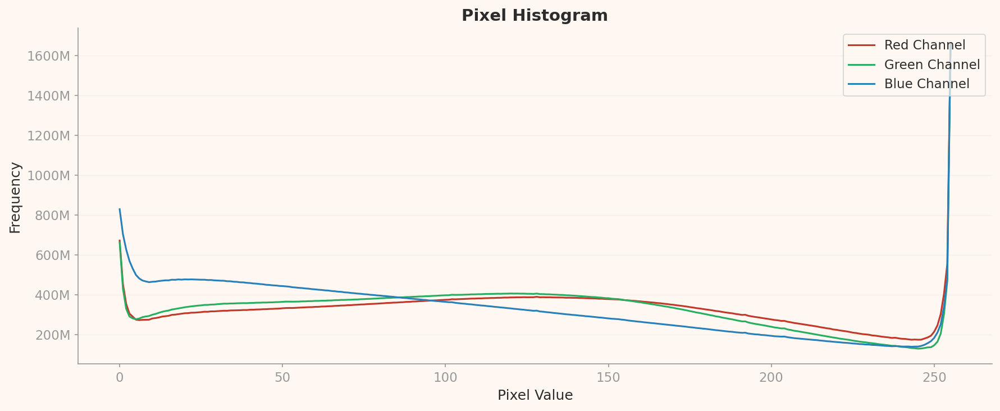
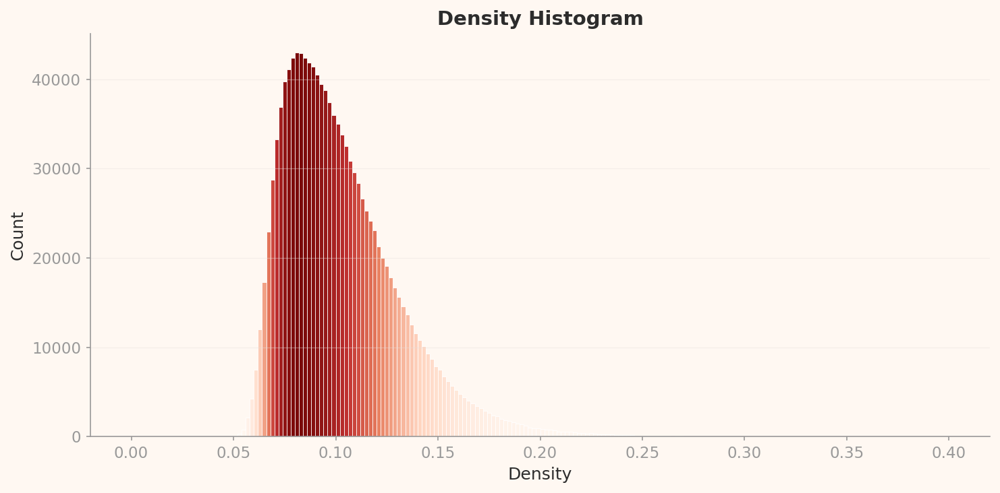
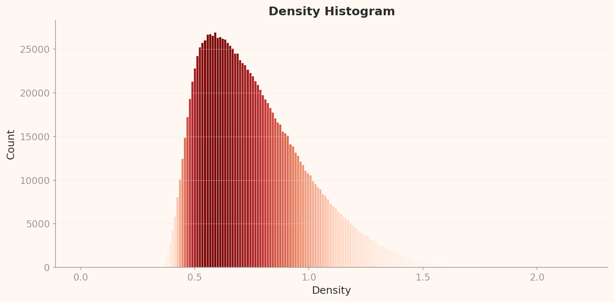

# 딥러닝을 낳은 데이터셋, ImageNet

_DataClinic이 진단한 AI 역사의 어머니 — 1,431,167장의 품질을 해부하다_

## Executive Summary

1,431,167

총 이미지

1,000

클래스

60/100

DataClinic 점수

167GB

데이터셋 크기

> [!callout]
> ImageNet은 AI 역사상 가장 영향력 있는 데이터셋이다. 2012년 AlexNet이 이 데이터셋으로 ILSVRC를 석권하면서 딥러닝 시대가 열렸다. 그러나 DataClinic 진단 점수 60점('보통')은 기술적 측면만의 평가다. 1,431,167장 이미지 속에는 추정 85,870장의 오라벨, 극단적 픽셀 클리핑, 그리고 공작새와 타란툴라가 지배하는 기묘한 밀도 분포가 숨어있다.

> 1,280차원 임베딩에서 공작새가 고밀도 영역의 83%(12개 중 10개)를 차지하고, 122차원 축소 후에는 타란툴라가 그 자리를 대신한다. 쥐덫과 업라이트 피아노가 가장 가까운 이웃이 되고, 삽과 변기 시트가 한 클러스터에 묶인다. 이것이 기계가 보는 세상이며, 이 시각이 10년간 모든 AI 모델에 전이되었다.

> DataClinic 진단은 형식적 무결성과 통계적 속성을 정밀하게 측정하지만, 라벨 정확도, 문화적 대표성, 의미론적 분류 체계의 적절성은 진단 범위 밖이다. ImageNet에서 이 범위 밖의 문제가 더 치명적이라는 사실이, 자동화된 데이터 품질 진단의 가치와 한계를 동시에 보여준다.

## L1: 픽셀이 말하는 것

Level 1은 픽셀 수준의 기초 체력 검사다. DataClinic은 네 가지를 평가한다: 이미지 무결성, 결측치, 클래스 균형, 통계 측정. 겉으로 보면 ImageNet은 탄탄하다. 1,431,167장의 이미지에 결측치가 없고, 98.43%가 RGB, 1,000개 클래스에 평균 1,281.2장씩 고르게 분포한다. 그러나 이 숫자들의 이면에는 API가 말하지 않는 이야기가 있다.

| 평가 항목 | 등급 | 세부 내용 |
| --- | --- | --- |
| 이미지 무결성 | 좋음 | RGB 98.43%, Grayscale 1.57%(22,469장), RGBa 0.0% |
| 결측치 | 좋음 | 결측치 없음 |
| 클래스 균형 | 형식적 양호 | 평균 1,281.2장, 표준편차 70.2, 범위 732~1,300 |
| 통계 측정 | 나쁨 | 이미지 다양성 낮음 — 픽셀 분포에서 극단적 클리핑 발견 |

### 120가지 개 품종이라는 의미론적 불균형

DataClinic은 클래스 균형을 '좋음'으로 판정했다. 수치상으로는 맞다. 클래스당 732~1,300장, 표준편차 70.2. 최소 클래스도 최대 클래스의 56% 수준이니 극단적 불균형은 아니다. 그러나 이 판정은 수량의 균형만 본다.

1,000개 클래스 중 120개(12%)가 개 품종이다. 시베리안 허스키와 알래스칸 맬러뮤트, 노퍽 테리어와 노리치 테리어, 요크셔 테리어와 실키 테리어 — 전문 수의사조차 사진만으로 구분하기 어려운 품종들이 각각 별개의 클래스다. 나머지 880개 클래스는 악기부터 가구, 음식, 차량, 풍경까지 인간 생활 전체를 커버해야 한다. 모델에게 "개 전문가가 되면서 동시에 만물박사가 되라"고 요구하는 구조다.

불일치 D1 (Major) — 클래스 균형 과대평가

DataClinic API는 클래스 균형을 '좋음'으로 판정하지만, 이는 수량적 균형만 반영한다. 1,000개 클래스 중 120개(12%)가 개 품종이라는 의미론적 불균형을 포착하지 못한다. 개 120품종을 구분할 수 있는 사람이 몇 명이나 될까? 이 구조적 편향은 WordNet의 생물학적 분류 체계를 기계적으로 따른 결과이며, DataClinic의 자동 진단이 감지할 수 있는 범위 밖이다.

### 블루 채널 255: 16억 픽셀의 비밀

DataClinic은 통계 측정을 '나쁨'이라고 판정했다. 그러나 왜 나쁜지는 설명하지 않는다. 아래 픽셀 히스토그램이 그 답이다.

*ImageNet 픽셀 히스토그램. X축: 픽셀 값(0-255), Y축: 빈도(M=백만). Blue 채널 pixel=255에서 약 16억 회의 극단적 스파이크가 관찰된다. 이것이 '통계: 나쁨'의 시각적 증거다.*

차트에서 가장 먼저 눈에 띄는 것은 양극단의 스파이크다. Blue 채널 pixel=255에서 약 16억 회의 빈도가 기록되었다. 이것은 중간 범위(50-200) 빈도의 4-5배에 해당하는 극단적인 값이다. pixel=0에서도 Blue 약 8.3억, Green 약 6.8억, Red 약 3.5억의 스파이크가 나타난다.

pixel=255 스파이크의 의미: 완전히 밝은 픽셀이 대량으로 존재한다. Blue 채널이 특히 높다는 것은 파란 하늘과 수면이 포함된 인터넷 이미지의 배경 편향을 반영한다. 흰 배경(R=G=B=255)도 3채널 모두에 기여하지만, Blue가 Red/Green보다 일관되게 높은 것은 추가적인 파란색 편향의 증거다. pixel=0 스파이크는 검은 배경, 패딩, letterboxing, JPEG 압축 아티팩트의 흔적이다.

이 양극단 클리핑은 인터넷 크롤링으로 수집한 이미지의 전형적인 문제다. 카메라 자동 노출 시스템이 밝은 하늘이나 어두운 그림자를 클리핑하고, JPEG 압축이 극단값을 증폭한다. 1,431,167장 규모에서 이 편향은 모델이 '밝기의 극단'에 과적합할 위험을 만든다.

불일치 D2 (Major) — '통계: 나쁨'의 구체적 원인 미설명

DataClinic API는 통계를 '나쁨'이라고만 판정하고, Blue 채널 pixel=255에서의 약 16억 픽셀 스파이크, pixel=0에서의 약 8.3억 픽셀 스파이크라는 구체적 증거를 설명하지 않는다. 전 구간에서 Blue > Green > Red 순서라는 인터넷 이미지의 하늘/수면 배경 편향도 언급되지 않는다. 이 차트 하나가 '나쁨'의 모든 이유를 담고 있다.

### 해상도: 20x17에서 7,056x4,488까지

이미지 크기 범위가 극단적으로 넓다. 최소 20x17px은 실제로 거의 식별 불가능한 수준이고, 최대 7,056x4,488px은 고화질 DSLR 사진이다. 이 400배 이상의 해상도 격차는 인터넷 크롤링의 특성상 불가피하지만, 학습 시 해상도 표준화(보통 224x224px)가 필수인 이유다.

또한 Grayscale 이미지가 1.57% 포함된다. 비율로는 작지만 절대 수로는 약 22,469장이다. RGB 3채널을 가정하는 표준 모델(AlexNet, ResNet, VGG 등)은 이 이미지들을 처리할 때 채널 복제나 별도 전처리가 필요하다. DataClinic은 '채널 주의 필요'라고 표기했지만, 22,469장이라는 규모감은 비율만으로는 전달되지 않는다.

## L2: 범용 AI의 눈 — 1,280차원의 세계

Level 2는 Wolfram ImageIdentify Net V2로 1,431,167장 각각을 1,280차원 벡터로 변환한다. 인간의 눈이 아닌 범용 AI의 눈으로 ImageNet을 관찰하는 단계다. 결과는 직관에 반하는 발견들로 가득하다.

### 클래스 평균 특징 벡터의 PCA 분포

1,000개 클래스 각각의 평균 특징 벡터를 2차원 PCA로 투영하면, 클래스들이 임베딩 공간에서 어떻게 분포하는지 한눈에 볼 수 있다. 아래 차트에서 각 점은 하나의 클래스를 나타내며, 가까이 있는 점들은 신경망이 시각적으로 유사하다고 판단한 클래스들이다.

*L2 PCA 전체 분포. 1,000개 클래스의 평균 특징 벡터를 2D로 투영. 우측 상단에 동물 클래스들이 밀집한 클러스터가 눈에 띈다. 나머지 인공물/도구/가구 클래스들은 넓게 분산되어 있다.*

### 밀도 분포: 공작새의 지배

L2 밀도 히스토그램은 강하게 우편향(right-skewed)된 단봉 분포를 보인다. 피크는 밀도 약 0.085에서 약 43,000 카운트. 대부분의 이미지가 0.05-0.15 밀도 범위에 집중되어 있고, 오른쪽 꼬리가 0.40까지 길게 확장된다. DataClinic은 이를 '분포: 좋음'으로 판정했지만, 이 우편향과 극단적 이상치를 보면 관대한 평가다.

*L2 밀도 분포. 피크 약 0.085에서 43,000 카운트. 공작새 고밀도 샘플(0.32-0.34)은 분포 꼬리의 극단에 위치한다 — 대부분의 이미지와 완전히 다른 밀도 수준.*

이 분포에서 가장 놀라운 발견은 고밀도 이상치의 정체다. 밀도 상위 12개 샘플 중 10개가 공작새(peacock)다. 밀도 0.322-0.344로, 피크(0.085)의 4배에 해당하는 극단적 고밀도. 나머지 2개는 titi(남미 원숭이)와 patas(허스원숭이) — 역시 시각적으로 매우 균일한 영장류 클래스다.

왜 공작새인가? 인터넷에서 "peacock"을 검색하면 답이 나온다. 거의 모든 이미지가 "꼬리를 활짝 펼친 공작새"라는 동일한 구도다. 이 극도의 시각적 균일성이 1,280차원 임베딩 공간에서 극도로 밀집한 클러스터를 형성한다. 공작새는 인터넷이 가장 반복적으로 촬영하는 피사체 중 하나이며, 이 데이터셋이 인터넷의 시각적 편향을 그대로 상속받았다는 증거다.

### 고밀도 이상치: 공작새와 영장류

아래는 L2 밀도 상위 이미지들이다. 공작새의 시각적 균일성이 육안으로도 확인된다.

peacock 0.344

titi 0.338

patas 0.337

peacock 0.331

peacock 0.330

peacock 0.329

peacock 0.324

peacock 0.322

> [!callout]
> 배치 편향 관찰: 고밀도 상위 12개 중 10개가 peacock 클래스에 집중되어 있다. 공작새 이미지의 극단적 시각적 균일성(펼친 깃털이라는 거의 동일한 구도)이 임베딩 공간에서 밀집 클러스터를 형성한 결과다. 이것은 데이터 오류가 아니라 인터넷 이미지 수집의 구조적 특성이다.

### 저밀도 이상치: 플루트와 렌즈 캡

반대편 극단 — 가장 밀도가 낮은 이미지들 — 은 모두 인공물(artifact) 클래스다. 플루트(0.023), 렌즈 캡(0.026), 에스프레소 메이커(0.026). 이 클래스들이 저밀도인 이유는 직관적이다: 다양한 각도, 맥락, 배경에서 촬영되어 임베딩 공간에서 넓게 산재한다.

flute 0.023

lens cap 0.026

espresso maker 0.026

coffeepot 0.032

플루트는 수평으로 놓이거나, 수직으로 세워지거나, 케이스에 담긴 상태로 촬영된다. 렌즈 캡은 크기, 색상, 브랜드에 따라 외양이 완전히 다르다. 에스프레소 메이커는 크롬 광택의 상업용부터 가정용 모카포트까지 형태가 다양하다. 이것이 '시각적으로 정의하기 어려운 클래스'의 증거이며, 공작새의 시각적 획일성과 정확히 반대되는 양상이다.

### 밀도 지형도: 클러스터의 입체적 모습

2D 밀도 지형도는 임베딩 공간에서 이미지들이 어디에 밀집하고 어디에 희박한지를 등고선으로 보여준다. 빨간색/노란색 영역이 고밀도 클러스터이며, 파란색/보라색 영역이 저밀도 지역이다.

*L2 밀도 지형도. 등고선이 밀집한 영역이 고밀도 클러스터 — 동물 클래스들(개 품종, 공작새, 영장류)이 집중된 지역. 등고선이 드문 외곽이 인공물, 도구, 가구 클래스들.*

## L3: 의미를 읽는 AI — 122차원의 정밀 관찰

Level 3는 동일한 Wolfram ImageIdentify Net V2 기반에서 ImageNet 데이터셋에 최적화된 122차원 렌즈를 적용한다. 1,280차원에서 122차원으로 약 10분의 1로 축소하는 과정에서, 클래스 구별에 가장 유효한 특징만 보존된다. L2에서 공작새가 지배했다면, L3에서는 전혀 다른 클래스가 부상한다.

### L3 PCA: 더 선명해진 클러스터

122차원으로 축소된 임베딩에서 PCA를 수행하면, L2보다 클래스간 경계가 더 선명하게 드러난다. 차원 축소가 노이즈를 제거하고 클래스 구별력을 높인 결과다.

*L3 PCA (122차원). L2와 비교하면 클래스간 경계가 더 뚜렷하다. 차원 축소가 노이즈를 제거하고 클래스 구별 특징을 강화한 결과.*

### 밀도 분포: 타란툴라의 부상

L3 밀도 히스토그램은 L2와 같은 우편향 단봉 분포이지만, 스케일이 완전히 다르다. 피크는 밀도 약 0.575에서 약 27,000 카운트. L2의 피크(밀도 0.085, 43,000 카운트)와 비교하면, 전체 밀도가 상승하고 피크 카운트는 감소했다 — 이미지들이 더 넓은 밀도 범위로 분산된 것이다.

*L3 밀도 분포. 피크 약 0.575에서 27,000 카운트. 타란툴라 고밀도 샘플(2.01-2.08)은 피크의 3.5배 밀도에 위치 — 분포 본체에서 극도로 격리된 이상치다.*

L3 고밀도 상위 12개 중 10개가 타란툴라(tarantula), 나머지 2개가 골프 공(golf ball)이다. L2에서 공작새가 지배했던 자리를 타란툴라가 대체했다. 이 전환은 이 스토리의 가장 흥미로운 발견 중 하나다.

왜 타란툴라인가? 122차원 축소가 클래스 구별 특징을 보존하는 과정에서, 타란툴라의 시각적 특징 — 검은 몸통, 방사형으로 뻗은 다리, 높은 명암 대비 — 이 극도로 압축 효율이 높은 패턴으로 부상했다. 골프 공도 같은 논리다: 흰 구체 + 딤플이라는 단순하고 반복적인 시각 구조. 두 클래스의 공통점은 단순하고 반복적인 시각 구조, 높은 대비, 일관된 촬영 각도다.

tarantula 2.08

tarantula 2.06

golf ball 2.04

tarantula 2.01

### L2 vs L3: 차원 축소가 바꾸는 것, 바꾸지 못하는 것

두 레벨의 비교는 차원 축소의 효과와 한계를 동시에 보여준다.

| 비교 항목 | L2 (1,280차원) | L3 (122차원) |
| --- | --- | --- |
| 밀도 피크 | ~0.085 (43,000건) | ~0.575 (27,000건) |
| 고밀도 지배 클래스 | peacock (10/12) | tarantula (10/12) |
| 저밀도 이상치 | flute (0.023) | lens cap (0.146) |
| 저밀도 클래스 구성 | 인공물: flute, lens cap, espresso maker | 동일 클래스 유지 |
| DataClinic 판정 | 기하: 좋음, 분포: 좋음 | 기하: 좋음, 분포: 좋음 |

차원 축소가 바꾸는 것: 고밀도 지배 클래스(peacock에서 tarantula로). 바꾸지 못하는 것: 저밀도 이상치의 구성(flute, lens cap, espresso maker는 차원과 무관하게 계속 이상치). 이것은 이 클래스들의 시각적 비일관성이 차원에 의존하지 않는 본질적 특성임을 의미한다.

*L3 밀도 지형도 (122차원). L2와 비교하면 등고선 분리가 더 선명하다. 고밀도 영역의 지배 클래스가 peacock에서 tarantula로 전환된 것이 이 차원 축소의 가장 뚜렷한 효과.*

## 클래스 혼동: 120가지 개 품종 딜레마

ImageNet의 1,000개 클래스 중 120개가 개 품종이라는 사실은 널리 알려져 있지만, 이것이 모델 학습에 미치는 구체적 영향은 잘 논의되지 않는다. DataClinic의 유사도 분석은 여기서 예상치 못한 발견들을 제공한다 — 개 품종 간의 혼동이 아니라, 완전히 다른 물체가 같은 클러스터에 묶이는 현상이다.

### 쥐덫과 업라이트 피아노: 나무 + 금속의 친연성

DataClinic 유사도 분석에서 mousetrap(쥐덫)의 가장 가까운 이웃은 upright piano(업라이트 피아노)와 laptop(노트북 컴퓨터)이었다. 인간에게 이 세 물체는 완전히 다른 카테고리지만, 신경망은 "나무 프레임 + 금속 메커니즘 + 직사각형 구조"라는 시각적 패턴을 공유한다고 판단했다.

mousetrap

~

upright piano

~

laptop

### 삽, 변기 뚫는 기구, 변기 시트: 긴 손잡이의 세계

shovel(삽)의 가장 가까운 이웃은 plunger(변기 뚫는 기구)와 toilet seat(변기 시트)였다. 공유하는 시각적 패턴은 "긴 손잡이 + 끝부분의 원형/타원형 구조". '손잡이 달린 도구'라는 시각적 카테고리가 의미론적 카테고리를 초월하는 사례다.

shovel

~

plunger

~

toilet seat

### 진공청소기, 잔디 깎는 기계, 트랙터: 바퀴 달린 기계들

L3(122차원)에서 새롭게 발견된 유사도 쌍이다. vacuum(진공청소기)의 가장 가까운 이웃이 lawn mower(잔디 깎는 기계)와 tractor(트랙터). "바퀴 달린 기계"라는 시각 패턴이 L3의 축소된 차원에서 더 선명하게 드러난 것이다. 이 쌍은 L2에서는 나타나지 않았다 — 차원 축소가 '바퀴 + 기계' 특징을 더 중요하게 가중한 결과다.

vacuum

~

lawn mower

~

tractor

이 유사도 쌍들이 말하는 것은 명확하다. 신경망은 '의미'가 아닌 '시각적 패턴'으로 세상을 이해한다. 나무 프레임이면 쥐덫이든 피아노든 같은 동네에 산다. 이 시각이 ImageNet 사전학습을 통해 10년간 수천 개의 AI 모델에 전이되었다. 전이학습(transfer learning)으로 ImageNet 가중치를 가져다 쓰는 모든 모델은 "삽과 변기 시트가 비슷하다"는 판단을 기본값으로 상속받는 것이다.

### 개 120품종: 인간도 구분하지 못하는 경계

ImageNet의 120개 개 품종 문제는 위의 교차 클래스 혼동과는 다른 차원의 문제다. 시베리안 허스키와 알래스칸 맬러뮤트, 노퍽 테리어와 노리치 테리어 — 이 품종들의 시각적 차이는 전문가가 아니면 구분하기 어렵다. WordNet의 생물학적 분류 체계를 기계적으로 따른 결과이지만, 실질적으로 모델에게 "개 전문가 자격증"을 요구하는 구조다.

이 120개 품종에 각각 약 1,281장이 할당되어 있으므로, 전체 데이터셋의 약 153,720장(10.7%)이 개 이미지다. 모델의 학습 용량 중 상당 부분이 개 품종 구분에 할당되며, 나머지 880개 클래스(악기, 가구, 음식, 차량 등 인간 생활 전체)에는 상대적으로 적은 용량이 배분된다.

### 전통적 혼동 쌍: Tench vs Goldfish

ImageNet의 고전적 혼동 사례다. tench(민물고기) 이미지의 대다수는 낚시꾼이 물고기를 손에 들고 찍은 사진이다. 모델은 "tench"를 식별하는 것이 아니라 "낚시꾼 손 위의 물고기"라는 맥락을 학습한다. goldfish(금붕어)는 유리 어항 속 이미지가 지배적이다. 생물학적 차이보다 촬영 맥락(context)이 더 강한 신호가 되는 맥락 편향(Context Bias)의 대표 사례다.

Tench 평균 이미지  
낚시꾼의 손 위

VS

Goldfish 평균 이미지  
유리 어항 속

두 물고기의 평균 이미지 차이는 생물학적 차이보다 촬영 환경의 차이를 반영한다.

### Sports Car vs Convertible: 경계 없는 분류

컨버터블은 스포츠카의 하위 개념이다. 지붕이 열린 스포츠카는 동시에 두 클래스에 속할 수 있다. ImageNet에서 이 두 클래스는 가장 혼동 빈도가 높은 쌍 중 하나이며, 평균 이미지가 거의 동일하게 보인다.

Sports Car

≈

Convertible

두 클래스 평균 이미지가 육안으로 구별이 어렵다. 모델도 마찬가지다.

## 라벨 노이즈: 85,870장의 진실

6%라는 숫자는 작아 보인다. 그러나 절대 수로 환산하면 이야기가 달라진다. Northcutt et al.(2021, Cornell AI Lab)의 연구는 ImageNet 검증 세트에서 약 6%의 라벨 오류율을 보고했다. 이 비율을 전체 1,431,167장에 적용하면 약 85,870장의 잘못 라벨링된 이미지가 존재하게 된다.

85,870장. 이것은 많은 소규모 AI 프로젝트의 전체 데이터셋보다 큰 수다. 이 오라벨된 이미지들이 10년간 수천 개의 AI 모델에 "정답"으로 주입되었다. 전이학습으로 ImageNet 사전학습 가중치를 사용하는 모든 모델 — ResNet, VGG, EfficientNet, 그리고 초기 CLIP까지 — 이 이 오류를 기본값으로 상속받았다.

불일치 D3 (Major) — 60점 '보통'의 구조적 맹점

DataClinic의 60점은 형식적 무결성(파일 존재, 라벨 매핑, 채널 일관성)과 통계적 속성(분포, 기하)만 반영한다. 라벨 정확도(6% 오류), 문화적 대표성(서구 중심 이미지), 의미론적 분류 체계 적절성(120개 개 품종), 개인정보(사람 이미지, 2019년 이후 일부 삭제)는 진단 범위 밖이다. 따라서 60점은 '최선의 경우' 점수이며, 이 범위 밖의 문제를 포함하면 실제 데이터 품질은 이보다 낮을 가능성이 높다.

### 라벨 오류의 세 가지 유형

ImageNet의 라벨 오류는 단순한 실수가 아니라 구조적 문제의 반영이다. 주요 유형은 세 가지다.

- 다중 레이블 문제 — 이미지에 여러 물체가 있을 때, 어느 것이 정답인가? 개 + 프리스비 이미지에서 "Labrador Retriever"와 "Frisbee" 중 하나만 정답이 될 수 없다. ImageNet은 단일 라벨만 허용하므로 구조적 모호성이 발생한다.
- 계층 레이블 모호성 — "Persian cat"과 "tabby"는 동시에 성립할 수 있다. 줄무늬 패턴을 가진 페르시아 고양이는 두 클래스 모두에 해당한다. WordNet의 계층 구조가 이 모호성을 해결하지 못한다.
- WordNet 동음이의어 — "cardigan"이 의류(니트 상의)와 개 품종(Cardigan Welsh Corgi) 두 가지 의미를 가져 혼용이 발생한다. "stretcher"도 의료용 들것과 캔버스 틀 두 의미가 혼재한다.

> [!callout]
> 라벨 노이즈의 역설: 6%의 라벨 오류가 있는 ImageNet으로 학습한 ResNet은 97%+ 정확도를 달성했다. 충분한 규모의 데이터가 있으면 어느 정도의 라벨 노이즈는 학습 중 자연스럽게 평균화된다. 그러나 이것이 라벨 품질을 소홀히 해도 된다는 의미는 아니다. 소규모 도메인 특화 데이터셋에서 라벨 노이즈는 치명적이며, 대규모 데이터셋에서도 편향의 누적은 전이학습을 통해 전파된다.

### 데이터 누출: 12,195쌍의 중복

라벨 오류 외에도, Barz & Denzler(2020) 연구는 ImageNet에서 12,195쌍의 준중복(near-duplicate) 이미지를 발견했다. 동일 이미지의 서로 다른 크롭, 연속 촬영(burst shot), 미러링 버전 등이다. 학습/검증 세트 간 이런 중복이 존재하면 모델 성능이 과대평가되는 '데이터 누출(Data Leakage)' 문제가 발생한다.

DataClinic의 Data Diet(데이터 다이어트) 권고는 이 중복 이미지들을 가장 직접적으로 겨냥한다. 그러나 DataClinic은 '라벨 정합성에 문제 없음'이라고 판정했다. 이것은 '파일명-클래스 매핑이 존재하고 일관적인가'를 검사한 것이지, 라벨이 실제 이미지 내용과 일치하는지를 검증한 것이 아니다. 사용자가 '라벨에 문제 없음'을 '라벨이 정확함'으로 오해할 위험이 있다.

## ImageNet의 유산과 한계

ImageNet이 없었다면 딥러닝 혁명도 없었다. 2009년 Fei-Fei Li 연구팀이 공개한 이 데이터셋은, 2012년 AlexNet이 ILSVRC Top-5 오류율을 26.2%에서 15.3%로 낮추면서 딥러닝 시대를 열었다. 이후 VGGNet(2014), GoogLeNet(2014), ResNet(2015) 등 모든 랜드마크 모델이 ImageNet으로 검증되었고, 사전학습 가중치가 전이학습의 표준이 되었다.

그러나 이 유산에는 그림자가 있다. ImageNet의 편향 — 서구 중심 이미지, AMT(Amazon Mechanical Turk) 라벨링 품질의 한계, 120개 개 품종 편중, 6% 오류율 — 이 10년간 수천 개 사전학습 모델에 '박혔다'. 전이학습으로 ImageNet 가중치를 사용하는 모든 모델이 이 편향을 상속받는다.

### AI 데이터의 진화: 2009-2026

2009

ImageNet 공개 — 딥러닝의 씨앗

1.4M 이미지, 1,000 클래스, Amazon Mechanical Turk 수작업 레이블. ILSVRC 대회로 딥러닝 혁명 촉발.

2012

AlexNet — 패러다임 전환

Top-5 오류율 15.3%. GPU + 딥러닝 + ImageNet의 시너지. AI 겨울의 종식.

2014

MS-COCO — 맥락의 시대

330K 이미지, Bounding Box + Caption. 단순 분류를 넘어 물체 검출과 이미지 설명으로.

2015

ResNet — ImageNet에서 인간을 넘다

152층, Top-5 오류율 3.57%. ImageNet에서의 인간 오류율(~5%)을 하회.

2017

JFT-300M — 웹스케일의 등장

Google 내부 3억 이미지, 약한 레이블. 수작업 한계 돌파, 규모가 품질을 대체하기 시작.

2021

LAION-5B + Northcutt 연구

58.5억 이미지-텍스트 쌍으로 CLIP 학습. 같은 해, Northcutt et al.이 ImageNet의 6% 라벨 오류를 보고.

2023-2024

LLM + 멀티모달 시대

GPT-4V, Gemini가 'closed-set' 분류 개념을 해체. 클래스 목록 없이 어떤 이미지도 설명하는 시대.

2025+

Physical AI — 다음 프론티어

로봇 조작 궤적, 1인칭 동영상, 촉각 데이터. 디지털 이미지를 넘어 물리 세계의 행동 데이터로.

ImageNet에서 Physical AI 데이터까지의 여정은 세 가지 전환을 보여준다. 첫째, 레이블의 해방 — 수작업(ImageNet)에서 약한 감독, 자기지도학습으로. 둘째, 닫힌 세계에서 열린 세계로 — 1,000 클래스에서 무한한 열린 어휘로. 셋째, 디지털에서 물리로 — 사진에서 힘, 저항, 촉각 데이터로. 그러나 패러다임이 아무리 변해도, "내 데이터에는 어떤 문제가 있는가?"라는 질문의 중요성은 변하지 않는다.

## 개선 제안

DataClinic은 두 가지를 권고했다: 데이터 다이어트(고밀도 중복 제거)와 데이터 벌크업(저밀도 영역 보강). 이 권고는 합리적이지만, ImageNet의 근본 문제에 대해서는 추가적인 제안이 필요하다.

### 1. 의미론적 클래스 재구조화

120개 개 품종을 "개" 상위 클래스 아래 계층적으로 통합하고, 해방된 용량을 인공물, 장면, 행동 등 부족한 카테고리에 재배분한다. 현재 구조는 WordNet의 생물학적 분류를 기계적으로 따른 것이므로, 시각적 구별 가능성을 기준으로 재설계할 필요가 있다.

### 2. 고밀도 클러스터 다이어트

peacock, tarantula, golf ball 등 극단적 고밀도 클래스에서 시각적으로 거의 동일한 이미지를 선별적으로 제거한다. DataClinic의 밀도 기반 이상치 분석이 이 작업을 효과적으로 안내할 수 있다. 다만, 오라벨된 85,870장 위에 벌크업을 적용하면 오라벨 위에 더 많은 데이터를 쌓는 것이므로, 벌크업 전에 라벨 정제가 선행되어야 한다.

### 3. 라벨 정제 파이프라인 적용

Confident Learning(Northcutt et al.)이나 CleanLab 등의 자동 라벨 정제 도구를 적용하여 고신뢰도 오라벨을 식별하고 수정한다. 특히 다중 레이블 문제(개 + 프리스비)와 WordNet 동음이의어(cardigan) 문제에 집중한다.

### 4. 저밀도 클래스 보강

flute, lens cap, espresso maker 등 시각적 정의가 어려운 저밀도 클래스에 다양한 각도, 맥락, 배경의 이미지를 추가한다. 합성 이미지(Stable Diffusion 등)를 활용하되, 합성 데이터의 분포 편향을 별도로 검증해야 한다.

### 5. 픽셀 클리핑 전처리

Blue 채널 pixel=255의 16억 픽셀 스파이크와 pixel=0의 8.3억 픽셀 스파이크에 대한 전처리 파이프라인을 구축한다. 클리핑된 극단값을 히스토그램 정규화(histogram normalization)로 완화하면 모델의 밝기 극단 과적합 위험을 줄일 수 있다.

진단 결과 요약

| 항목 | 결과 | 비판적 재해석 |
| --- | --- | --- |
| 종합 점수 | 60점 (보통) | 기술적 측면만의 점수. 라벨 오류, 편향 미반영. |
| 클래스 균형 | 형식적 양호 | 수량 양호, 의미론적 불균형(120 개 품종 12%). |
| 통계 측정 | 나쁨 | Blue 255 클리핑 16억, pixel=0 클리핑 8.3억. |
| L2 고밀도 지배 | peacock 10/12 | 인터넷 이미지 시각적 균일성의 직접 증거. |
| L3 고밀도 지배 | tarantula 10/12 | 차원 축소 후 압축 효율 높은 패턴이 부상. |
| 라벨 오류 (외부) | ~6% (85,870장) | DataClinic 진단 범위 밖. 실제 품질 하한. |
| 개선 방향 | Diet + Bulk-up | 합리적이나, 라벨 정제가 선행되어야 효과적. |

[DataClinic 리포트 #123 전체 보기](https://dataclinic.ai/en/report/123)

<!-- stat-card -->
**페블러스가 이 데이터셋에 주목하는 이유** — ImageNet은 1,431,167장이라는 규모가 품질 문제를 가려온 대표적 사례다. Blue 채널 16억 픽셀 클리핑, 공작새/타란툴라의 밀도 지배, 120개 개 품종의 의미론적 편향 — 이 문제들은 수동 검토로는 감지하기 어려운 규모에서 작동한다. — [DataClinic](https://dataclinic.ai)이 진단하는 밀도 기반 이상치, 클래스 간 분포 불균형, 픽셀 수준 통계 편향은 이 데이터셋에서 모두 확인되었다. 데이터가 커질수록, 자동화된 품질 진단 없이는 이런 문제를 발견하는 것조차 불가능해진다.
