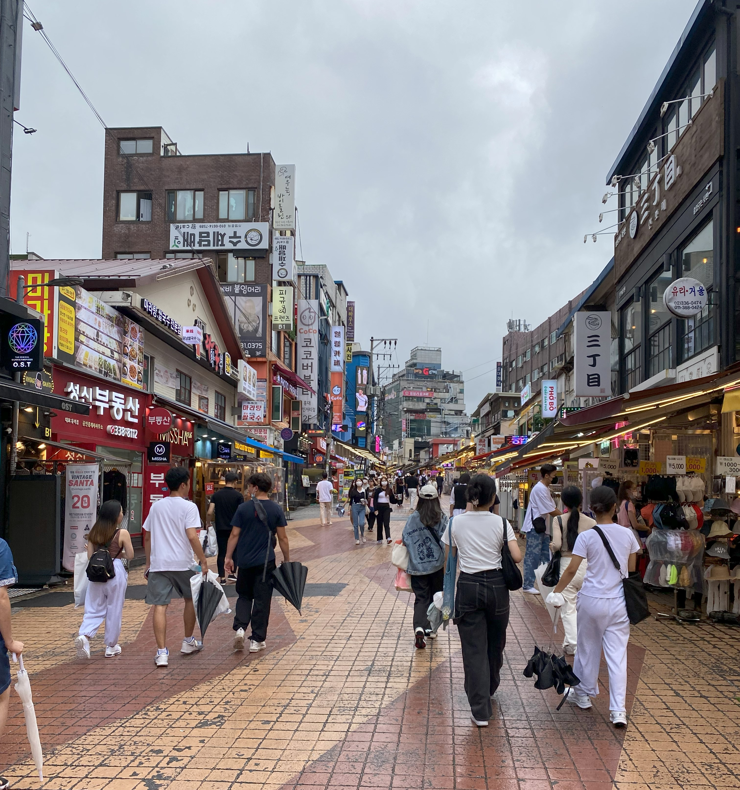

# Why the Most 

_A DataClinic Diagnosis of 970,000 K-Fashion Images_

## Executive Summary

> [!callout]
> This story is built on **[DataClinic Report #127](https://dataclinic.ai/report/127)**. The subject is AI Hub's **K-Fashion** image dataset: **967,806** Korean fashion photos labeled across **24 styles**, from Street, Modern, Romantic and Feminine to Punk and Hip-hop. We looked at all of it through DataClinic's three-stage lens.

> The official scorecard looks excellent. The style-classification benchmark published by AI Hub reports **Recall@3 of 91.11%**. By the numbers, this is "data that works." But once DataClinic unfolds the distribution, three things accuracy was hiding come into view: an extreme imbalance in which a single Street class makes up **46.5%** of everything, batches of nearly identical photos from a single shoot (near-duplicates), and a **blurriness in the style boundaries** that even humans struggle to agree on.

> The sharpest piece of evidence was the #1 and #2 "**most typical Street**" images surfaced by the class-discriminative lens (L3). Open them up and you find a clearly Romantic look: a floral chiffon blouse and skinny jeans against a white studio backdrop. Meanwhile, an oversized graphic sweatshirt shot by a city window was pushed out as "atypical." The "typical Street" the AI had learned wasn't the clothing. It was the **shooting format**. This story follows that paradox through the actual images.

967,806

Images diagnosed

24

Style classes

46.5%

Street share (largest)

382

Punk images (smallest)

## The Dataset — 970,000 Korean Fashion Photos

*▲ Hongdae, Seoul (2022). Real K-Fashion context — city streets, people, movement — in contrast to the dataset's studio lookbook frames. | Source: [Wikimedia Commons](https://commons.wikimedia.org/wiki/File:Street_hongdae_Seoul.jpg) (CC BY-SA 4.0)*

## L1 — Hygiene Passes, Diversity Raises a Question

## L2 — 24 Styles Seen Through a General-Purpose Lens

## L3 — Looking Again Through the Class-Discriminative Lens

## What "the Most Street" Really Is

> [!callout]

## Real-World Impact — If You Train Fashion AI on This Data

### ⚠️ Scenario: When you search for "street look"

## Conclusion — A Correct Label Doesn't Make the Data Right

| Frame | What it compares | What it reveals |
| --- | --- | --- |
| ① Official 91% ↔ Structure | AI Hub style-classification Recall@3 91.11% vs DataClinic distribution analysis | Accuracy doesn't show the imbalance, batch shooting, or blurred label boundaries. Near-duplicates can even inflate accuracy through leakage. |
| ② Subjective-style domains | Datasets with fuzzy boundaries — WikiArt (art movements), Places365 (places), Korean food, etc. | Labels as subjective as style, genre or taste, the kind people rarely agree on, produce overlapping clusters. K-Fashion falls into the same trap, with imbalance and batch bias added on top. |
| ③ Class imbalance | Street 449,494 images vs Punk 382 images | A gap of about 1,177×. A long tail where the standard deviation (91,811) exceeds the mean (40,325). Minority classes are hard to learn well. |

## References

### Diagnostic Report

- 1.DataClinic. (2026). [K-Fashion Image DataClinic Diagnostic Report #127](https://dataclinic.ai/report/127). DataClinic (Pebblous Inc.)

### Dataset & Technical Documentation

- 2.OpinionLive (with Ewha Womans University, Korea Fashion Industry Research Institute, AI.M, Wearly). (2020). [K-Fashion Image Dataset (Dataset No. 51)](https://www.aihub.or.kr/aihubdata/data/view.do?currMenu=115&topMenu=100&dataSetSn=51). AI Hub. 66,321 views · 4,059 downloads (as of 2026-06). Style classification Recall@3 91.11%, item detection AP@50 81.48%.
- 3.Wolfram Research. (2023). [Wolfram ImageIdentify Net V2](https://resources.wolframcloud.com/NeuralNetRepository/resources/Wolfram-ImageIdentify-Net-V1/). Wolfram Neural Net Repository. Used as the base neural network for DataClinic L2/L3 analysis (observation dimension L2: 1,280, L3: 150).
