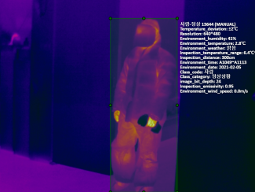
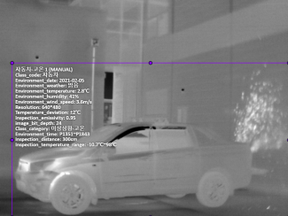
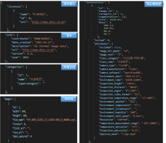
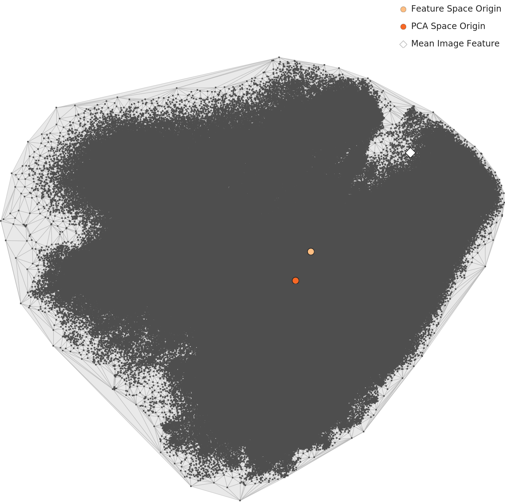
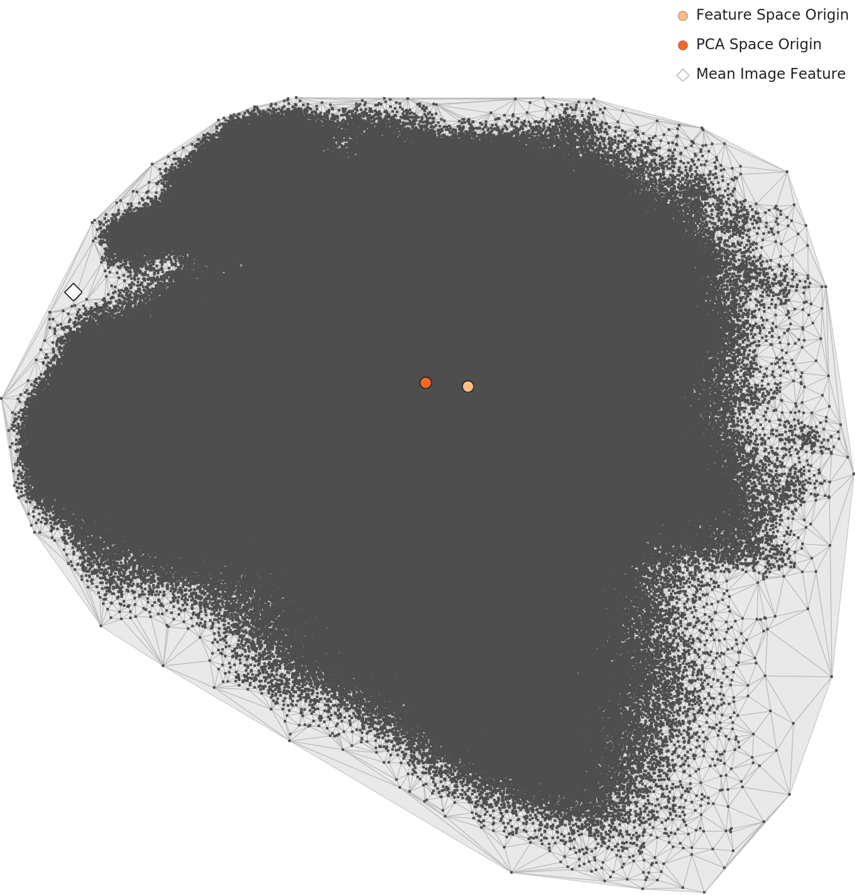

# When AI Sees a 

_1.22M Industrial Thermal Images Diagnosed by DataClinic_

## Executive Summary

> [!callout]
> **1.22 million thermal images** were gathered to teach AI to spot fires, leaks, and overheating across industrial complexes. AI Hub's [Thermal Camera Image Dataset](https://aihub.or.kr/aihubdata/data/view.do?currMenu=115&topMenu=100&aihubDataSe=data&dataSetSn=235) (dataSetSn=235) photographs 10 object types (storage tank, transport pipe, transport valve, switchboard, AC outdoor unit, factory exterior/interior, person, car, ship) in both normal and anomaly states. Across 20 classes, that is **1,223,849** images. [DataClinic Report #128](https://dataclinic.ai/en/report/128) shows where this asset is solid and where it is still soft.

> At L1, image channels split into 80% RGBa and 20% RGB, and class counts span an **11.14×** spread. In L2's generic neural lens (1,280 dimensions), the median density gap between normal and anomaly sits around 0.45. Switch to L3's domain-optimized lens (120 dimensions) and that gap widens to roughly **1.3, almost 3× wider**. Dimensionality optimization sharpens the classification boundary.

> Yet some signals remain unreachable by dimensions alone. **The most typical Pipe-Normal image (density 2.77)** and **Pipe-Leak (median ≈ 1.0)** form the dataset's most dramatic contrast within a single domain, while the low-density outliers in Person-Normal (D1) and Car-Normal (D30) recur as the same images at rank 1–2 in both L2 and L3. Meanwhile, the high-density top of Person-Anomaly-Identify is occupied by files named `CAR_AON_21.02.05_…_D20_`: bboxes from a car-anomaly capture session that ended up labeled as person-anomaly. Three threads of the same diagnosis, lined up on one page.

20

classes (10 objects × normal/anomaly)

1.22M

images diagnosed

11.14×

class imbalance (max/min)

3×

L2→L3 separation widening

> [!callout]
> ⚠️ **Note on missing scores** — DataClinic's composite score and L1/L2/L3 grades are gated behind authentication and were not collected by this pipeline. The article avoids asserting absolute scores and grounds its analysis in qualitative findings about distributions, outliers, and labels. Neighbor-report scores appear only in the Comparison Frame section.

### 📊 DataClinic's Three-Level Diagnostic System

<!-- stat-card -->
**DataClinic looks at a dataset through three lenses of increasing depth. It starts with surface statistics, moves to a generic neural view, and ends with a view tuned to the domain. Each level surfaces finer quality issues than the last.** — L1Basic Quality Diagnostic — Checks dataset hygiene: image channels, resolution, missing values, class balance. This is where the dataset's mixed RGB/RGBa channels and 11× class imbalance first surface. — L2DataLens — Generic Neural Net (1,280 dim) — Analyzes distribution, geometry, and density in Wolfram ImageIdentify Net V2's 1,280-dimensional feature space. Every image is first seen as a "general image." — L3Domain-Optimized Lens (120 dim) — Reduces dimensions to fit the domain so its native patterns surface. For this dataset, 1,280 dimensions compress to 120 (≈10.7×), and normal-vs-anomaly separation sharpens about 3×.

## Dataset Overview — 1.22M Images Built to Detect Industrial Disasters

Fire, leaks, and overheating are among the most common — and most belatedly noticed — accidents in industrial complexes. By the time the human eye catches them, it is usually too late. Thermal cameras can see the warning signs earlier, and an AI that reads those thermal frames automatically can sound the alarm earlier still. The **Thermal Camera Image Dataset** (AI Hub `dataSetSn=235`) is a national-scale AI training dataset built to train exactly that alarm system.

Ten object types common in industrial environments were photographed in both normal and anomaly states. Normal frames totaled 770,765 and anomaly frames 263,864 (1,034,629 in all). The cropped-to-bbox version is the subject of this diagnostic: **20 classes, 1,223,849 images**. The dataset was led by NH Networks with Dongwon Safety System, Tium Welfare Foundation, and VTW Inc. as participating partners.

▲ A cross-section of 20 classes across 1.22M frames — the signature palette of industrial thermal imagery: orange-yellow heat sources floating on purple-blue cooled backgrounds.

What this dataset is and the conditions under which it was collected come down to three metadata axes. 640×480 PNGs encode temperatures from -20°C to 1000°C (±2°C accuracy), the same objects are shot at distances from 20cm to 90m and tagged with distance tokens D0.5–D200, and collection ran continuously for six months from September 2020 through February 2021. These three axes — temperature range, shooting distance, collection window — determine where and how the distribution splits in the L2 and L3 analyses that follow.

### Thermal Specs

### Shooting Distance

### Collection Window

> [!callout]

*▲ Person-Normal — sample with annotation metadata overlay (640×480 · D3 · 2.8°C)*

*▲ Car — same half-hour session, identical environment, different object class*

*▲ Official AI Hub annotation JSON schema — even the metadata fields this diagnosis does not touch, laid out side by side. | Source: [AI Hub](https://aihub.or.kr/aihubdata/data/view.do?currMenu=115&topMenu=100&aihubDataSe=data&dataSetSn=235)*

## L1 — Hygiene Passes, but Two Signals Surface in Channels and Class Balance

### 80% RGBa + 20% RGB — Channels split two ways

### 11.14× class spread — Car-Normal vs. Ship-Overheat

#### Image count by class (top 6 + bottom 4)

### Cold Background, Narrow Heat Source — Industrial Thermal Color Splits in Two

### The Blurrier the Mean, the More Restless the Class — Three Normal/Anomaly Pairs to Pre-read

## L2 — Where Normal First Splits From Anomaly

### Distribution Splits in Two — A Left Mound and a Tight Spike at 0.68

### Normal and Anomaly Diverge by 0.45 — but Each Class Drifts Even Wider

### The Mean Image Sits at the Edge, Not the Center — PCA's Quiet Warning

### Same Pipe, Two Distributions — L2's First Visualization of the Normal/Anomaly Asymmetry

## L3 — Fold the Dimensions, and the Normal/Anomaly Gap Widens 3×

### The Narrow Spike Dissolves into a Plateau — A Distribution Reshaped by Dimensional Optimization

### What the Box Chart Shows — Separability Stretches from 0.45 to 1.3 (3× Wider)

### Same Class, Same Position, Wider Gap — Four Pairs Revisited in L3

### What PCA 2D Cannot Show — A Single Blob Hides the Dimensional Achievement

*L2 PCA — 1,280 dim → 2D*

*L3 PCA — 120 dim → 2D*

## Two Things Dimensions Could Not Reach

### Person-Normal D1 — the statelessness of a 1m close-up

### Car-Normal D30 — two normals inside one class

#### L2/L3 shared low-density outliers — TOP-5

| Rank | Class | Distance | L2 density | L3 density | L2/L3 match |
| --- | --- | --- | --- | --- | --- |
| 1 | Person-Normal | D1 | 0.066 | 0.411 | ✅ same image |
| 2 | Car-Normal | D30 | 0.070 | 0.426 | ✅ same image |
| 3 | Person-Anomaly-Identify | D5 | 0.069 | 0.447 | ✅ same image |
| 4 | Car-Normal | D30 | — | 0.456 | L3 new |
| 5 | Car-Normal | D25 | 0.071 | 0.471 | ✅ same image |

## There's a Car Inside Person-Anomaly — Tracks of Label Contamination

#### The CAR_AON cluster inside Person-Anomaly-Identify (L3 top-10 similarity)

> [!callout]

## Real-World Impact — When AI Reads a 'Leak' as Normal

### ⚠️ Scenario: Same pipe, different distribution — 1m normal vs. 0.5m leak

### 🔄 When 1m and 30m turn the same car into two normals

### ✅ Direction of the fix — standardize at the collection stage

- ① Standardize camera distance tokens (D1, D30) to 1m increments and split the extremes into separate subclasses
- ② Unify RGB and RGBa channels into a single format
- ③ Audit the bbox labeling procedure for multi-object frames, especially person regions extracted during car-anomaly shoots

## Comparative Frame — More Standardizable than Waste, Yet Standardization Left Unfinished

## Conclusion — What Dimensions Can Sharpen vs. What the Camera Must Standardize

| Item | Finding | One-line assessment |
| --- | --- | --- |
| L1 channels | RGBa 80% + RGB 20% | Unify to a single format before training |
| L1 class balance | 11.14× spread | Apply class weighting during training |
| L2 → L3 separation | Median gap 0.45 → 1.3 (≈ 3×) | A clear win for dimensionality optimization |
| L2/L3 shared low-density | 4 of 5 are the same image | A collection-scale problem dimensions cannot fix |
| Car-Normal distribution | D3 (2.7) vs. D30 (0.43–0.47) | Two normals in one class — distance standardization needed |
| Pipe normal/anomaly contrast | 2.77 vs. 1.0 | Most dramatic signal — threshold-design gray zone |
| Person-Anomaly label contamination | CAR_AON_21.02.05 batch dominates | Bbox labeling procedure needs review (HIGH) |

## References

### Dataset

- 1.NH Networks et al. (2021). _Thermal Camera Image Dataset_. Korea NIA (AI Hub). [aihub.or.kr · dataSetSn=235](https://aihub.or.kr/aihubdata/data/view.do?currMenu=115&topMenu=100&aihubDataSe=data&dataSetSn=235)

### DataClinic Diagnostic Reports

- 2.DataClinic (Pebblous). (2025). _DataClinic Diagnostic Report #128 — Thermal Camera Images_. [dataclinic.ai/en/report/128](https://dataclinic.ai/en/report/128)
- 3.DataClinic (Pebblous). (2025). _DataClinic Diagnostic Report #131 — Industrial Waste Images_. [dataclinic.ai/en/report/131](https://dataclinic.ai/en/report/131)
- 4.DataClinic (Pebblous). (2025). _DataClinic Diagnostic Report #225 — PBLS Military 3-Class_. [dataclinic.ai/en/report/225](https://dataclinic.ai/en/report/225)
