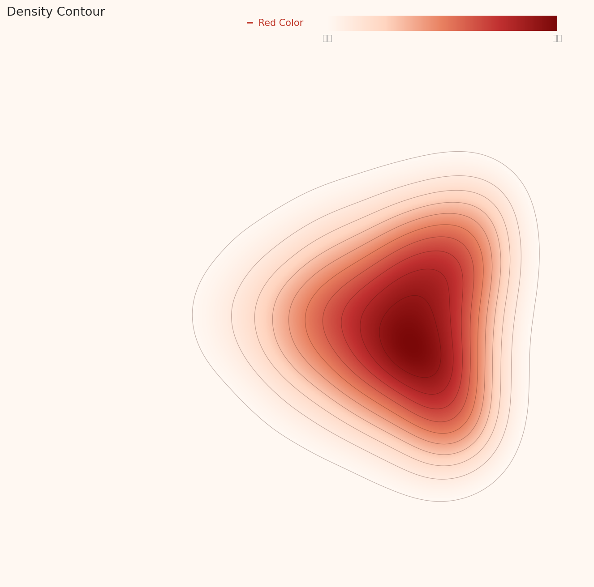
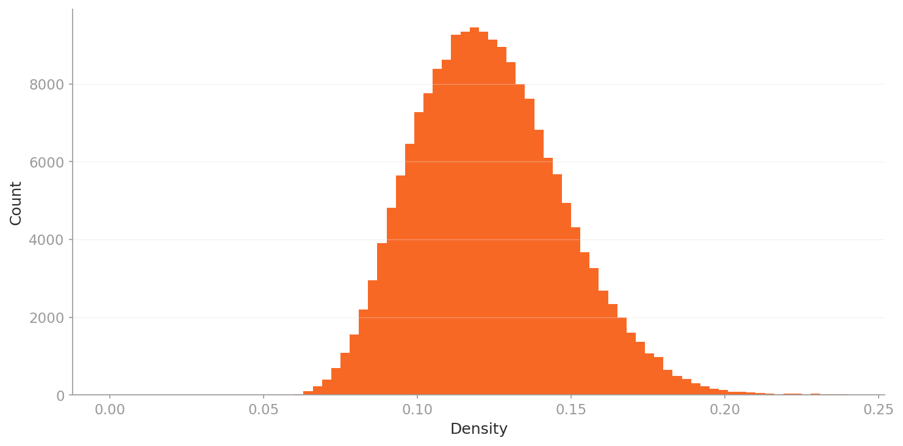
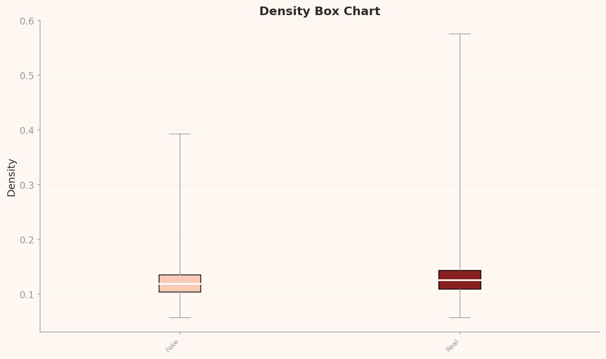
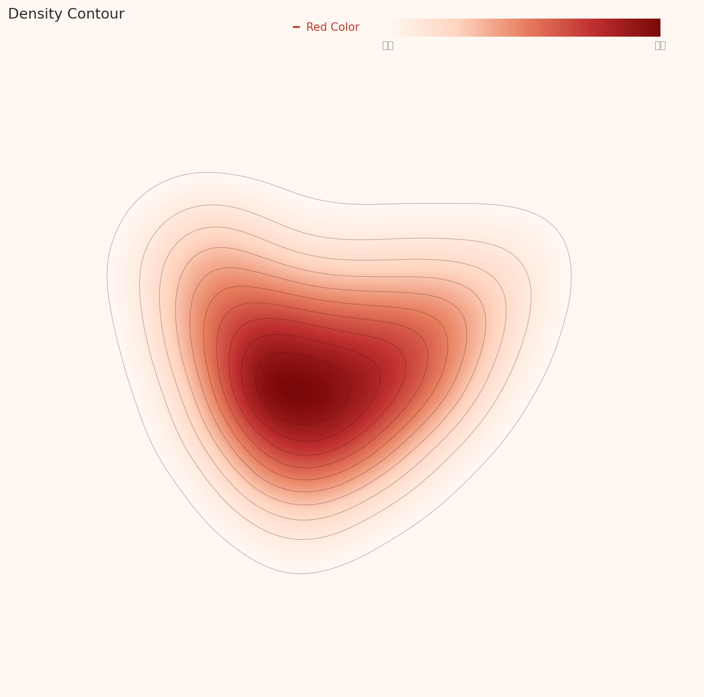
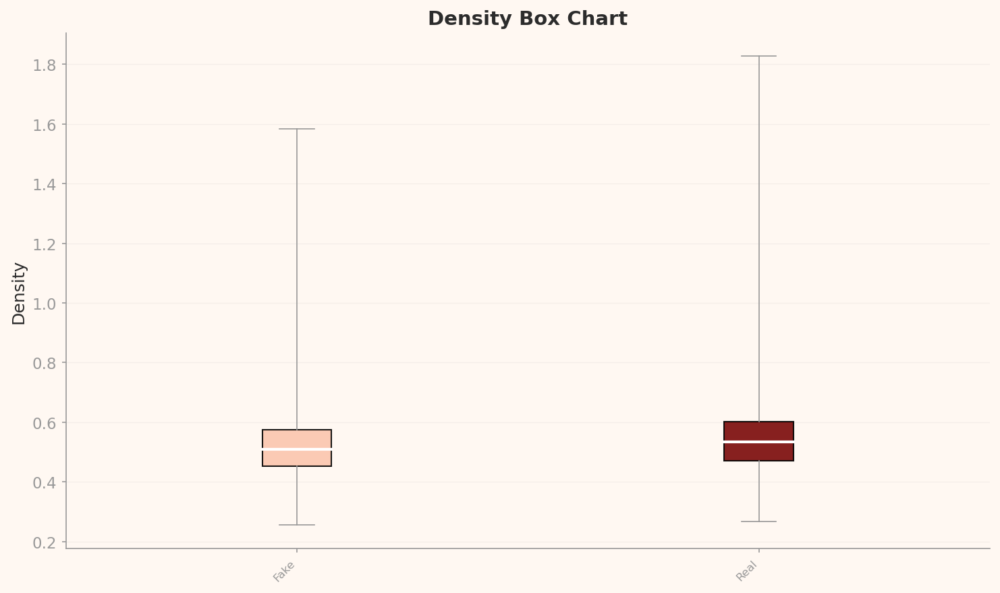

# The Faces AI Can

_Dissecting 190K Deepfake Images — The Detection Blind Spots Revealed by DataClinic_

## Executive Summary

> [!callout]
> This article is based on the analysis from **[DataClinic Report #169](https://dataclinic.ai/en/report/169)**.
>                             When 190,000 deepfake and real face images were diagnosed with DataClinic, the dataset earned a score of **91 out of 100 ("Good")**,
>                             demonstrating high quality in class balance, resolution uniformity, and label integrity.
>                             However, feature-space analysis revealed that Fake and Real images are almost perfectly intermixed,
>                             confirming the fundamental difficulty of deepfake detection at the data level.

> Under a general-purpose neural network (L2, 1,280 dimensions), the entire dataset forms a single triangular cluster.
>                             Under a domain-optimized model (L3, 177 dimensions), this shape transforms into a heart, exposing subtle structural differentiation within the data.
>                             The phenomenon of Real images monopolizing the high-density core suggests
>                             that the concept of a "typical face" maps more naturally onto Real photographs.

> In practical terms, this dataset is ready for immediate use in deepfake detection model training.
>                             That said, separately managing low-density outliers — faces in tattoos, non-frontal compositions, and multi-person images — can further boost model performance.
>                             DataClinic's sole recommendation of "Data Bulk-up" is best interpreted as a call to collect additional data
>                             that covers the extreme outliers the current set does not fully represent.

91

DataClinic Overall Score

2

Classes (Fake / Real)

191,857

Total Images

256px

Uniform Resolution (Square)

### DataClinic Grade Summary

<!-- stat-card -->
**L1 IntegrityGood** — L1 MissingGood — L1 BalanceGood — L1 StatisticsGood — L2 DataLensNo Issues — L2 GeometryGood — L2 DistributionModerate — L3 DataLensNo Issues — L3 GeometryGood — L3 DistributionGood

## Dataset Overview — Deepfake vs Real Images

**deepfake-and-real-images** is a binary classification dataset for deepfake detection, publicly available on Hugging Face.
                        It contains **191,857** face images at 256x256 RGB resolution, split into Fake (95,201) and Real (96,656) classes
                        with a class ratio of **1.015** — near-perfect balance.

Deepfake detection is one of the defining AI security challenges of our time.
                        Fabricated political videos, synthetic faces used in financial fraud, manipulated photos flooding social media — defending against all of these threats
                        requires **high-quality training data**.
                        How well this dataset serves that role is exactly what DataClinic's three-level diagnosis reveals.

*Representative image collage from deepfake-and-real-images (DataClinic L1)*

#### Dataset Specifications

- **191,857 images** (used in diagnosis)
- **1.7 GB** (1,752 MB)
- **256x256 px** — square, pre-processed
- **RGB channels** — consistent throughout
- **2 classes** — Fake / Real
- **Near-perfect balance** — ratio 1.015

#### Class Breakdown

- **Fake:** 95,201 — deepfake-generated faces
- **Real:** 96,656 — authentic human faces
- **Std. deviation:** 1,028.8 images
- **Source:** [Hugging Face](https://huggingface.co/datasets/Hemg/deepfake-and-real-images)

## Level 1 — Basic Quality Diagnosis

Level 1 checks the fundamental health of a dataset across four dimensions:
                        label integrity, missing values, class balance, and image resolution statistics.
                        This dataset received a **"Good" grade across all four**.
                        Because it was distributed in a pre-processed state, resolutions are uniformly 256x256,
                        and labels contain no errors or gaps.

Particularly noteworthy is the class balance. With 95,201 Fake vs 96,656 Real images, the ratio is just 1.015 —
                        meaning there is virtually no risk of class-imbalance bias during model training.
                        For a deepfake detection dataset, this level of balance is exemplary design.

### Pixel Histogram — The Color Fingerprint of Face Images

The pixel histogram shows the brightness distribution for each RGB channel across the entire dataset.
                        All three channels exhibit prominent spikes at the extreme values (0 and 255).
                        The Red channel shows the largest clipping at 255, reaching approximately 150 million in frequency,
                        while the Blue channel records the highest spike at 0, around 178 million.

This is an inherent characteristic of face imagery. Skin tones drive high Red channel values (brightness clipping),
                        while dark backgrounds and hair regions concentrate near Blue channel 0.
                        In the mid-brightness range, Red is relatively flat, while Blue and Green skew toward lower values.

*Pixel histogram: Red channel clipping at 255 (skin tones) and Blue channel spike at 0 (dark backgrounds) reveal the dataset's face-image signature.*

### Mean Images — The Subtle Difference Between Fake and Real

Comparing the per-class mean images, both Fake and Real produce a frontal-facing face shape.
                        However, subtle differences emerge — the Fake mean image shows a slightly rounder facial contour with a broader hairline distribution
                        and softer edges. This reflects the tendency of deepfake generation models to synthesize faces anchored around an "average face."

*Fake mean image*

*Real mean image*

## Level 2 — How a General-Purpose Lens Sees Faces

Level 2 analyzes the data's structure in feature space extracted by Wolfram ImageIdentify Net V2 (1,280 dimensions).
                        This general-purpose neural network was trained on a wide variety of images — objects, landscapes, animals, and more —
                        so it views the dataset from the perspective of "images in general."

The result is unambiguous. **All 191,857 images form a single cohesive cluster.**
                        Fake and Real are completely intermixed in the same space, and density values alone cannot separate the two classes.
                        In a general-purpose feature space, deepfakes and real faces are effectively indistinguishable — and that is precisely what makes deepfakes so dangerous.

### Density Contour — The Triangular Cluster

In the density contour chart, the data forms a single triangular / teardrop-shaped cluster.
                        Contour lines stack concentrically around a clear density center,
                        with density gradually decreasing toward the periphery — a classic unimodal structure.

*L2 density contour: all 191,857 images form a single triangular cluster. No Fake/Real separation.*

### Density Distribution — What the Right Tail Means

The density histogram shows a slightly right-skewed unimodal distribution.
                        The peak sits in the 0.11–0.12 range, where the majority of images are concentrated.
                        The long right tail indicates that particularly "typical" face photographs carry high density values,
                        and this skew is the reason the distribution grade came in as "Moderate."

*L2 density histogram: slightly right-skewed unimodal distribution. Peak at 0.11–0.12.*

### Fake vs Real Density Comparison

In the density box chart, the boxes for Fake (median ~0.119) and Real (median ~0.125) overlap almost completely.
                        But there is one critical difference — Real's upper whisker extends to **0.575**,
                        far wider than Fake's 0.393.
                        This indicates that particularly "typical" faces cluster at high density and belong exclusively to Real.

*L2 density box chart: medians are similar, but Real's maximum density (0.575) far exceeds Fake's (0.393).*

> [!callout]
> **Key finding:** Under a general-purpose lens, Fake and Real are nearly indistinguishable. However, the fact that **all high-density outliers are Real**
>                             reveals that "quintessential face photographs" — ID-photo style, frontal, evenly lit — are concentrated in the Real class.
>                             Deepfake generation models may not yet fully replicate these "extremely typical" faces.

## Level 3 — What the Domain-Specific Lens Reveals

Level 3 re-analyzes the same data through a domain-optimized model (177 dimensions).
                        Although the dimensionality dropped dramatically from L2's 1,280 to 177,
                        the **internal structure of the data actually becomes sharper**.
                        That is the core value of domain optimization — by stripping away irrelevant dimensions and retaining only meaningful features,
                        it lets us see the data's true structure.

### From Triangle to Heart — A Shape Shift in Cluster Geometry

The density contour that appeared as a triangle/teardrop in L2 **transforms into a heart shape** in L3.
                        The primary density center sits at the bottom, with a secondary lobe forming above,
                        creating an overall heart silhouette.

This dual-lobe structure suggests that L3's domain optimization has captured some of the subtle feature differences between Fake and Real.
                        The two lobes are not fully separated, but an **internal structural differentiation** that was invisible in L2 has now emerged.
                        Viewing the same data through a different lens reveals a different shape — and that is the value of multi-level diagnosis.

*L3 density contour: the triangle (L2) transforms into a heart shape. Domain optimization reveals internal structure.*

L2

#### General-Purpose Lens (1,280-D)

- Triangular / teardrop cluster
- Distribution grade: Moderate
- Mean density: 0.124
- Real max density: 0.575

L3

#### Domain-Specific Lens (177-D)

- Heart-shaped cluster (dual lobe)
- Distribution grade: Good
- Mean density: 0.530
- Real max density: 1.828

### L3 Density Distribution — More Symmetric, More Stable

The L3 density histogram is noticeably more symmetric than L2's.
                        The peak sits in the 0.48–0.50 range, with values spread from 0.2 to 1.1 — a wider range than L2.
                        As the right tail shortens, the distribution grade rises from "Moderate" to **"Good"** —
                        a sign that domain optimization has spread the data more uniformly.

*L3 density histogram: more symmetric and stable than L2. Distribution grade "Good."*

### Fake vs Real at L3

In the L3 density box chart, the gap between Fake (median ~0.51) and Real (median ~0.535) follows a similar pattern to L2,
                        but the density values themselves are much higher.
                        Critically, Real's whisker range (~1.83) extends well beyond Fake's (~1.58),
                        **confirming even more strongly than L2 that a high-density core group exists within Real.**
                        All L3 high-density outliers are also exclusively Real.

*L3 density box chart: Real's max density (1.83) notably exceeds Fake's (1.58). The L2 pattern is amplified at L3.*

## Representative Samples — What the Model Is Most and Least Confident About

The most intuitive output of density-based analysis is the actual image samples themselves.
                        **High-density images** sit at the core of feature space — the "most typical" images —
                        while **low-density images** lie at the periphery — the "most atypical."
                        Comparing these two extremes reveals where a deepfake detection model performs well and where it is likely to struggle.

### Real Class — What Authentic Face Photographs Actually Look Like

A representative selection of Real images drawn from across the dataset.
                        The range runs from ID-photo-style portraits to casual everyday shots.
                        Higher density scores indicate proximity to the feature-space core; lower scores indicate more atypical images.

Real 0.407

Real 0.386

Real 0.384

Real 0.370

Real 0.154

Real 0.087

▲ 6 Real samples — spanning density range 0.087–0.407.

### Fake Class — What AI-Generated Deepfakes Actually Look Like

A representative selection of Fake images drawn from across the dataset.
                        They range from faces that look almost indistinguishable from real photos to non-frontal compositions and noise-overlaid images — a wide variety of generation methods at work.

Fake 0.092

Fake 0.088

Fake 0.069

Fake 0.057

Fake 0.060

Fake 0.058

▲ 6 Fake samples — from near-realistic generations to atypical compositions.

> [!callout]
> **Data quality note:** The density analysis surfaces an interesting bias — the top high-density images are concentrated in just two file batches (7903–7915 and 36304–36315). These are effectively near-identical images taken under the same conditions in the same session.
>                             This points to a potential **batch bias**: the same shooting session may be over-represented in the Real class, which could skew the model's learned notion of a "typical" real face.

### Real vs Fake — Class-Level Density Distribution

Placing the classwise density plots side by side makes it immediately clear why no Fake images appear in the high-density core.
                        Real forms a narrow, tall cluster, while Fake spreads much more broadly.
                        Because deepfake generation models employ a wide variety of styles, techniques, and backgrounds,
                        they cannot form a single dense cluster in feature space.

### Low Density — The Model's Blind Spots

Low-density outliers contain a mix of Fake and Real, and every one of them departs from the "typical face photo" pattern.
                        The representative Real low-density sample (image_32115) is a **face tattooed on skin** — not an actual human face, but ink on a body.
                        A Fake low-density sample (image_2671) shows a child looking downward alongside a doll — non-frontal and atypical composition.
                        Another Fake low-density sample (image_598) depicts two people wearing white head coverings with rain/noise overlay.

Real 0.057

Fake 0.057

Fake 0.058

Fake 0.058

Real 0.059

Fake 0.059

Real 0.059

Real 0.060

Real 0.060

Fake 0.060

Fake 0.060

Real 0.060

▲ Bottom 12 by density — Real and Fake intermingled. Images that stray from "typical face" end up in the same peripheral zone.

> [!callout]
> **Key insight:** The high-density core is monopolized by Real, while the low-density periphery is a Fake/Real mix.
>                             This means deepfake detection models can easily classify "typical faces" as Real,
>                             but struggle far more with atypical images — tattooed faces, non-frontal compositions, and noisy images — where **Fake/Real distinction becomes much harder**.
>                             The presence of a "tattoo face" among Real low-density samples also highlights the need for data curation.

## Data Journalism — The Truth Behind the Training Data That Catches Deepfakes

Everyone knows why deepfakes are a societal problem.
                        What far fewer people understand is **where the AI that detects them actually learns**.
                        A deepfake detection model's performance ultimately depends on the quality of its training data.
                        This dataset's DataClinic diagnosis lays bare that quality in hard numbers and visualizations.

### What a Score of 91 Really Means — High Quality, but Not Perfect

A score of 91 ("Good") confirms that this dataset is fundamentally well-constructed.
                        Class balance is near-perfect, resolution is uniform, and labels are error-free.
                        So why not 100?

The L2 distribution grade came in as "Moderate" because of the asymmetric tail in the density distribution.
                        And what creates that tail is precisely the Real class's high-density outliers — standard, ID-photo-style portraits.
                        Paradoxically, **the score is docked because overly typical Real images exist**.
                        From a data-quality standpoint, this is less a flaw than a characteristic of the dataset itself.

### Training Data Quality = The Foundation of Detection Trustworthiness

The most important finding in this diagnosis is the composition of low-density outliers.
                        Tattooed faces, non-frontal compositions, noise overlays — these atypical images cluster in the low-density region with no clear Fake/Real separation.
                        In the real world, malicious deepfakes are more likely to be generated from varied angles, lighting conditions, and contexts rather than frontal ID-photo settings.

In other words, the patterns revealed by low-density outliers **may closely mirror real-world deepfake threats**.
                        If a detection model is vulnerable in this region, it is likely vulnerable in production as well.
                        This is why this dataset's quality diagnosis goes beyond a mere technical assessment — it connects directly to **the foundation of societal trust**.

### What the Difference in Lenses Tells Us

The fact that a triangular cluster in L2 (general-purpose, 1,280-D) becomes heart-shaped in L3 (domain-optimized, 177-D)
                        is not just a visual curiosity. It demonstrates that **using the right tool for the problem makes the data tell a richer story**.
                        The distribution grade improving to "Good" at L3 is because domain optimization smoothed the asymmetric tail
                        while revealing the data's intrinsic structure more clearly.

> [!callout]
> **The bigger picture:** The trustworthiness of deepfake detection AI underpins judicial decisions, election integrity, and financial security.
>                             That trustworthiness starts with training data quality.
>                             This dataset's score of 91 means "ready for immediate use,"
>                             but the blind spots exposed by low-density outliers are a reminder that **continuous data quality management** is non-negotiable.

## Verdict & Recommendations

With a DataClinic score of 91 ("Good"), this dataset is a high-quality resource that can be deployed immediately for deepfake detection model training.
                        DataClinic's sole recommendation — "Data Bulk-up" — is not about fixing problems in the existing data,
                        but about expanding the dataset's coverage to improve model generalization.

#### ⚠ Why Data Dieting Is Not the Answer

- • **Fake diversity is a feature, not a bug:** Low-density Fake samples may represent rare generation techniques. Remove them and you create a model blind to those deepfake styles.
- • **Low-density = real-world threat profile:** Actual malicious deepfakes look nothing like standard ID photos — they come from unusual angles, in bad lighting, in context. These outliers prepare the model for what it will actually face.
- • **Binary classification is fragile to imbalance:** Trimming either class, even under a quality flag, risks skewing the Real/Fake ratio and directly degrading detection performance.
- • **Batch bias calls for addition, not subtraction:** The over-concentration of same-batch Real images is solved by _adding_ diverse Real images to dilute the cluster — not by removing the existing ones.

<!-- stat-card -->
**Despite the batch bias and outlier findings, **pruning or culling this dataset would be the wrong move.****

#### 1. Separate Management of Low-Density Outliers

<!-- stat-card -->
**Isolate low-density outliers — tattooed faces, non-frontal compositions, multi-person images — into a dedicated subset
                                and leverage them in a hard negative mining strategy.
                                These images are the most effective material for strengthening a model's weak points.**

#### 2. Augment Atypical Fake Images (Data Bulk-up)

<!-- stat-card -->
**The current low-density Fake images are characterized by non-frontal compositions and noise overlays.
                                Adding deepfake images generated from diverse angles, lighting conditions, and resolutions
                                will improve the model's real-world resilience.**

#### 3. Increase Real Class Diversity

<!-- stat-card -->
**The fact that all high-density outliers are Real suggests an over-concentration of "ID-photo style" images within the Real class.
                                Adding Real images from diverse settings — outdoor, low-light, varied ethnicities and ages —
                                will make the feature-space distribution more uniform.**

#### 4. Curate Non-Face Images

<!-- stat-card -->
**The Real low-density set includes images like a "tattoo face" — not an actual person's photograph but ink on skin.
                                Identifying and either removing or reclassifying such images
                                will help the model learn a clearer definition of "face."**

## Frequently Asked Questions

#### Q. What does a DataClinic score of 91 mean?

<!-- stat-card -->
**DataClinic rates dataset quality on a 0–100 scale. A score of 91 ("Good") indicates that label integrity, class balance, resolution uniformity,
                                and feature-space structure are all in good shape — the dataset is ready for model training out of the box.**

#### Q. If Fake and Real overlap in feature space, does that mean deepfake detection is impossible?

<!-- stat-card -->
**Not at all. The general-purpose model used here (Wolfram ImageIdentify Net) is not specialized for deepfake detection.
                                Dedicated detection models leverage frequency-domain analysis, facial landmark consistency, and generation artifacts — features specifically designed for this task.
                                DataClinic evaluates "data quality," not "detection performance."**

#### Q. Why does the cluster change from a triangle at L2 to a heart at L3?

<!-- stat-card -->
**L2 uses a 1,280-dimensional general-purpose feature space, while L3 uses a 177-dimensional domain-optimized space.
                                During dimensionality reduction and domain-specific optimization, irrelevant features are stripped away, making the data's latent structure more visible.
                                The heart's dual-lobe structure reflects subtle feature differentiation between Fake and Real.**

#### Q. Can this dataset be used commercially?

<!-- stat-card -->
**You should check the dataset's license. Please verify the terms of use on the original Hugging Face page.
                                DataClinic's diagnosis is a data quality assessment — license interpretation requires a separate legal review.**

#### Q. Batch bias was detected — shouldn't we remove those duplicate images?

<!-- stat-card -->
**No. Adding is the right prescription, not removing. Pruning the over-represented batch would shrink the Real class
                                and create class imbalance. The correct fix is to supplement with Real images from diverse conditions to dilute the
                                batch concentration. Similarly, low-density Fake images may cover specific generation techniques — removing them
                                narrows the model's detection scope.**

#### Q. What does "Data Bulk-up" mean?

<!-- stat-card -->
**DataClinic's Data Bulk-up recommendation means supplementing the existing data with additional images.
                                For this dataset, collecting more of the atypical image types revealed by low-density outliers — faces from diverse angles, lighting conditions, and contexts —
                                will improve the model's generalization performance.**
