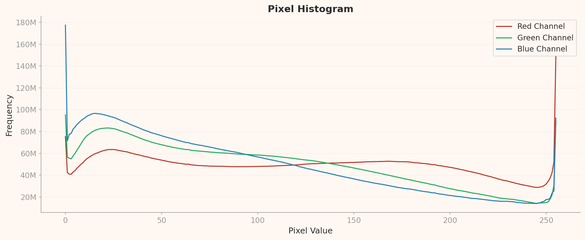
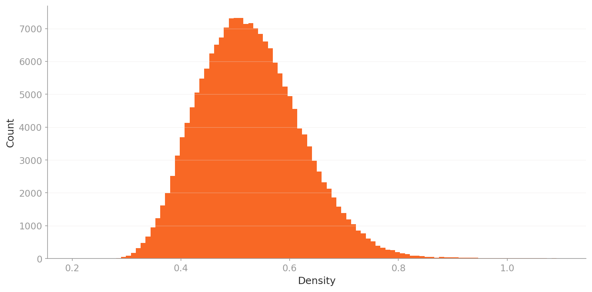

# AI가 구별 못하는 얼굴들

_19만 장의 딥페이크 데이터 해부 — DataClinic 91점이 드러낸 탐지의 사각지대_

## Executive Summary

> [!callout]
> 이 글은 **[DataClinic 리포트 #169](https://dataclinic.ai/en/report/169)**의 분석 결과를 바탕으로 작성되었습니다.
>                             19만 장의 딥페이크/진짜 얼굴 이미지를 DataClinic으로 진단한 결과, **91점 '좋음'** 등급을 받은 이 데이터셋은
>                             클래스 균형, 해상도 통일, 레이블 무결성 모두에서 높은 품질을 보였습니다.
>                             그러나 특징 공간 분석에서 Fake와 Real이 거의 완벽하게 혼재되어 있어,
>                             딥페이크 탐지의 근본적 어려움을 데이터 수준에서 확인할 수 있었습니다.

> 범용 신경망(L2, 1,280차원)에서는 전체 데이터가 하나의 삼각형 클러스터를 형성했으나,
>                             도메인 최적화 모델(L3, 177차원)에서는 하트 형태로 변하면서 내부의 미세한 구조적 분화가 드러났습니다.
>                             고밀도 핵심부를 Real 클래스가 독점하는 현상은
>                             '전형적 얼굴'이라는 개념이 Real 이미지에 더 잘 매핑됨을 시사합니다.

> 실무적으로 이 데이터셋은 딥페이크 탐지 모델 학습에 즉시 활용 가능한 상태입니다.
>                             다만 저밀도 이상치(문신 속 얼굴, 비정면 구도, 다중 인물 이미지)를 별도로 관리하면
>                             모델 성능을 더 높일 수 있습니다.
>                             DataClinic의 유일한 제안사항인 '데이터 벌크업'은
>                             극단적 이상치 대응을 위한 추가 데이터 확보를 권장하는 것으로 해석됩니다.

91

DataClinic 종합 점수

2

클래스 (Fake / Real)

191,857

총 이미지 수

256px

통일 해상도 (정사각형)

### DataClinic 등급 요약

<!-- stat-card -->
**L1 무결성좋음** — L1 결측값좋음 — L1 클래스균형좋음 — L1 통계좋음 — L2 DataLens특이사항 없음 — L2 기하좋음 — L2 분포보통 — L3 DataLens특이사항 없음 — L3 기하좋음 — L3 분포좋음

## 데이터셋 개요 — 딥페이크 vs 진짜 이미지

**deepfake-and-real-images**는 Hugging Face에 공개된 딥페이크 탐지용 이진 분류 데이터셋입니다.
                        총 **191,857장**의 256x256 RGB 얼굴 이미지가 Fake(95,201장)와 Real(96,656장) 두 클래스로 나뉘어 있으며,
                        클래스 간 비율은 **1.015**로 거의 완벽한 균형을 이룹니다.

딥페이크 탐지는 현대 AI 보안의 핵심 과제입니다.
                        정치인의 가짜 영상, 금융 사기에 사용되는 합성 얼굴, SNS에 범람하는 조작된 사진 — 이 모든 위협에 대응하려면
                        탐지 모델을 훈련시킬 **고품질 데이터셋**이 필수입니다.
                        이 데이터셋이 그 역할을 얼마나 잘 수행할 수 있는지, DataClinic의 3단계 진단으로 확인합니다.

*deepfake-and-real-images 대표 이미지 콜라주 (DataClinic L1)*

#### 데이터셋 사양

- **191,857장** (진단 사용)
- **1.7GB** (1,752MB)
- **256x256px** — 정사각형, 전처리 완료
- **RGB 채널** — 전체 일관
- **2개 클래스** — Fake / Real
- **거의 완벽 균형** — 비율 1.015

#### 클래스 구성

- **Fake:** 95,201장 — 딥페이크로 생성된 가짜 얼굴
- **Real:** 96,656장 — 실제 사람의 진짜 얼굴
- **표준편차:** 1,028.8장
- **출처:** [Hugging Face](https://huggingface.co/datasets/Hemg/deepfake-and-real-images)

## Level 1 — 기초 품질 진단

Level 1은 데이터셋의 기본 건강 상태를 점검합니다.
                        레이블 정합성, 결측치, 클래스 균형, 이미지 해상도 통계 — 이 네 가지 축에서 이 데이터셋은 **모두 '좋음'** 등급을 받았습니다.
                        전처리가 이미 완료된 상태에서 배포되었기 때문에 해상도가 256x256으로 완벽하게 통일되어 있고,
                        레이블에 오류나 결측이 없습니다.

특히 주목할 점은 클래스 균형입니다. Fake 95,201장 vs Real 96,656장으로 비율이 1.015에 불과하여,
                        모델 학습 시 클래스 불균형으로 인한 편향 걱정이 없습니다.
                        딥페이크 탐지 데이터셋에서 이 정도의 균형은 매우 바람직한 설계입니다.

### 픽셀 히스토그램 — 얼굴 이미지의 색상 지문

픽셀 히스토그램은 전체 데이터셋의 RGB 채널별 밝기값 분포를 보여줍니다.
                        세 채널 모두 극단값(0과 255)에서 뚜렷한 스파이크가 관찰됩니다.
                        Red 채널은 255 구간에서 약 1.5억 빈도로 가장 큰 클리핑을 보이고,
                        Blue 채널은 0 구간에서 약 1.78억 빈도로 최대 스파이크를 기록합니다.

이것은 얼굴 이미지의 본질적 특성입니다. 피부톤은 Red 채널 값이 높고(밝기 클리핑),
                        어두운 배경이나 머리카락 영역은 Blue 채널 0값 근처에 집중됩니다.
                        중간 밝기 구간에서 Red는 상대적으로 평탄하고, Blue/Green은 낮은 값 쪽으로 치우쳐 있습니다.

*픽셀 히스토그램: Red 채널 255값 클리핑(피부톤)과 Blue 채널 0값 스파이크(어두운 배경)가 얼굴 데이터셋의 특징을 드러냄*

### 평균 이미지 — Fake vs Real의 미묘한 차이

클래스별 평균 이미지를 비교하면 Fake와 Real 모두 정면을 바라보는 얼굴 형태가 나타납니다.
                        그러나 미묘한 차이가 있습니다 — Fake 평균 이미지가 약간 더 둥근 얼굴 윤곽과 넓은 헤어라인 분포를 보이며,
                        경계가 더 부드럽습니다. 이는 딥페이크 생성 모델이 '평균적 얼굴'을 기준으로 합성하는 경향을 반영합니다.

*Fake 평균 이미지*

*Real 평균 이미지*

## Level 2 — 범용 렌즈가 본 얼굴의 세계

Level 2는 Wolfram ImageIdentify Net V2(1,280차원)로 추출한 특징 공간에서 데이터의 구조를 분석합니다.
                        이 범용 신경망은 얼굴뿐 아니라 사물, 풍경, 동물 등 다양한 이미지를 학습한 모델로,
                        '이미지 일반'의 관점에서 데이터셋을 바라봅니다.

결과는 명확합니다. **전체 191,857장이 하나의 응집된 클러스터를 형성**합니다.
                        Fake와 Real이 동일한 공간에 완전히 혼재되어 있으며, 밀도 값만으로는 두 클래스를 분리할 수 없습니다.
                        범용 특징 공간에서 딥페이크와 진짜 얼굴은 사실상 구별 불가능하다는 것 — 이것이 딥페이크가 위협적인 이유이기도 합니다.

### 밀도 등고선 — 삼각형 클러스터

밀도 등고선 차트에서 데이터는 삼각형/물방울 형태의 단일 클러스터를 형성합니다.
                        등고선이 동심원적으로 중첩되어 하나의 명확한 밀도 중심이 존재하며,
                        주변부로 갈수록 밀도가 점차 감소하는 전형적인 단봉 구조입니다.

*L2 밀도 등고선: 191,857장 전체가 하나의 삼각형 클러스터를 형성. Fake/Real 분리 없음.*

### 밀도 분포 — 오른쪽 꼬리의 의미

밀도 히스토그램은 약간 오른쪽으로 치우친 단봉 분포를 보여줍니다.
                        피크는 0.11~0.12 구간에 위치하며, 대부분의 이미지가 이 밀도 범위에 밀집되어 있습니다.
                        오른쪽으로 길게 뻗은 꼬리는 특히 '전형적인' 얼굴 사진들이 높은 밀도를 가짐을 의미하며,
                        이것이 분포 등급 '보통'의 원인입니다.

*L2 밀도 히스토그램: 약간 오른쪽으로 치우친 단봉 분포. 피크 구간 0.11~0.12.*

### Fake vs Real 밀도 비교

밀도 박스차트에서 Fake(중앙값 ~0.119)와 Real(중앙값 ~0.125)의 박스가 거의 완전히 겹칩니다.
                        그러나 결정적 차이가 하나 있습니다 — Real 클래스의 상단 위스커가 **0.575**까지 확장되어
                        Fake(0.393)보다 훨씬 넓습니다.
                        이는 Real 클래스에 특히 '전형적인' 얼굴들이 고밀도로 밀집되어 있음을 시사합니다.

*L2 밀도 박스차트: Fake와 Real의 중앙값은 유사하지만, Real의 최대 밀도(0.575)가 Fake(0.393)보다 훨씬 높음.*

> [!callout]
> **핵심 발견:** 범용 렌즈에서 Fake와 Real은 거의 구별 불가능합니다. 그러나 **고밀도 이상치가 전부 Real**이라는 사실은
>                             '전형적 얼굴 사진'(증명사진 스타일, 정면, 균일 조명)이 Real 클래스에 집중되어 있음을 보여줍니다.
>                             딥페이크 생성 모델은 아직 이런 '극도로 전형적인' 얼굴을 완벽하게 재현하지 못하는 것일 수 있습니다.

## Level 3 — 도메인 특화 렌즈의 발견

Level 3는 도메인 최적화 모델(177차원)로 동일한 데이터를 다시 분석합니다.
                        L2의 1,280차원에서 177차원으로 차원이 크게 줄었지만,
                        오히려 **데이터 내부의 구조가 더 선명하게 드러납니다**.
                        이것이 도메인 최적화의 핵심 가치입니다 — 불필요한 차원을 제거하고 의미 있는 특징만 남김으로써
                        데이터의 진짜 구조를 볼 수 있게 합니다.

### 삼각형에서 하트로 — 클러스터 형태의 변화

L2에서 삼각형/물방울 형태였던 밀도 등고선이 L3에서는 **하트(심장) 형태**로 변합니다.
                        하단에 주요 밀도 중심(가장 진한 등고선)이 위치하고, 상단에 보조 로브가 형성되어
                        전체적으로 하트 실루엣을 만들어냅니다.

이 이중 로브 구조는 L3의 도메인 최적화가 Fake/Real 간의 미세한 특징 차이를 일부 포착했음을 시사합니다.
                        두 로브가 완전히 분리되지는 않았지만, L2에서는 보이지 않던 **내부 구조적 분화**가 드러난 것입니다.
                        같은 데이터를 다른 렌즈로 보면 다른 형태가 나타나는 것 — 이것이 다단계 진단의 가치입니다.

*L3 밀도 등고선: 삼각형(L2)에서 하트 형태로 변화. 도메인 최적화가 내부 구조를 드러냄.*

L2

#### 범용 렌즈 (1,280차원)

- 삼각형/물방울 클러스터
- 분포 등급: 보통
- 평균 밀도: 0.124
- Real 최대 밀도: 0.575

L3

#### 도메인 렌즈 (177차원)

- 하트형 클러스터 (이중 로브)
- 분포 등급: 좋음
- 평균 밀도: 0.530
- Real 최대 밀도: 1.828

### L3 밀도 분포 — 더 대칭적, 더 안정적

L3의 밀도 히스토그램은 L2보다 더 대칭적인 형태를 보입니다.
                        피크는 0.48~0.50 구간에 위치하며, 범위는 0.2~1.1로 L2보다 넓게 분포합니다.
                        오른쪽 꼬리가 짧아지면서 분포 등급이 '보통'에서 **'좋음'**으로 상승했습니다 —
                        이는 도메인 최적화가 데이터를 더 균일하게 분산시켰음을 의미합니다.

*L3 밀도 히스토그램: L2보다 대칭적이고 안정적인 분포. 분포 등급 '좋음'.*

### L3에서의 Fake vs Real

L3 밀도 박스차트에서 Fake(중앙값 ~0.51)와 Real(중앙값 ~0.535)의 차이는 L2와 유사한 패턴을 보이지만,
                        밀도 값 자체가 훨씬 높아졌습니다.
                        결정적으로 Real의 위스커 범위(~1.83)가 Fake(~1.58)보다 확연히 넓어,
                        **Real 내부에 고밀도 핵심 이미지 그룹이 존재함**이 L2보다 더 강하게 확인됩니다.
                        L3 고밀도 이상치 역시 전부 Real 클래스입니다.

*L3 밀도 박스차트: Real의 최대 밀도(1.83)가 Fake(1.58)보다 확연히 높음. L2 패턴이 L3에서 증폭됨.*

## 대표 이미지 분석 — 모델이 가장 확신하는 것과 가장 헷갈리는 것

밀도 기반 분석의 가장 직관적인 결과물은 실제 이미지 샘플입니다.
                        **고밀도 이미지**는 특징 공간의 핵심부에 위치한 '가장 전형적인' 이미지이고,
                        **저밀도 이미지**는 주변부에 위치한 '가장 비전형적인' 이미지입니다.
                        이 두 극단을 비교하면 딥페이크 탐지 모델이 어디서 잘 작동하고 어디서 실패하는지 직관적으로 알 수 있습니다.

### Real 클래스 — 실제 얼굴 사진은 어떻게 생겼나

데이터셋 전반에서 고른 Real 샘플입니다. 증명사진 스타일부터 자연스러운 일상 사진까지 다양한 유형이 포함되어 있습니다.
                        밀도가 높을수록 특징 공간 핵심부에 가깝고, 낮을수록 비전형적 이미지입니다.

Real 0.407

Real 0.386

Real 0.384

Real 0.370

Real 0.154

Real 0.087

▲ Real 대표 샘플 — 밀도 0.087~0.407 범위에서 고른 6장.

### Fake 클래스 — AI 생성 딥페이크는 어떻게 생겼나

데이터셋 전반에서 고른 Fake 샘플입니다. 얼핏 실제 사람처럼 보이는 것부터 비정면 구도, 노이즈 오버레이까지 다양한 생성 방식이 혼재합니다.

Fake 0.092

Fake 0.088

Fake 0.069

Fake 0.057

Fake 0.060

Fake 0.058

▲ Fake 대표 샘플 — 자연스러운 생성 이미지부터 비전형 구도까지 6장.

> [!callout]
> **데이터 품질 주의:** 밀도 기반 이상치 분석에서 흥미로운 편향이 발견됩니다 — 최고밀도 상위 이미지들이 단 두 파일 배치(7903~7915, 36304~36315)에 집중되어 있습니다. 이 이미지들은 사실상 동일한 촬영 조건에서 나온 극히 유사한 시리즈입니다. **배치 편향(batch bias)**의 가능성이 있으며, 데이터 수집 단계에서 동일 세션 이미지가 과도하게 포함되었을 수 있습니다.

### Real vs Fake — 클래스별 밀도 분포 비교

클래스별 밀도 분포를 나란히 놓으면 왜 고밀도 핵심부에 Fake가 없는지 분명해집니다.
                        Real은 좁고 높은 클러스터를 형성하는 반면, Fake는 더 넓게 퍼져 있습니다.
                        딥페이크 생성 모델이 다양한 스타일·기법·배경을 사용하기 때문에 특징 공간에서 단일 밀집 클러스터를 이루기 어렵습니다.

### 저밀도 — 모델의 사각지대

저밀도 이상치에는 Fake와 Real이 혼재되어 있으며, 하나같이 '전형적 얼굴 사진'에서 벗어난 이미지들입니다.
                        Real 저밀도 대표(image_32115)는 **문신에 새겨진 얼굴** — 실제 사람 얼굴이 아닌 피부 위의 잉크 이미지입니다.
                        Fake 저밀도(image_2671)는 아래를 내려다보는 아이와 인형으로 비정면, 비전형적 구도이고,
                        Fake 저밀도(image_598)는 두 사람이 흰 머릿수건을 쓴 이미지에 비/노이즈 오버레이가 추가되어 있습니다.

Real 0.057

Fake 0.057

Fake 0.058

Fake 0.058

Real 0.059

Fake 0.059

Real 0.059

Real 0.060

Real 0.060

Fake 0.060

Fake 0.060

Real 0.060

▲ 저밀도 하위 12개 — Real/Fake 혼재. '전형적 얼굴'에서 벗어난 이미지들이 한 공간에 섞인다.

> [!callout]
> **핵심 인사이트:** 고밀도 핵심부는 Real이 독점하고, 저밀도 경계부는 Fake/Real이 혼재합니다.
>                             이는 딥페이크 탐지 모델이 '전형적 얼굴'을 쉽게 Real로 판별하지만,
>                             문신 속 얼굴, 비정면 구도, 노이즈 이미지 같은 **비전형적 이미지에서는 Fake/Real 구분이 훨씬 어려워짐**을 시사합니다.
>                             특히 Real 저밀도에 '문신 속 얼굴'이 포함되어 데이터 정제의 필요성이 제기됩니다.

## 데이터 저널리즘 — AI가 딥페이크를 잡는 방법, 그 훈련 데이터의 진실

딥페이크가 사회 문제인 이유는 누구나 알고 있습니다.
                        그러나 **그것을 잡는 AI가 어디서 배우는지**는 잘 모릅니다.
                        딥페이크 탐지 모델의 성능은 결국 훈련 데이터의 품질에 의존합니다.
                        이 데이터셋의 DataClinic 진단은 그 품질의 실체를 수치와 시각화로 보여줍니다.

### 91점의 의미 — 높은 품질, 그러나 완벽하지 않은 이유

91점 '좋음' 등급은 이 데이터셋이 기본적으로 잘 구축되어 있음을 확인합니다.
                        클래스 균형이 거의 완벽하고, 해상도가 통일되어 있으며, 레이블에 오류가 없습니다.
                        그렇다면 왜 100점이 아닌가?

L2 분포 등급이 '보통'인 이유는 밀도 분포의 비대칭 꼬리 때문입니다.
                        그리고 그 비대칭 꼬리를 만드는 것이 바로 Real 클래스의 고밀도 이상치들 — 증명사진 스타일의 표준적 초상사진입니다.
                        역설적으로, **너무 전형적인 Real 이미지들이 존재하기 때문에 점수가 깎인 것**입니다.
                        데이터 품질의 관점에서 이것은 결함이라기보다 데이터셋의 특성입니다.

### 훈련 데이터의 품질 = 탐지 신뢰도의 기반

이 진단에서 가장 중요한 발견은 저밀도 이상치의 구성입니다.
                        문신 속 얼굴, 비정면 구도, 노이즈 오버레이 — 이런 비전형적 이미지들이 저밀도 영역에서 Fake/Real 구분 없이 혼재되어 있습니다.
                        실제 악용되는 딥페이크도 정면 증명사진 스타일보다는 다양한 각도, 조명, 맥락에서 생성됩니다.

즉, 저밀도 이상치가 보여주는 패턴은 **실제 딥페이크 위협과 유사한 특성**을 가질 수 있습니다.
                        탐지 모델이 이 영역에서 취약하다면, 실전에서도 취약할 가능성이 높습니다.
                        이것이 이 데이터셋의 품질 진단이 단순한 기술적 평가를 넘어 **사회적 신뢰의 기반**과 직결되는 이유입니다.

### 렌즈의 차이가 말하는 것

L2(범용, 1,280차원)에서 삼각형이던 클러스터가 L3(도메인 최적화, 177차원)에서 하트 형태로 변한 것은
                        단순한 시각적 변화가 아닙니다. 이것은 **문제에 맞는 도구를 사용하면 데이터가 더 많은 이야기를 들려준다**는 것을 보여줍니다.
                        L3에서 분포 등급이 '좋음'으로 올라간 것은 도메인 최적화가 비대칭 꼬리를 완화하면서
                        데이터의 본질적 구조를 더 잘 드러냈기 때문입니다.

> [!callout]
> **사회적 의미:** 딥페이크 탐지 AI의 신뢰도는 사법 판단, 선거 공정성, 금융 보안의 기반입니다.
>                             그 신뢰도의 출발점은 훈련 데이터의 품질입니다.
>                             이 데이터셋의 91점은 '즉시 사용 가능한 수준'을 의미하지만,
>                             저밀도 이상치가 드러낸 사각지대는 **지속적인 데이터 품질 관리**의 필요성을 환기합니다.

## 진단 총평 및 권고사항

DataClinic 91점 '좋음' 등급의 이 데이터셋은 딥페이크 탐지 모델 훈련에 바로 투입할 수 있는 고품질 데이터셋입니다.
                        DataClinic이 유일하게 제안한 '데이터 벌크업'은 현재 데이터의 문제가 아니라,
                        더 넓은 범위의 이미지를 추가하여 모델의 일반화 성능을 높이라는 방향을 제시합니다.

#### ⚠ 데이터 다이어트를 권장하지 않는 이유

- • **Fake 클래스는 다양성이 생명:** 저밀도 Fake 샘플들은 특정 생성 기법의 희귀한 예시일 수 있습니다. 제거하면 그 유형의 딥페이크를 못 잡는 모델이 됩니다.
- • **저밀도 = 현실의 위협:** 실제 악용되는 딥페이크는 표준 증명사진 스타일보다 비정면, 저조도, 특이 구도가 훨씬 많습니다. 이 이상치들이 모델의 사각지대를 채워줍니다.
- • **클래스 균형 유지:** 이진 분류(Real/Fake)는 한 클래스를 편향 제거 명목으로 줄이면 class imbalance가 발생해 탐지 성능이 직접 저하됩니다.
- • **배치 편향의 해법은 추가:** Real 클래스의 동일 배치 집중 문제는 해당 이미지를 빼서 해결하는 것이 아니라, 다른 조건의 Real 이미지를 _더 추가_해서 해결합니다.

<!-- stat-card -->
**배치 편향이나 저밀도 이상치를 이유로 데이터를 솎아내는 **데이터 다이어트는 이 데이터셋에 적합하지 않습니다.****

#### 1. 저밀도 이상치 별도 관리

<!-- stat-card -->
**문신 속 얼굴, 비정면 구도, 다중 인물 이미지 등 저밀도 이상치를 별도 세트로 분리하여
                                하드 네거티브 마이닝(hard negative mining) 전략에 활용하세요.
                                이 이미지들은 모델의 취약점을 강화하는 데 가장 효과적입니다.**

#### 2. 비전형적 Fake 이미지 보강 (Data Bulk-up)

<!-- stat-card -->
**현재 Fake 클래스의 저밀도 이미지들은 비정면 구도나 노이즈 오버레이가 특징입니다.
                                다양한 각도, 조명 조건, 해상도의 딥페이크 이미지를 추가하면
                                모델의 실전 대응력이 향상됩니다.**

#### 3. Real 클래스 다양성 확보

<!-- stat-card -->
**고밀도 이상치가 전부 Real인 현상은 Real 클래스 내에 '증명사진 스타일'이 과도하게 집중되어 있음을 시사합니다.
                                다양한 환경(실외, 저조도, 다양한 인종/연령)의 Real 이미지를 추가하면
                                특징 공간의 분포가 더 균일해집니다.**

#### 4. 비얼굴 이미지 정제

<!-- stat-card -->
**Real 저밀도에 '문신 속 얼굴'처럼 실제 인물 사진이 아닌 이미지가 포함되어 있습니다.
                                이런 이미지를 식별하고 제거하거나 별도 카테고리로 분류하면
                                모델이 '얼굴'의 정의를 더 명확하게 학습할 수 있습니다.**

## 자주 묻는 질문

#### Q. DataClinic 91점은 어떤 의미인가요?

<!-- stat-card -->
**DataClinic은 데이터셋의 품질을 0~100점으로 평가합니다. 91점 '좋음' 등급은 레이블 무결성, 클래스 균형, 해상도 통일,
                                특징 공간 구조 모두에서 양호하다는 의미이며, 모델 학습에 바로 활용 가능한 상태입니다.**

#### Q. Fake와 Real이 특징 공간에서 혼재되어 있다면, 딥페이크 탐지가 불가능한 건가요?

<!-- stat-card -->
**아닙니다. 여기서 사용된 범용 모델(Wolfram ImageIdentify Net)은 딥페이크 탐지에 특화되지 않은 모델입니다.
                                전용 탐지 모델은 주파수 도메인 분석, 얼굴 랜드마크 일관성, 생성 아티팩트 등 특화된 특징을 사용하여 분류합니다.
                                DataClinic 진단은 '데이터 품질'을 평가하는 것이지 '탐지 성능'을 예측하는 것이 아닙니다.**

#### Q. L2에서 삼각형이 L3에서 하트로 바뀐 이유는 무엇인가요?

<!-- stat-card -->
**L2는 1,280차원의 범용 특징 공간이고, L3는 177차원의 도메인 최적화 공간입니다.
                                차원 축소와 도메인 맞춤 최적화 과정에서 불필요한 특징이 제거되면서 데이터 내부의 잠재 구조가 더 선명하게 드러난 것입니다.
                                하트의 이중 로브 구조는 Fake/Real 간의 미세한 특징 분화를 반영합니다.**

#### Q. 이 데이터셋을 상업적으로 사용할 수 있나요?

<!-- stat-card -->
**이 데이터셋의 라이선스를 확인해야 합니다. Hugging Face 원본 페이지에서 사용 조건을 반드시 확인하세요.
                                DataClinic 진단은 데이터 품질 평가이며, 라이선스 해석은 별개의 법적 검토가 필요합니다.**

#### Q. 배치 편향이 발견됐는데 문제 이미지를 제거해야 하지 않나요?

<!-- stat-card -->
**아닙니다. 제거(다이어트)보다 추가(벌크업)가 올바른 처방입니다. 동일 배치 이미지를 빼면
                                Real 클래스의 총량이 줄어 클래스 불균형이 생깁니다. 대신 다양한 환경·조건의 Real 이미지를
                                추가해 배치 집중도를 희석시키는 것이 효과적입니다. 또한 Fake 클래스의 저밀도 이미지는
                                특정 생성 기법의 희귀 예시일 수 있어, 제거하면 탐지 범위가 좁아집니다.**

#### Q. '데이터 벌크업'이란 무엇인가요?

<!-- stat-card -->
**DataClinic의 Data Bulk-up 권장은 기존 데이터에 추가 데이터를 보강하라는 의미입니다.
                                이 데이터셋의 경우, 저밀도 이상치가 보여주는 비전형적 이미지 유형(다양한 각도, 조명, 맥락의 얼굴)을
                                추가로 수집하면 모델의 일반화 성능이 향상됩니다.**
