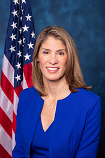

# Congress Wants to Count the Jobs AI Took

_The Great American AI Act draft freezes state AI rules for three years — and orders federal agencies to measure AI_

## Executive Summary

> [!callout]
> On June 4, 2026, Republican Representative Jay Obernolte and Democratic Representative Lori Trahan jointly released a 269-page AI bill draft in the U.S. House. It is called the Great American AI Act, and for now it is a discussion draft — not yet formally introduced. One clause grabbed the headlines: federal law would freeze, for three years, any state law that governs how AI models are developed. Reading it as Washington moving to blanket the patchwork of 50 separate state rulebooks under one, the political controversy followed immediately.

> But for anyone who works with data, a quieter passage deserves more attention. The same draft hands federal statistical agencies new homework. The Bureau of Labor Statistics (BLS) and the Census Bureau must revise their existing surveys to capture AI adoption and the employment shifts it drives, and the Department of Labor must stand up an AI workforce research hub within 90 days. Above all, if AI was a substantial factor in a mass layoff, employers must write that fact — and the number of jobs lost — into the layoff notice itself. In effect, the draft installs the measuring instruments before any prohibition.

> And that leaves one question worth sitting with. Why has the regulation's opening move become not a prohibition but "making it countable, so we can see what is happening"? Set the clause that halts state regulation beside the clause that measures the labor market, and you can see that capturing how fast AI is reshaping society — in data — has quietly become a precondition for policy itself.

### Key Numbers

The four numbers below compress why the draft arrived in this particular shape, right now. The pause on state regulation carries a hard three-year clock; the federal government commits to newly tracking at least 15 occupations. The reality that called for that measurement is the 108,000 job cuts announced in a single month, and the 87% who say a human should review such decisions stands behind that anxiety.

Sources: [Obernolte·Trahan press release](https://obernolte.house.gov/media/press-releases/obernolte-trahan-release-discussion-draft-great-american-ai-act), [Bloomberg Law](https://news.bloomberglaw.com/daily-labor-report/ai-related-layoffs-test-new-yorks-ability-to-track-job-losses)

<!-- stat-card -->
**3 years** — Pause on state AI-development rules — Sunsets Dec 2029 — a forcing timer to build a federal standard

<!-- stat-card -->
**15+** — AI-sensitive occupations designated — Labor Dept. updates every 2 years, with annual employment outlooks

<!-- stat-card -->
**108,000** — Job cuts announced, Jan 2026 — Up 118% year over year — the backdrop for the measurement push

<!-- stat-card -->
**87%** — "A human should review AI layoffs" — Survey of 500 U.S. adults, June 2026

## How Far the Three-Year Freeze on 50 States' Laws Reaches

Start with the most-reported clause. The draft's Title V preempts, for three years, any state law that "specifically governs" the development of AI models. The whole thing hinges on the word "development." State laws that dictate how a model is trained, or what safety framework it must carry, are paused. State laws that govern AI in actual use — when AI weighs in on housing, employment, healthcare, or financial decisions — stay fully alive. Privacy law, consumer protection law, and anti-discrimination law are left untouched.

That puts California squarely in the crosshairs as the headline example. Development-stage rules such as AB 2013, which requires transparency about training data, and parts of SB 942 on content watermarking, would be suspended for three years. The frontier-safety regulations that several states had been racing to write are, in effect, consolidated up to the federal level.

What stands out is that the pause comes with an expiration date stamped on it. The preemption lapses in December 2029. The sponsors describe this as a forcing function. If the federal government fails to build a real standard while state laws sit locked, then in three years the 50 states' rules spring back to life. The pause isn't the goal; it's a pressure device to make federal policy concrete within that window.

The opposition takes aim at exactly this point. Brad Carson of Americans for Responsible Innovation called the preemption a "generational mistake." The worry is that the floor of AI accountability that states have been building gets converted into a ceiling set by Washington. Parts of the labor movement, including the AFL-CIO, and advocacy groups such as Public Citizen are also critical of the preemption clause. On the other side, industry groups like the Business Software Alliance and the Information Technology Industry Council (ITIC) backed the draft, arguing one consolidated rulebook beats one fractured into 50.

*▲ United States Capitol | Source: [Wikimedia Commons](https://commons.wikimedia.org/wiki/File:US_Capitol_west_side.JPG)*

> [!callout]
> **Drawing the line**: the three-year pause applies only to state laws governing AI development. The protections that kick in when AI is used stay in place. The built-in sunset is a hard condition: the federal government must finish its standard before the clock runs out.

## The Government Decided to Count It Directly

Overshadowed by the preemption fight, the draft's Title II carries a clause of an entirely different texture. It orders the federal government to measure, directly, what AI is doing to the labor market. The idea is to take the count first — before prohibiting or permitting anything.

The thickest strand is an overhaul of the federal statistical system. The BLS and the Census Bureau must rework their existing surveys to capture AI adoption and the employment changes it brings. The Secretary of Labor designates at least 15 AI-sensitive occupations, refreshes the list every two years, and publishes an annual employment outlook for them. A program that tracks how jobs flow in and out of each occupation runs alongside.

*▲ All 50 U.S. states — the scope across which BLS and Census Bureau surveys will be revised to capture AI adoption and employment shifts | Source: [Wikimedia Commons](https://commons.wikimedia.org/wiki/File:Map_of_USA_with_state_names.svg)*

There is also a device for measuring the measurement tools themselves. The draft sets up a prize competition to develop benchmarks that gauge, in a reproducible way, which tasks AI can automate. The attempt is to answer "can AI replace this work?" with a number rather than a hunch. Add to that the AI workforce research hub, to be established inside the Department of Labor within 90 days, which produces scenario planning and policy insight.

Pried apart, each clause looks like ordinary administrative work. Put together, the picture changes. Survey overhaul, occupation designation, flow tracking, and automation benchmarks combine into an infrastructure that converts "what is AI doing to jobs?" into national statistics. The design lays down the data before the regulation.

> [!callout]
> **Measurement infrastructure**: BLS/Census survey overhaul, annual outlooks for 15+ AI-sensitive occupations, automation-potential benchmarks, a Labor Department research hub. Scattered clauses, gathered together, become a machine the state runs to count AI's effect on employment on a regular cadence.

## Writing 'AI Was the Cause' on the Layoff Notice

Among the measurement clauses, the one workers will feel most directly is the WARN Act amendment. The existing WARN Act requires companies with 100 or more employees to give 60 days' advance notice before a mass layoff. The draft bolts on a new AI section. If AI was a "substantial factor" in that mass layoff, the company must add four things to the notice.

- •State that AI was a substantial factor.
- •Describe what kind of AI was used and how.
- •Give a good-faith estimate of the number of jobs eliminated by AI.
- •State whether retraining or upskilling was attempted before the layoff, and if so, what.

How this clause behaves in practice has already faced one trial run. New York State added AI-factor disclosure to its WARN filings ahead of the federal effort, and within a year more than 160 companies filed under it. Experts, though, flag the limits of self-reporting. It is hard to cleanly separate the cuts a company labels "because of AI" from cuts driven by ordinary software modernization or robot adoption. The signal is plain: building a measuring instrument does not immediately yield clean data.

Still, the case for the clause rests on numbers and public sentiment. By the Challenger, Gray & Christmas tally, 108,000 job cuts were announced in January 2026 alone — up 118% from a year earlier. In a June 2026 survey of 500 U.S. adults, 87% said "a layoff decision recommended by AI should be reviewed by a human manager." When you cannot count what is happening, it is hard to answer that anxiety with policy.

*▲ Representative Lori Trahan (D-MA) — co-sponsor of the GAAIA alongside Rep. Obernolte | Source: [U.S. Congress Bioguide](https://bioguide.congress.gov/bioguide/photo/T/T000482.jpg)*

> [!callout]
> **Layoffs that become data**: the real effect of the WARN Act amendment reaches past the individual notice. Once each AI-driven mass layoff becomes a row in a national database, only then can "what AI did to jobs" be tallied at all. The New York case shows that for that data to be clean, the reporting design has to be far more precise.

## Measurement Became the Starting Point of Regulation

Regulation usually starts with prohibition or permission. It first sets out what you may not do, and what conditions you must meet to do something. This draft runs in a different order. State regulation of AI development is paused for three years, and the very first thing moved into that space is a measuring instrument. Revising the BLS and Census surveys, designating sensitive occupations and issuing yearly outlooks, taking layoff reports one by one and stacking them into data — that comes first.

The reason this order makes sense is simple. When you cannot count what is happening, no policy can find solid ground. Regulation imposed without knowing how many jobs AI has cut, and in which occupations, has no choice but to lean on guesswork. The draft promotes the work of turning that guesswork into data into Clause One of regulation. Measurement became not the conclusion but the premise.

This is, of course, still a discussion draft. The preemption window, the number of sensitive occupations, the reporting threshold — all of it can change as it moves through the legislative process. But whatever version it settles into, the underlying idea of laying down measurement infrastructure is likely to survive. New York and Connecticut have already adopted similar reporting duties, and the pressure to demand labor-market data is growing across party lines.

<!-- stat-card -->
**Editor's Note** — The logic behind Pebblous's idea of "AI-Ready Data" lands in the same place. Good decisions are only possible on top of well-organized, trustworthy data. A government installing measuring instruments before it touches AI's effect on employment follows the same order as a company refining its data before adopting AI. Whether the work is regulation or business, making things countable comes first — that part doesn't change.

## References

### Official Documents

- 1.Obernolte, J., & Trahan, L. (2026). "[Obernolte, Trahan Release Discussion Draft of the Great American AI Act](https://obernolte.house.gov/media/press-releases/obernolte-trahan-release-discussion-draft-great-american-ai-act)." U.S. House of Representatives. — Official press release announcing the 269-page draft; bipartisan co-sponsorship.

### News Coverage

- 2.Roll Call. (2026, June 4). "[Bipartisan AI draft proposes three-year preemption of state laws](https://rollcall.com/2026/06/04/bipartisan-ai-draft-proposes-three-year-preemption-of-state-laws/)." — Political clash over the three-year state-preemption clause and stakeholder reactions.
- 3.FedScoop. (2026, June 4). "[Bipartisan Great American AI Act draft proposes three-year preemption of state laws](https://fedscoop.com/bipartisan-great-american-ai-act-draft-proposes-three-year-preemption-of-state-laws/)." — Overview of the draft's clauses and the scope of preemption.
- 4.Bloomberg Law. (2026). "[AI-Related Layoffs Test New York's Ability to Track Job Losses](https://news.bloomberglaw.com/daily-labor-report/ai-related-layoffs-test-new-yorks-ability-to-track-job-losses)." Daily Labor Report. — A year of New York's AI WARN reporting and the limits of self-disclosure.

### Legal & Policy Analysis

- 5.Tech Policy Press. (2026). "[Unpacking the Great American Artificial Intelligence Act of 2026](https://www.techpolicy.press/unpacking-the-great-american-artificial-intelligence-act-of-2026/)." — Clause-by-clause analysis of Titles I–V.
- 6.Fisher Phillips. (2026). "[Congress Proposes First Comprehensive Federal AI Framework](https://www.fisherphillips.com/en/insights/insights/congress-proposes-first-comprehensive-federal-ai-framework)." — The WARN Act amendment and AI mass-layoff disclosure from an employer-counsel perspective.
- 7.DLA Piper. (2026). "[Unpacking the Great American AI Act](https://www.dlapiper.com/en-us/insights/publications/2026/06/unpacking-the-great-american-ai-act)." — Safety requirements and the boundaries of preemption from a compliance standpoint.
- 8.Addington Law. (2026). "[Congress's Great American AI Act Signals Increased Scrutiny of Workplace AI](https://www.addingtonlaw.com/post/congress-s-great-american-ai-act-signals-increased-scrutiny-of-workplace-ai)." — Signals of tighter scrutiny of workplace AI and worker-protection provisions.
