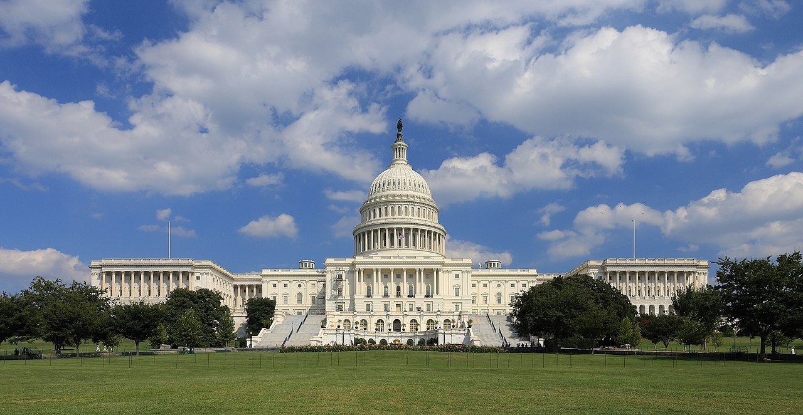
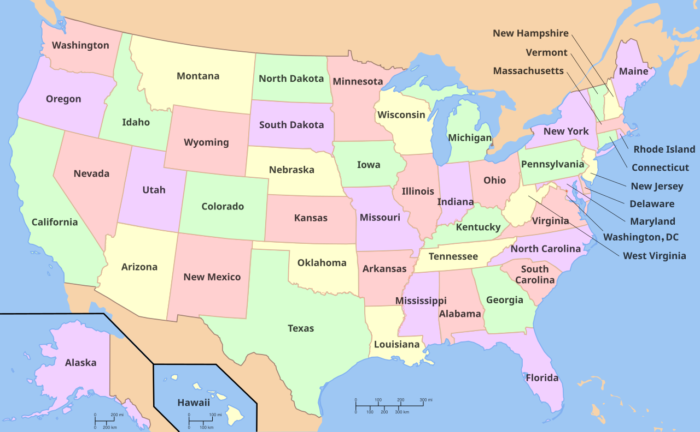

# 미국 의회가 AI가 없앤 일자리를 직접 세기로 했다

_Great American AI Act 초안은 주 AI 규제를 3년 멈추고, 연방 통계기관이 AI의 고용 영향을 직접 측정하게 한다_

## Executive Summary

> [!callout]
> 2026년 6월 4일, 미 하원의 공화당 Jay Obernolte 의원과 민주당 Lori Trahan 의원이 269쪽짜리 AI 법안 초안을 함께 내놓았습니다. 이름은 Great American AI Act, 아직 정식 발의 전의 토론용 초안입니다. 헤드라인을 가져간 것은 한 조항이었습니다. 연방법이 AI 모델 개발을 규율하는 주(州) 법을 3년간 멈춰 세운다는 것입니다. 50개 주가 제각기 만들던 규칙을 워싱턴이 하나로 덮겠다는 선언이라, 정치적 논란이 곧장 따라붙었습니다.

> 그런데 데이터를 다루는 입장에서 더 눈여겨볼 대목은 따로 있습니다. 같은 초안이 연방 통계기관에 새로운 숙제를 줍니다. 노동통계국(BLS)과 인구조사국은 기존 설문을 고쳐 AI 도입과 고용 변화를 잡아내야 하고, 노동부는 90일 안에 AI 노동력 연구 허브를 세워야 합니다. 무엇보다 대량해고에 AI가 주된 원인이었다면, 기업은 해고 통지서에 그 사실과 사라진 일자리 수를 적어 내야 합니다. 금지보다 먼저 측정 장치를 깔아 둔 셈입니다.

> 여기서 한 가지 질문이 남습니다. 왜 규제의 1번 조항이 금지가 아니라 "무슨 일이 벌어지는지 셀 수 있게 만드는 것"이 됐을까요. 주 규제를 멈추는 조항과 노동시장을 측정하는 조항을 나란히 놓고 보면, AI가 사회를 바꾸는 속도를 데이터로 잡아내는 일이 어느새 정책의 전제 조건으로 올라서 있습니다.

### 주요 수치

아래 네 숫자는 이 초안이 왜 지금 이 모습으로 나왔는지를 압축합니다. 주 규제를 멈추는 기간에는 3년이라는 시한이 박혔고, 연방이 새로 들여다보겠다는 직종은 최소 15개입니다. 그 측정을 불러낸 현실이 한 달 만에 발표된 10만 8천 건의 감원이고, 사람이 한 번은 검토해야 한다는 87%의 목소리가 그 불안을 받칩니다.

출처: [Obernolte·Trahan 보도자료](https://obernolte.house.gov/media/press-releases/obernolte-trahan-release-discussion-draft-great-american-ai-act), [Bloomberg Law](https://news.bloomberglaw.com/daily-labor-report/ai-related-layoffs-test-new-yorks-ability-to-track-job-losses)

<!-- stat-card -->
**3년** — 주 AI 개발 규제 정지 — 2029년 12월 일몰, 연방 기준을 만들 강제 타이머

<!-- stat-card -->
**15개+** — AI-민감 직종 지정 — 노동부가 2년마다 갱신, 매년 고용 전망 발표

<!-- stat-card -->
**108,000** — 2026년 1월 감원 발표 — 전년 동기 대비 118% 증가, 측정 필요의 배경

<!-- stat-card -->
**87%** — "AI 해고, 사람이 검토해야" — 2026년 6월 미국 성인 500명 여론조사

## 50개 주 법을 3년 묶는다, 어디까지

가장 많이 보도된 조항부터 봅니다. 초안의 Title V는 연방법이 AI 모델 개발을 "구체적으로 규율하는" 주 법을 3년간 선점(preempt)합니다. 핵심은 "개발"이라는 단어에 걸려 있습니다. 모델을 어떻게 학습시키는지, 어떤 안전 프레임워크를 갖춰야 하는지를 정한 주 법은 멈춥니다. 반면 AI를 실제로 쓰는 단계, 그러니까 주거·고용·의료·금융 결정에 AI가 개입할 때를 규율하는 주 법은 그대로 살아 있습니다. 개인정보보호법과 소비자보호법, 반차별법도 건드리지 않습니다.

그래서 영향권에 드는 대표적 사례가 캘리포니아입니다. 학습 데이터 투명성을 요구한 AB 2013, 콘텐츠 워터마킹을 다룬 SB 942의 일부 같은 개발 단계 규율이 3년 동안 정지됩니다. 여러 주가 앞다퉈 만들던 프론티어 안전 규제가 사실상 연방 차원으로 일원화되는 셈입니다.

주목할 점은 이 정지에 끝나는 날짜가 박혀 있다는 것입니다. 선점은 2029년 12월에 만료됩니다. 발의자들은 이를 강제 타이머(forcing function)라고 설명합니다. 주 법을 잠가 두는 동안 연방이 제대로 된 기준을 만들지 못하면, 3년 뒤 다시 50개 주의 규칙이 살아납니다. 멈춤 자체가 목적이 아니라, 그 기간 안에 연방 정책을 구체화하라는 압박 장치인 셈입니다.

반대 목소리는 바로 이 지점을 겨냥합니다. Americans for Responsible Innovation의 Brad Carson은 주 법 선점을 "세대적 실수"라고 불렀습니다. 그동안 주(州)들이 쌓아 온 AI 책임의 바닥(floor)이 연방이 정한 천장(ceiling)으로 바뀐다는 우려입니다. AFL-CIO를 비롯한 노동계 일부와 Public Citizen 같은 시민단체도 선점 조항에 비판적입니다. 반면 Business Software Alliance와 정보기술산업협의회(ITIC) 같은 업계 단체는 규칙이 50개로 쪼개지는 것보다 하나로 정리되는 편이 낫다며 지지를 표했습니다.

*▲ 미국 의회의사당 (United States Capitol) | Source: [Wikimedia Commons](https://commons.wikimedia.org/wiki/File:US_Capitol_west_side.JPG)*

> [!callout]
> **경계선 정리**: 3년 정지는 AI 개발을 규율하는 주 법에만 적용됩니다. AI를 쓰는 단계의 보호 장치는 그대로입니다. 일몰 시한을 박아 둔 것은 연방이 그 안에 기준을 완성하라는 강제 조건입니다.

## 국가가 직접 세기로 했다

선점 논란에 가려졌지만, 초안의 Title II는 전혀 다른 결의 조항을 담고 있습니다. AI가 노동시장에 무엇을 하고 있는지를 연방이 직접 측정하라는 주문입니다. 금지하거나 허가하기 전에 먼저 셈을 한다는 발상입니다.

가장 굵직한 줄기는 연방 통계 체계의 개편입니다. 노동통계국(BLS)과 인구조사국은 기존 설문을 손봐서 AI 채택과 그로 인한 고용 변화를 잡아내야 합니다. 노동부 장관은 AI에 민감한 직종을 15개 이상 지정하고 2년마다 갱신하며, 그 직종에 대해 매년 고용 전망을 내놓습니다. 직종별로 일자리가 어떻게 드나드는지를 추적하는 프로그램도 함께 돌아갑니다.

*▲ 미국 50개 주 — BLS·Census 설문 개편과 AI 민감직종 모니터링이 적용될 범위 | Source: [Wikimedia Commons](https://commons.wikimedia.org/wiki/File:Map_of_USA_with_state_names.svg)*

측정의 도구를 측정하는 장치도 있습니다. 초안은 AI가 어떤 작업을 자동화할 수 있는지를 재현 가능한 방식으로 재는 벤치마크를 개발하도록 경진대회(prize competition)를 운영하게 합니다. "AI가 이 일을 대체할 수 있는가"를 직관이 아니라 수치로 답하겠다는 시도입니다. 여기에 노동부 안에 90일 이내로 설립되는 AI 노동력 연구 허브가 더해져, 시나리오 플래닝과 정책 인사이트를 생산합니다.

조항을 하나씩 떼어 놓고 보면 평범한 행정 업무처럼 보입니다. 그러나 합쳐 놓으면 그림이 달라집니다. 설문 개편, 직종 지정, 흐름 추적, 자동화 벤치마크가 모여 "AI가 일자리에 무엇을 하는가"를 국가 통계로 환산하는 인프라가 됩니다. 규제 이전에 데이터부터 깔겠다는 설계입니다.

> [!callout]
> **측정 인프라**: BLS·Census 설문 개편, 15개 이상 AI-민감 직종의 연간 전망, 자동화 가능성 벤치마크, 노동부 연구 허브. 흩어진 조항들이 모이면 AI의 고용 영향을 국가가 정기적으로 세는 장치가 됩니다.

## 해고 통지서에 'AI가 원인'을 쓴다

측정 조항 가운데 노동자가 가장 직접 체감할 부분은 WARN Act 개정입니다. 기존 WARN Act는 100인 이상 기업이 대량해고를 하기 60일 전에 미리 통지하도록 정해 두었습니다. 초안은 여기에 AI에 관한 칸을 새로 붙입니다. AI가 그 대량해고의 "주된 요인(substantial factor)"이었다면, 기업은 통지서에 추가로 네 가지를 적어야 합니다.

- •AI가 실질적 요인이었다는 사실을 명시한다.
- •어떤 종류의 AI를 어떻게 활용했는지 기술한다.
- •AI로 인해 사라진 일자리 수를 선의의 추정치로 적는다.
- •해고에 앞서 재교육이나 업스킬링을 시도했는지, 했다면 무엇을 했는지 밝힌다.

이 조항이 현실에서 어떻게 작동하는지는 이미 한 차례 시험대에 올랐습니다. 뉴욕주는 연방보다 앞서 WARN 신고에 AI 요인 공개를 더했고, 1년 만에 160개가 넘는 기업이 신고했습니다. 다만 전문가들은 자기 신고 방식의 한계를 지적합니다. 기업이 AI 때문이라고 적은 감원과, 단순한 소프트웨어 현대화나 로봇 도입에 따른 감원을 칼같이 구분하기 어렵다는 것입니다. 측정 장치를 만든다고 곧바로 깨끗한 데이터가 나오지는 않는다는 신호입니다.

그럼에도 이 조항이 필요하다고 보는 배경에는 숫자와 여론이 있습니다. Challenger, Gray & Christmas 집계로 2026년 1월 한 달에만 10만 8천 개의 일자리 감축이 발표됐고, 이는 전년 동기 대비 118% 늘어난 수치입니다. 같은 해 6월 미국 성인 500명을 대상으로 한 조사에서는 87%가 "AI가 추천한 해고 결정은 사람 관리자가 검토해야 한다"고 답했습니다. 무슨 일이 벌어지는지 셀 수 없으면 이 불안에 정책으로 답하기 어렵습니다.

*▲ Lori Trahan 하원의원 (민주당·매사추세츠) — Obernolte 의원과 함께 GAAIA를 공동 발의한 양당 파트너 | Source: [U.S. Congress Bioguide](https://bioguide.congress.gov/bioguide/photo/T/T000482.jpg)*

> [!callout]
> **데이터가 되는 해고**: WARN Act 개정의 진짜 효과는 개별 통지서를 넘어섭니다. AI가 원인인 대량해고 하나하나가 국가 데이터베이스의 한 줄(row)이 되면, 그제야 "AI가 일자리에 무엇을 했는가"를 집계할 수 있게 됩니다. 뉴욕 사례는 그 데이터가 깨끗하려면 신고 설계가 더 정교해야 함을 보여 줍니다.

## 규제의 출발점이 측정이 됐다

규제는 보통 금지나 허가에서 시작합니다. 무엇을 하면 안 되는지, 무엇을 하려면 어떤 조건을 갖춰야 하는지를 먼저 정합니다. 그런데 이 초안의 순서는 다릅니다. AI 개발에 대한 주 규제는 일단 3년 멈춰 세우고, 그 자리에 가장 먼저 들여놓은 것이 측정 장치입니다. BLS와 인구조사국의 설문을 고치고, 민감 직종을 지정해 매년 전망을 내고, 해고 하나하나를 신고받아 데이터로 쌓는 일이 먼저입니다.

이 순서가 말이 되는 이유는 단순합니다. 무슨 일이 벌어지는지 셀 수 없으면 어떤 정책도 근거를 갖기 어렵기 때문입니다. AI가 어느 직종에서 얼마나 일자리를 줄였는지 모르는 상태에서 내리는 규제는 짐작에 기댈 수밖에 없습니다. 초안은 그 짐작을 데이터로 바꾸는 작업을 규제의 1번 조항으로 끌어올렸습니다. 측정이 결론이 아니라 전제가 된 것입니다.

물론 이것은 아직 토론용 초안입니다. 선점 기간도, 민감 직종 숫자도, 신고 기준도 입법 과정에서 얼마든지 바뀔 수 있습니다. 다만 어느 버전으로 정리되든 측정 인프라를 깔자는 발상 자체는 살아남을 가능성이 높습니다. 뉴욕과 코네티컷이 이미 비슷한 신고 의무를 도입했고, 노동시장 데이터를 요구하는 압력은 정파를 가리지 않고 커지고 있기 때문입니다.

<!-- stat-card -->
**Editor's Note** — 페블러스가 "AI-Ready Data"를 말할 때의 논리도 여기에 닿아 있습니다. 좋은 의사결정은 잘 정돈되고 믿을 만한 데이터 위에서만 가능합니다. 정부가 AI의 고용 영향을 다루기 전에 측정 장치부터 까는 것은, 기업이 AI를 도입하기 전에 데이터부터 다듬는 것과 같은 순서입니다. 규제든 사업이든, 셀 수 있게 만드는 일이 먼저라는 점은 다르지 않습니다.

## 참고문헌

### 공식 문서

- 1.Obernolte, J., & Trahan, L. (2026). "[Obernolte, Trahan Release Discussion Draft of the Great American AI Act](https://obernolte.house.gov/media/press-releases/obernolte-trahan-release-discussion-draft-great-american-ai-act)." U.S. House of Representatives. — 269쪽 초안의 공식 발표 보도자료. 양당 공동 발의.

### 보도

- 2.Roll Call. (2026, 6월 4일). "[Bipartisan AI draft proposes three-year preemption of state laws](https://rollcall.com/2026/06/04/bipartisan-ai-draft-proposes-three-year-preemption-of-state-laws/)." — 주 법 3년 선점 조항의 정치적 충돌과 이해관계자 반응.
- 3.FedScoop. (2026, 6월 4일). "[Bipartisan Great American AI Act draft proposes three-year preemption of state laws](https://fedscoop.com/bipartisan-great-american-ai-act-draft-proposes-three-year-preemption-of-state-laws/)." — 초안 조항 개요 및 선점 범위 정리.
- 4.Bloomberg Law. (2026). "[AI-Related Layoffs Test New York's Ability to Track Job Losses](https://news.bloomberglaw.com/daily-labor-report/ai-related-layoffs-test-new-yorks-ability-to-track-job-losses)." Daily Labor Report. — 뉴욕주 AI WARN 신고 1년 운영 사례와 자기 신고의 한계.

### 법률·정책 분석

- 5.Tech Policy Press. (2026). "[Unpacking the Great American Artificial Intelligence Act of 2026](https://www.techpolicy.press/unpacking-the-great-american-artificial-intelligence-act-of-2026/)." — Title I~V 조항별 상세 분석.
- 6.Fisher Phillips. (2026). "[Congress Proposes First Comprehensive Federal AI Framework](https://www.fisherphillips.com/en/insights/insights/congress-proposes-first-comprehensive-federal-ai-framework)." — 고용주 법무 관점에서 본 WARN Act 개정과 AI 대량해고 공개 의무.
- 7.DLA Piper. (2026). "[Unpacking the Great American AI Act](https://www.dlapiper.com/en-us/insights/publications/2026/06/unpacking-the-great-american-ai-act)." — 규제 컴플라이언스 관점의 안전 요건·선점 경계 분석.
- 8.Addington Law. (2026). "[Congress's Great American AI Act Signals Increased Scrutiny of Workplace AI](https://www.addingtonlaw.com/post/congress-s-great-american-ai-act-signals-increased-scrutiny-of-workplace-ai)." — 직장 내 AI 활용에 대한 규제 강화 시그널과 노동자 보호 조항.
