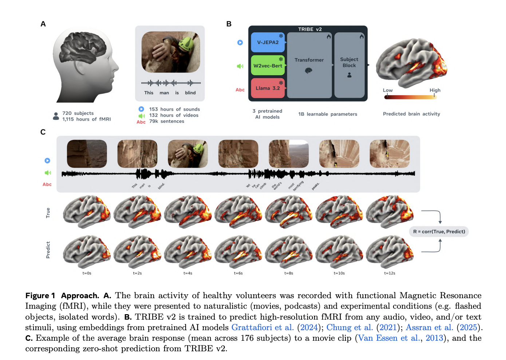
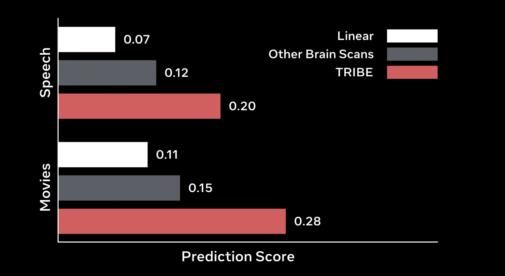
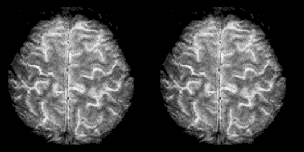

# AI Can Predict Your Brain Activity

_A Deep Dive into Meta TRIBE v2 — Brain Encoding Foundation Models and Their Implications_

## Executive Summary

> [!callout]
> On March 26, 2026, Meta FAIR unveiled **TRIBE v2** (Trimodal Brain Encoder v2).
>                         Trained on over 1,000 hours of fMRI data from more than 720 subjects, the model
>                         **predicts how the brain responds** to images, video, audio, and text stimuli —
>                         with **70× higher spatial resolution** and **2–3× better accuracy** than prior state-of-the-art.

> More significantly, the model's **scaling law has not yet plateaued**.
>                         Prediction accuracy keeps rising as more fMRI data is added.
>                         Brain research is at an inflection point: the field is shifting from
>                         "placing subjects in scanners one study at a time" to
>                         "running thousands of virtual experiments in seconds."

> Model weights and code are available as **CC BY-NC open source**.
>                         But the implications of this technology — the predictability of brain activity patterns,
>                         neural privacy, and Meta's strategic positioning — remain underexplored.

70×

Resolution Gain

2–3×

Accuracy Gain

720+

fMRI Subjects

1,000h+

Training fMRI Data

## What Is TRIBE? — An AI That Predicts Your Brain

TRIBE stands for **Trimodal Brain Encoder** — a brain encoding foundation model
                    developed by Meta FAIR (Fundamental AI Research) that predicts how the human brain responds to stimuli.

What exactly does "predicts" mean here?
                    Brain activity can be measured via **fMRI (functional Magnetic Resonance Imaging)**,
                    which records how much each region of the brain activates — measured in
                    **voxels**, essentially 3D pixels. When you see an image or hear a sound,
                    fMRI tracks which brain regions "light up" and by how much.

*▲ A researcher guides a subject into an fMRI scanner — TRIBE v2's training data was collected exactly this way: real subjects watching videos inside scanners while their brain activity was recorded | Source: [Wikimedia Commons (Imperial Centre for Psychedelic Research)](https://commons.wikimedia.org/wiki/File:190603_Functional_magnetic_resonance_imaging_at_the_Imperial_Centre_for_Psychedelic_Research.jpg)*

TRIBE v2 reverses this process.
                    Without placing anyone in a scanner,
                    it **predicts how the brain would respond to any given stimulus**
                    — image, video, audio, or text — at the resolution of ~70,000 voxels.

#### Brain Encoding vs. Brain Decoding

<!-- stat-card -->
**🧠 → 💻 Brain Decoding** — Reads fMRI signals to infer what a person is seeing or thinking. The direction of "mind reading." — 💻 → 🧠 Brain Encoding — Predicts how the brain responds to a given stimulus. TRIBE v2's direction. Goal: accelerating neuroscience research. — TRIBE v2 is an encoding model. It simulates brain responses to stimuli — it does not read your mind.

TRIBE v2's direct predecessor won the Algonauts 2025 Challenge —
                    an international competition in brain encoding.
                    Meta's FAIR team took first place in 2025 and subsequently scaled that architecture into TRIBE v2.

## v1 → v2: The Numbers Tell the Story

The jump from TRIBE v1 to v2 isn't a minor update.
                    Nearly every metric changed by an order of magnitude.

| Metric | TRIBE v1 | TRIBE v2 |
| --- | --- | --- |
| Training subjects | 4 | 720+ |
| Training fMRI data | Low-res, small volume | 451.6 hrs (25 studies) |
| Evaluation dataset | Single study | 1,117.7 hrs, 720 subjects |
| Predicted voxels | ~1,000 | ~70,000 |
| Resolution | Low | 70× improvement |
| Accuracy | Baseline | 2–3× improvement |
| Input modalities | Primarily visual | Video + Audio + Text |
| Zero-shot generalization | Limited | New subjects, languages, tasks |
| Scaling plateau | — | Not yet reached |

> [!callout]
> **The standout figure:** 4 subjects → 720+.
>                         In neuroscience, fMRI data collection is extraordinarily slow and expensive.
>                         Scanning one subject for one hour can cost thousands of dollars, with months of analysis to follow.
>                         Meta aggregated data scattered across labs worldwide into a single foundation model.

*▲ TRIBE v2 approach (Paper Figure 1) — Left: subjects watch naturalistic movies while fMRI records brain activity. Right: TRIBE v2 takes video, audio, and text features as input and predicts per-subject brain activation maps | Source: [Meta FAIR (2026)](https://ai.meta.com/research/publications/a-foundation-model-of-vision-audition-and-language-for-in-silico-neuroscience/)*

The **scaling law** deserves special attention.
                    TRIBE v2's prediction accuracy increases log-linearly as more fMRI data is added —
                    no plateau in sight. Just as language models followed "more text = better model,"
                    TRIBE v2 follows "more fMRI data = more accurate brain predictions."
                    **Performance has not yet leveled off.**

## Technical Deep Dive: Three AIs Learning to Understand the Brain

TRIBE v2's architecture is a three-stage pipeline:
                    **multimodal feature extraction → temporal integration → brain mapping.**
                    Each stage draws on Meta's latest AI models.

<!-- stat-card -->
**Stage 1 — Multimodal Encoders (Frozen Weights)** — V-JEPA 2 — Video features — Wav2Vec-BERT — Audio features — LLaMA 3.2 — Language features

↓

<!-- stat-card -->
**Stage 2 — Temporal Transformer** — 8 layers · 8 attention heads · 100-second context window

↓

<!-- stat-card -->
**Stage 3 — Subject-Specific Brain Mapping** — Per-subject prediction block → ~70,000 voxel fMRI output

### Stage 1: Three Specialized AIs Process the Senses

Three specialized models handle each sensory modality independently.
                    Crucially, their **weights are frozen** — TRIBE v2 doesn't retrain them.
                    It treats their learned representations as rich feature inputs for brain prediction.

#### V-JEPA 2 — Seeing

<!-- stat-card -->
**Meta's self-supervised video model. Encodes motion, objects, and spatial relationships into high-dimensional features —
                            effectively the AI analog of what the visual cortex processes in space and time.**

#### Wav2Vec-BERT — Hearing

<!-- stat-card -->
**Meta's speech foundation model. Processes acoustic patterns, rhythm, and linguistic content.
                            Drives predictions for auditory cortex and language processing regions.**

#### LLaMA 3.2 — Understanding Language

<!-- stat-card -->
**Meta's open-source large language model. Represents meaning, context, and linguistic structure.
                            Central to predicting frontal lobe and language area responses.**

### Stage 2: A Temporal Transformer Integrates 100 Seconds

The three encoders' outputs feed into a **Temporal Transformer** —
                    8 layers, 8 attention heads — that integrates multimodal information
                    within a **100-second context window**.

The 100-second window is a deliberate design choice.
                    fMRI signals have an inherent **hemodynamic response lag**:
                    when the brain receives a stimulus, blood flow changes appear 4–6 seconds later,
                    and the effect takes time to dissipate.
                    The Temporal Transformer accounts for this delay by simultaneously processing
                    past, present, and future stimuli in context.

### Stage 3: Mapping to Each Individual Brain

In the final stage, the integrated representation passes through
                    a **subject-specific prediction block** to produce
                    approximately 70,000 voxel-level fMRI outputs.
                    Since every brain is slightly different, this stage adapts to each individual's neural anatomy.

Particularly impressive is **zero-shot prediction**:
                    TRIBE v2 can predict responses for an entirely new subject,
                    stimuli in a new language, or a novel experimental task —
                    all without additional training. Its accuracy often tracks
                    **closer to the group average than to individual scan noise.**

> [!callout]
> **One-line summary:** TRIBE v2 is a bridge model connecting Meta's latest video AI (V-JEPA 2), speech AI (Wav2Vec-BERT), and language AI (LLaMA 3.2) to neuroscience — learning how well each AI's "sensory features" mirror the corresponding "sensory processing regions" of the human brain.

*▲ TRIBE v2 prediction accuracy (Paper Figure 2) — On both Speech and Movies stimuli, TRIBE achieves 2–3× the prediction score of simple linear models and meaningfully outperforms other brain scan baselines | Source: [Meta FAIR (2026)](https://ai.meta.com/research/publications/a-foundation-model-of-vision-audition-and-language-for-in-silico-neuroscience/)*

## In-Silico Neuroscience — Running Brain Experiments in a Computer

The biggest opportunity TRIBE v2 unlocks is **in-silico neuroscience**:
                    running neuroscience experiments entirely in simulation.

Consider the bottlenecks of traditional brain research.
                    Answering "how does this advertisement activate the prefrontal cortex?"
                    used to require recruiting dozens of subjects, booking scanner time
                    (thousands of dollars per hour at a research hospital),
                    months of analysis, and another year of peer review.
                    With TRIBE v2, you can **simulate brain responses to thousands of images in seconds.**

*▲ High-resolution fMRI brain scan — TRIBE v2 predicts brain activation across 70,000+ voxels at this resolution. The contrast with prior models (~1,000 voxels) becomes immediately apparent | Source: [Wikimedia Commons](https://commons.wikimedia.org/wiki/File:High_Resolution_FMRI_of_the_Human_Brain.gif)*

#### 🔬 Accelerating Neuroscience

- • Pre-screening hypotheses before expensive scans
- • Predicting responses to rare or novel stimuli
- • Modeling information flow between brain regions
- • Virtual experiments in data-scarce domains

#### 🏥 Clinical & Applied Uses

- • Sensory processing research in neurodevelopmental disorders
- • Simulating brain responses in patients with language impairments
- • Pre-optimizing brain-computer interfaces
- • Supporting neurorehabilitation protocol design

#### 🤖 AI Model Development

- • Measuring how "brain-like" AI vision/audio models are
- • Alignment research between human cognition and AI representations
- • Designing brain-inspired architectures
- • Building more naturalistic human-AI interfaces

#### 🎓 Education & Access

- • Brain research education without fMRI hardware
- • Lowering barriers for researchers in lower-resource settings
- • Open-source release enabling global collaboration
- • Small labs gaining large-scale research capabilities

2025

Algonauts 2025 Challenge — First Place

Meta FAIR wins the international brain encoding competition. The foundational TRIBE v2 architecture is established.

March 26, 2026

TRIBE v2 Public Release

Paper, model weights, code, and interactive demo released simultaneously. CC BY-NC open source.

2026 and beyond

Scaling Not Yet Saturated — Improvement Continues

Accuracy keeps rising with more fMRI data. As more research data is shared globally, so will the model's capability.

## Brain Digital Twins — Technology Outpacing Ethics

Framing TRIBE v2 as simply a research tool misses the bigger picture.
                    The capabilities it unlocks raise a new category of questions.

### Neural Privacy

Brain activity patterns are **individually identifying**.
                    How you respond to stimuli can reveal emotional states, cognitive biases, and subconscious preferences
                    with far greater accuracy than behavioral data alone.

TRIBE v2 doesn't need your personal fMRI scan.
                    A model trained on others' data can already predict
                    "how do brains like yours respond to this advertisement?"
                    If this is applied to advertising and content optimization,
                    your brain's responses could be commercially exploited
                    _without you ever consenting to a brain scan._

#### Neural Rights — A Legal Vacuum

Legal protections for brain data are currently minimal. Chile became the first country to enshrine "neural rights" in its constitution in 2021,
                        and a handful of jurisdictions are debating similar frameworks — but most of the world has no legislation.
                        GDPR protects personal data, but it has no clear provisions for AI that _predicts_ brain responses without a personal fMRI scan.

### Brain Encoding as an AI Alignment Benchmark

TRIBE v2 introduces a compelling new benchmark: **"How human-like is this AI?"** —
                    measurable directly against brain activity. "Does this model process information the way
                    the human brain does?" becomes an empirical, neuroscientifically grounded question.

The TRIBE v2 paper notes this explicitly:
                    models like LLaMA 3.2 and V-JEPA 2 can be evaluated as encoders by how well
                    their representations predict corresponding brain regions.
                    **It's essentially using fMRI to verify how human-like an AI's "seeing, hearing, and understanding" really is.**

### The BCI Connection

Meta is aggressively positioning itself in AR/VR and BCI —
                    through the Quest headset and Ray-Ban Meta smart glasses.
                    Companies like Neuralink and Synchron are attracting attention in the same space.
                    A foundation model for predicting brain responses could become critical infrastructure
                    for this entire ecosystem.

## Why Is Meta Doing This? — Reading the Strategic Play

The CC BY-NC open-source release of TRIBE v2 isn't altruism.
                    Within Meta's AI strategy, this decision follows a consistent pattern.

#### 1. A Brain-Alignment Benchmark for Its Own AI Models

<!-- stat-card -->
**LLaMA, V-JEPA 2, and Wav2Vec-BERT are TRIBE v2's encoders.
                            When TRIBE v2 improves, it simultaneously validates how well Meta's AI models align
                            with the human brain. It creates a self-reinforcing loop that provides neuroscientific
                            credibility for Meta's AI competitiveness.**

#### 2. Open-Source to Build an Ecosystem — and Attract fMRI Data

<!-- stat-card -->
**The same playbook as LLaMA: open-source release builds an ecosystem.
                            As researchers worldwide build on TRIBE v2 and publish papers,
                            new fMRI datasets get released publicly — which Meta can use to train
                            even better future versions.**

#### 3. Staking Claim to Core AR/VR-BCI Technology

<!-- stat-card -->
**Meta Quest and Ray-Ban smart glasses already collect gaze, voice, and environmental data.
                            As brain-response prediction matures, combining it with non-invasive sensors
                            (EEG, eye tracking, galvanic skin response) opens the door to
                            real-time AR/VR interfaces optimized to individual brain responses.**

#### 4. Building Trust with the Neuroscience Community

<!-- stat-card -->
**Cognitive neuroscientists have traditionally been skeptical of Big Tech.
                            Releasing TRIBE v2 as open-source research and competing in Algonauts
                            is a deliberate trust-building exercise with a community that controls
                            access to the very data Meta needs.**

> [!callout]
> **Bottom line:** TRIBE v2 plays three roles simultaneously in Meta's AI portfolio:
>                         a validation tool for its own AI models, a data-attraction flywheel through ecosystem building,
>                         and a foundational technology bet on the AR/VR-BCI future.
>                         It sits precisely at the intersection of pure neuroscience research and strategic positioning.

<!-- stat-card -->
**Why Pebblous follows this research** — TRIBE v2's scaling law is more than a performance metric.
                        **More data means better predictions** — but it also means
                        **data quality determines where the model actually scales to.**
                        If the training fMRI contains batch bias, over-represented stimulus types, or duplicate sessions,
                        the model scales in the wrong direction, confidently. — The issues [DataClinic](https://dataclinic.ai) diagnoses —
                        class imbalance, redundant samples, batch bias — apply directly to brain encoding datasets.
                        The larger the data, the more consequential the quality of that data becomes.

## Frequently Asked Questions

#### Q. Is TRIBE v2 mind reading?

<!-- stat-card -->
**No. TRIBE v2 is an encoding model — it predicts how the brain responds to a given stimulus.
                            It does not read brain signals to infer what you're thinking.
                            The directions are opposite: predicting brain response from stimulus is a fundamentally
                            different problem from inferring content from brain activity.**

#### Q. Can I try TRIBE v2 myself?

<!-- stat-card -->
**Yes. Meta has released an interactive demo at aidemos.atmeta.com/tribev2,
                            along with model weights and code under CC BY-NC.
                            That said, practical use requires fMRI data, so it's currently most useful for neuroscience researchers.**

#### Q. What does 70× resolution actually mean?

<!-- stat-card -->
**TRIBE v1 (and comparable prior models) predicted around 1,000 voxels — the 3D pixels of brain activity.
                            TRIBE v2 predicts ~70,000. That means it can map fine-grained activation across the entire cortical surface.
                            Think of the difference between a 1,000-pixel image and a 70,000-pixel image.**

#### Q. What does "scaling not yet saturated" mean in practice?

<!-- stat-card -->
**Just as language models keep improving with more text and parameters,
                            TRIBE v2's prediction accuracy rises log-linearly with more fMRI data — with no plateau in sight.
                            In practical terms: every new brain study that shares data publicly makes the next version of TRIBE better.**

#### Q. What are the neural rights implications?

<!-- stat-card -->
**Most legal systems have no specific protections for brain data or brain response predictions.
                            Chile is the only country with constitutional "neural rights" provisions (since 2021).
                            As brain encoding AI matures, the field urgently needs governance frameworks covering
                            inference of brain responses from population-level data — not just individual scan privacy.**
