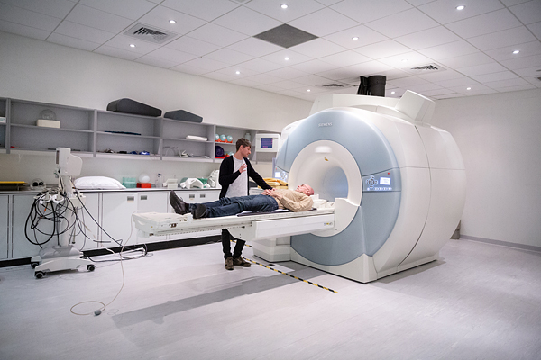

# AI가 당신의 뇌를 예측한다

_Meta TRIBE v2 심층 분석 — 뇌 인코딩 파운데이션 모델의 현실과 함의_

## Executive Summary

> [!callout]
> 2026년 3월 26일, Meta FAIR는 **TRIBE v2**(Trimodal Brain Encoder v2)를 공개했습니다.
>                         700명 이상의 피험자에게서 수집한 1,000시간 이상의 fMRI 데이터로 훈련된 이 모델은,
>                         이미지·영상·음성·텍스트 자극에 대한 **뇌의 반응을 예측**합니다.
>                         해상도는 기존 대비 **70배**, 정확도는 **2~3배** 향상됐습니다.

> 더 중요한 것은 이 모델의 **스케일링 법칙이 아직 포화하지 않았다**는 사실입니다.
>                         fMRI 데이터를 더 줄수록 정확도가 계속 오릅니다.
>                         뇌 연구는 이제 "실험실에서 피험자를 스캐너에 눕히는" 방식에서
>                         "AI가 가상으로 수천 번 실험하는" 방식으로 전환점을 맞이하고 있습니다.

> 모델 가중치와 코드는 **CC BY-NC 오픈소스**로 공개됐습니다.
>                         그러나 이 기술이 가져오는 함의 — 뇌 활동 패턴의 예측 가능성, 뉴럴 프라이버시,
>                         그리고 Meta의 전략적 포지션 — 은 아직 충분히 논의되지 않고 있습니다.

70×

해상도 향상

2~3×

정확도 향상

720명

fMRI 피험자 수

1,000h+

학습 fMRI 데이터

## TRIBE란 무엇인가 — 뇌를 예측하는 AI

TRIBE는 **Trimodal Brain Encoder**의 약자입니다. Meta FAIR(Fundamental AI Research) 팀이 개발한
                    뇌 인코딩(brain encoding) 파운데이션 모델로, 인간의 뇌가 특정 자극에 어떻게 반응하는지를 예측합니다.

여기서 "예측"이란 무엇을 의미할까요?
                    인간의 뇌 활동은 **fMRI(기능성 자기공명영상)**로 측정할 수 있습니다.
                    fMRI는 뇌의 특정 영역이 얼마나 활성화됐는지를 **복셀(voxel)** — 3D 픽셀 —
                    단위로 기록합니다. 어떤 영상을 보여줬을 때, 어떤 소리를 들었을 때,
                    뇌의 어느 부분이 얼마나 밝아지는지를 측정하는 것입니다.

*▲ 연구자가 피험자를 fMRI 스캐너로 안내하는 장면 — TRIBE v2의 훈련 데이터는 이처럼 실제 피험자가 스캐너에서 자극을 받으며 수집된 뇌 활동 데이터입니다 | Source: [Wikimedia Commons (Imperial Centre for Psychedelic Research)](https://commons.wikimedia.org/wiki/File:190603_Functional_magnetic_resonance_imaging_at_the_Imperial_Centre_for_Psychedelic_Research.jpg)*

TRIBE v2는 이 과정을 뒤집습니다.
                    실제로 피험자를 스캐너에 눕히지 않아도,
                    **어떤 자극(이미지·영상·음성·텍스트)을 주면 뇌가 어떻게 반응할지**를
                    AI가 예측합니다. 70,000개의 복셀에 대해, 고해상도로.

#### 뇌 인코딩 vs 뇌 디코딩

<!-- stat-card -->
**🧠 → 💻 뇌 디코딩 (Brain Decoding)** — fMRI 신호를 읽어 "이 사람이 무엇을 보고/생각하고 있는가"를 맞춤. 마인드 리딩에 가까운 방향. — 💻 → 🧠 뇌 인코딩 (Brain Encoding) — 자극을 주면 뇌가 어떻게 반응하는지 예측. TRIBE v2의 방향. 신경과학 연구 가속화가 목적. — TRIBE v2는 인코딩 모델입니다. "뇌를 읽는" 디코딩이 아니라, "자극에 대한 뇌 반응을 시뮬레이션"합니다.

TRIBE v2의 직접적인 전신은 Algonauts 2025 챌린지에서 우승한 모델입니다.
                    Algonauts는 뇌 인코딩 분야의 국제 경진대회로, Meta의 FAIR 팀이 2025년 우승했고
                    그 아키텍처를 대폭 확장한 것이 TRIBE v2입니다.

## v1 → v2: 숫자로 보는 도약

TRIBE v1에서 v2로의 전환은 단순한 버전 업이 아닙니다.
                    거의 모든 지표에서 자릿수가 달라졌습니다.

| 항목 | TRIBE v1 | TRIBE v2 |
| --- | --- | --- |
| 훈련 피험자 수 | 4명 | 720명 이상 |
| 훈련 fMRI 데이터 | 저해상도, 소량 | 451.6시간 (25개 연구) |
| 평가 데이터셋 | 단일 연구 | 1,117.7시간, 720명 |
| 예측 복셀 수 | ~1,000 복셀 | ~70,000 복셀 |
| 해상도 | 저해상도 | 70배 향상 |
| 정확도 | 기준 | 2~3배 향상 |
| 입력 모달리티 | 시각 위주 | 영상 + 음성 + 텍스트 |
| 제로샷 일반화 | 제한적 | 새 피험자, 새 언어, 새 과제 |
| 스케일링 포화 여부 | — | 미포화 (계속 향상 중) |

> [!callout]
> **가장 주목할 수치:** 피험자 4명 → 720명이라는 규모의 차이.
>                         신경과학 연구에서 fMRI 데이터 수집은 매우 비싸고 느립니다.
>                         피험자 한 명을 한 시간 스캔하는 비용은 수백만 원, 분석에는 몇 달이 걸립니다.
>                         Meta는 전 세계 연구소에 흩어진 데이터를 하나의 파운데이션 모델로 통합했습니다.

*▲ TRIBE v2 접근법 (논문 Figure 1) — 피험자가 영화를 시청하는 동안 fMRI로 뇌 활동을 기록하고(좌), AI가 영상·음성·텍스트 자극에 대한 피험자별 뇌 활성화 지도를 예측함(우) | Source: [Meta FAIR (2026)](https://ai.meta.com/research/publications/a-foundation-model-of-vision-audition-and-language-for-in-silico-neuroscience/)*

특히 주목해야 할 것은 **스케일링 법칙**입니다.
                    TRIBE v2는 fMRI 데이터를 더 추가할수록 예측 정확도가 로그-선형으로 계속 증가합니다.
                    GPT 계열 언어 모델이 "더 많은 텍스트 = 더 좋은 모델"이었듯,
                    TRIBE v2는 "더 많은 fMRI 데이터 = 더 정확한 뇌 예측"의 법칙을 따릅니다.
                    **아직 성능 정체(plateau)가 없습니다.**

## 기술 심층: 세 개의 AI가 뇌를 이해하는 방법

TRIBE v2의 아키텍처는 세 단계로 구성됩니다:
                    **멀티모달 특징 추출 → 시간적 통합 → 뇌 매핑.**
                    각 단계에서 Meta의 최신 AI 모델들이 파이프라인을 구성합니다.

<!-- stat-card -->
**Stage 1 — 멀티모달 인코더 (동결 가중치)** — V-JEPA 2 — 영상 특징 — Wav2Vec-BERT — 음성 특징 — LLaMA 3.2 — 언어 특징

↓

<!-- stat-card -->
**Stage 2 — Temporal Transformer** — 8 레이어 · 8 어텐션 헤드 · 100초 윈도우로 시간 통합

↓

<!-- stat-card -->
**Stage 3 — Subject-Specific Brain Mapping** — 피험자별 예측 블록 → ~70,000 복셀 fMRI 출력

### Stage 1: 세 가지 AI가 감각을 처리한다

첫 번째 단계에서는 세 개의 특화된 AI 모델이 각각의 감각 정보를 처리합니다.
                    중요한 것은 이 인코더들의 **가중치가 동결(frozen)**되어 있다는 점입니다.
                    TRIBE v2는 이 모델들을 재학습하지 않고, 이미 학습된 표현을 뇌 예측의 입력으로 활용합니다.

#### V-JEPA 2 — 영상을 보다

<!-- stat-card -->
**Meta의 자기지도학습(self-supervised) 비디오 모델. 화면의 움직임, 물체, 공간 관계를 고차원 특징으로 인코딩합니다.
                            시각 피질이 처리하는 시공간 정보의 AI 버전이라 할 수 있습니다.**

#### Wav2Vec-BERT — 소리를 듣다

<!-- stat-card -->
**Meta의 음성 인식 파운데이션 모델. 음성의 음향적 패턴, 리듬, 언어적 내용을 처리합니다.
                            청각 피질과 언어 처리 영역에 해당하는 뇌 반응을 예측하는 데 활용됩니다.**

#### LLaMA 3.2 — 언어를 이해하다

<!-- stat-card -->
**Meta의 오픈소스 대형 언어 모델. 텍스트의 의미, 맥락, 언어적 구조를 표현합니다.
                            전두엽과 언어 처리 영역의 뇌 반응 예측에 핵심적인 역할을 합니다.**

### Stage 2: Temporal Transformer가 100초를 통합한다

세 개의 인코더 출력은 **Temporal Transformer**로 전달됩니다.
                    이 Transformer는 8개 레이어, 8개 어텐션 헤드로 구성되며,
                    **100초 윈도우** 내의 멀티모달 정보를 통합합니다.

100초라는 윈도우 크기는 중요한 설계 선택입니다.
                    fMRI 신호에는 **혈역학적 반응 지연(hemodynamic response lag)**이 있습니다.
                    뇌가 자극을 받으면 혈류 변화가 4~6초 후에 나타나고, 영향이 사라지는 데도 시간이 걸립니다.
                    Temporal Transformer는 이 시간 지연을 고려하여
                    과거·현재·미래 자극의 맥락을 동시에 처리합니다.

### Stage 3: 피험자별 뇌로 매핑한다

마지막 단계에서 통합된 표현은 **피험자별 예측 블록**을 통해
                    약 70,000개의 복셀로 출력됩니다.
                    모든 사람의 뇌는 조금씩 다르기 때문에, 이 단계는 피험자 개인의 뇌 구조에 맞게 조정됩니다.

더 인상적인 것은 **제로샷 예측**입니다.
                    전혀 본 적 없는 새 피험자, 새 언어의 자극, 새로운 실험 과제에 대해서도
                    추가 학습 없이 예측을 수행할 수 있습니다.
                    그 정확도는 종종 **개별 피험자의 실제 fMRI 측정값보다 그룹 평균에 더 가깝습니다.**

> [!callout]
> **한 줄 요약:** TRIBE v2는 Meta의 최신 비디오 AI(V-JEPA 2), 음성 AI(Wav2Vec-BERT), 언어 AI(LLaMA 3.2)를 뇌 과학과 연결하는 브리지 모델입니다. 각 AI가 처리하는 "감각 특징"이 인간 뇌의 "감각 처리 영역"과 얼마나 유사한지를 학습한 것입니다.

*▲ TRIBE v2 예측 정확도 비교 (논문 Figure 2) — 음성(Speech)·영화(Movies) 자극에서 단순 선형 모델(Linear) 대비 2~3배, 기존 뇌 스캔(Other Brain Scans) 대비에서도 유의미하게 높은 예측 점수 | Source: [Meta FAIR (2026)](https://ai.meta.com/research/publications/a-foundation-model-of-vision-audition-and-language-for-in-silico-neuroscience/)*

## 가상 신경과학 실험 — in-silico neuroscience의 의미

TRIBE v2가 열어주는 가장 큰 가능성은 **in-silico neuroscience**입니다.
                    컴퓨터 시뮬레이션으로 신경과학 실험을 하는 것입니다.

기존 신경과학 연구의 병목을 생각해보세요.
                    "이 광고 이미지가 전두엽 활성화에 어떤 영향을 미치는가?"라는 질문에 답하려면:
                    수십 명의 피험자를 모집하고, fMRI 스캐너 시간을 예약하고(대학병원 기준 시간당 수백만 원),
                    데이터를 분석하고, 논문을 쓰는 데 1~2년이 걸렸습니다.
                    TRIBE v2로는 **수 초 만에 수천 개의 이미지에 대한 뇌 반응을 시뮬레이션**할 수 있습니다.

*▲ 고해상도 fMRI 뇌 스캔 — TRIBE v2는 이와 같은 70,000개 이상의 복셀에 대해 자극별 뇌 활성화 패턴을 예측합니다. 기존 모델(~1,000 복셀)과의 해상도 차이가 이 그림에서 직관적으로 와닿습니다 | Source: [Wikimedia Commons](https://commons.wikimedia.org/wiki/File:High_Resolution_FMRI_of_the_Human_Brain.gif)*

#### 🔬 신경과학 연구 가속화

- • 가설 검증을 위한 사전 스크리닝
- • 희귀 자극(특수 언어, 감각 조합)에 대한 뇌 반응 예측
- • 뇌 영역 간 정보 흐름 모델링
- • 데이터 부족 연구 영역에서의 가상 실험

#### 🏥 임상 및 응용 가능성

- • 신경발달 장애의 감각 처리 연구
- • 언어 장애 환자의 뇌 반응 시뮬레이션
- • 뇌-컴퓨터 인터페이스(BCI) 사전 최적화
- • 신경 재활 프로토콜 개발 지원

#### 🤖 AI 모델 개발 지원

- • AI 시각/청각 모델의 뇌 유사도 평가
- • 인간 인지와 AI 표현의 정렬(alignment) 연구
- • 뇌 영감(brain-inspired) 아키텍처 설계
- • 자연스러운 인간-AI 인터페이스 연구

#### 🎓 교육 및 접근성

- • fMRI 장비 없이 뇌 연구 교육 가능
- • 개발도상국 연구자의 신경과학 연구 진입
- • 오픈소스 공개로 글로벌 협업 촉진
- • 소규모 실험실의 대규모 연구 역량 확보

2025

Algonauts 2025 챌린지 우승

Meta FAIR, 뇌 인코딩 국제 경진대회에서 1위. TRIBE v2의 기반 아키텍처 확립.

2026년 3월 26일

TRIBE v2 공개 발표

논문, 모델 가중치, 코드, 인터랙티브 데모 동시 공개. CC BY-NC 오픈소스.

2026년 이후

스케일링 미포화 — 계속 성장 중

fMRI 데이터가 늘어날수록 정확도 향상이 지속. 더 많은 연구 데이터가 공유될수록 모델 성능도 오를 것.

## 뇌 디지털 트윈의 함의 — 기술이 앞서고 윤리가 뒤따른다

TRIBE v2를 "단순히 신경과학 연구 도구"로만 바라보면 충분하지 않습니다.
                    이 모델이 열어주는 능력은 새로운 종류의 질문들을 제기합니다.

### 뉴럴 프라이버시(Neural Privacy)

뇌 활동 패턴은 **개인 식별이 가능**합니다.
                    어떤 자극에 어떻게 반응하는지는 감정 상태, 인지 편향, 무의식적 선호도를
                    의식적 행동보다 훨씬 정확하게 드러낼 수 있습니다.

TRIBE v2는 직접 fMRI를 찍지 않아도 됩니다 — 이미 측정된 다른 사람들의 데이터로
                    훈련된 모델이 "당신과 유사한 사람들의 뇌가 이 광고를 보면 어떻게 반응하는가"를
                    예측할 수 있게 됩니다. 이것이 광고·콘텐츠 최적화에 적용된다면,
                    사용자가 자신의 뇌 데이터를 직접 제공하지 않아도 뇌 반응이 상업적으로 활용될 수 있습니다.

#### Neural Rights — 아직 법적 공백

뇌 데이터에 대한 법적 보호는 현재 극히 제한적입니다. 칠레는 2021년 세계 최초로 '신경권(Neural Rights)'을 헌법에 포함시켰고,
                        일부 국가에서 논의 중이지만 대부분의 국가에서는 법적 공백이 존재합니다.
                        GDPR은 개인 데이터를 보호하지만, AI가 개인 fMRI 없이 뇌 반응을 _예측_하는 경우에 대한 규정은 아직 없습니다.

### AI 정렬(Alignment)과 뇌 인코딩의 관계

TRIBE v2가 제시하는 또 다른 흥미로운 함의는 **AI 모델 평가의 새로운 기준**입니다.
                    "이 AI 모델이 인간의 인지와 얼마나 비슷하게 정보를 처리하는가?"를
                    뇌 인코딩 모델로 직접 측정할 수 있게 됩니다.

TRIBE v2의 논문에서도 이 점을 언급합니다:
                    LLaMA 3.2, V-JEPA 2 같은 Meta의 AI 모델이 뇌의 해당 처리 영역과
                    얼마나 잘 정렬되는지를 평가하는 도구로 TRIBE v2를 활용할 수 있습니다.
                    **AI가 인간처럼 "보고, 듣고, 이해하는"지를 fMRI로 검증하는 것**입니다.

### BCI(뇌-컴퓨터 인터페이스)와의 연결

Meta는 AR/VR 기기인 Quest와 스마트 안경 Ray-Ban Meta를 통해
                    헬스케어 및 BCI 분야로의 진출을 공격적으로 준비 중입니다.
                    Neuralink(Elon Musk), Synchron 같은 BCI 스타트업이 주목받는 것도 같은 맥락입니다.
                    뇌 반응을 예측하는 파운데이션 모델은 이 생태계에서 핵심 기반 기술이 될 수 있습니다.

## Meta는 왜 이걸 하나 — 전략적 맥락 읽기

TRIBE v2가 CC BY-NC로 오픈소스 공개된 것은 순수한 이타주의가 아닙니다.
                    Meta의 AI 전략에서 이 결정은 일관된 패턴을 따릅니다.

#### 1. 자사 AI 모델의 뇌 정렬 측정 도구

<!-- stat-card -->
**LLaMA, V-JEPA 2, Wav2Vec-BERT가 TRIBE v2의 인코더로 활용됩니다.
                            TRIBE v2의 성능이 좋아진다는 것은 Meta의 기반 AI 모델들이
                            인간 뇌와 얼마나 잘 정렬되는지를 동시에 검증하는 것입니다.
                            Meta AI 모델의 경쟁력을 신경과학적으로 뒷받침하는 순환 구조입니다.**

#### 2. 오픈소스로 생태계를 형성, 연구 데이터를 끌어모은다

<!-- stat-card -->
**LLaMA를 오픈소스로 풀어 생태계를 형성한 전략과 동일합니다.
                            TRIBE v2를 오픈소스로 공개하면 전 세계 연구자들이 이를 기반으로 논문을 씁니다.
                            그 과정에서 새로운 fMRI 데이터셋이 공개되고, Meta는 이를 다음 버전 훈련에 활용할 수 있습니다.**

#### 3. AR/VR-BCI 미래의 기반 기술 선점

<!-- stat-card -->
**Meta Quest, Ray-Ban 스마트 안경은 이미 사용자의 시선·음성·환경을 수집합니다.
                            뇌 반응 예측 기술이 성숙하면 비침습적 센서(EEG, 안구 추적, 피부 전도도)와 결합하여
                            AR/VR 인터페이스를 뇌 반응에 실시간으로 최적화하는 것이 가능해집니다.**

#### 4. 인지 신경과학 커뮤니티와의 신뢰 구축

<!-- stat-card -->
**신경과학 커뮤니티는 전통적으로 빅테크에 비판적입니다.
                            TRIBE v2를 순수 연구 목적의 오픈소스로 공개하고
                            Algonauts 챌린지에 참여하는 것은 이 커뮤니티와의 신뢰 관계를 구축하는 전략입니다.**

> [!callout]
> **핵심 판단:** TRIBE v2는 Meta의 AI 포트폴리오 전략에서 세 가지 역할을 동시에 합니다:
>                         자사 AI 모델 검증 도구, 생태계 형성을 통한 데이터 수집 채널,
>                         그리고 AR/VR-BCI 미래를 위한 기반 기술 선점.
>                         "순수 신경과학 연구"와 "전략적 포지셔닝"이 교차하는 지점에 있습니다.

<!-- stat-card -->
**페블러스가 이 연구에 주목하는 이유** — TRIBE v2의 스케일링 법칙은 단순한 성능 수치가 아닙니다.
                        **데이터를 늘릴수록 성능이 오른다**는 것은, 동시에
                        **데이터의 질이 결과를 결정한다**는 의미이기도 합니다.
                        훈련에 사용된 fMRI 데이터에 배치 편향이 있거나, 특정 자극 유형이 과다 대표된다면
                        모델은 잘못된 방향으로 스케일됩니다. — 페블러스가 [DataClinic](https://dataclinic.ai)으로
                        진단하는 문제들 — 클래스 불균형, 중복 샘플, 배치 편향 — 은
                        뇌 인코딩 데이터셋에도 그대로 적용됩니다.
                        데이터가 커질수록 데이터 품질 진단은 더 중요해집니다.

## 자주 묻는 질문

#### Q. TRIBE v2는 마인드 리딩(mind reading)인가요?

<!-- stat-card -->
**아닙니다. TRIBE v2는 "어떤 자극을 보여주면 뇌가 어떻게 반응할지"를 예측하는 인코딩 모델이지,
                            "뇌 활동을 읽어 무슨 생각을 하는지 알아내는" 디코딩 모델이 아닙니다.
                            방향이 반대입니다. 자극 → 뇌 반응을 예측하는 것과, 뇌 반응 → 내용을 추론하는 것은 전혀 다른 문제입니다.**

#### Q. TRIBE v2로 직접 뭔가를 해볼 수 있나요?

<!-- stat-card -->
**네. Meta는 인터랙티브 데모(aidemos.atmeta.com/tribev2)를 공개했습니다. 또한 모델 가중치와 코드를 CC BY-NC 라이선스로 공개했습니다.
                            단, 실제 활용을 위해서는 fMRI 데이터가 필요하므로 현재는 주로 신경과학 연구자들을 위한 도구입니다.**

#### Q. 70배 해상도 향상이란 구체적으로 무엇인가요?

<!-- stat-card -->
**TRIBE v1(및 이전 유사 모델)은 약 1,000개의 복셀(뇌의 3D 픽셀)을 예측했습니다.
                            TRIBE v2는 약 70,000개의 복셀을 예측합니다. 전체 뇌 피질 표면에 대한 세밀한 활성화 지도를 그릴 수 있게 된 것입니다.
                            1,000픽셀 이미지 vs. 70,000픽셀 이미지의 차이라고 생각하면 됩니다.**

#### Q. 스케일링 법칙이 아직 포화하지 않았다는 것은 무슨 의미인가요?

<!-- stat-card -->
**LLM이 더 많은 텍스트 데이터와 파라미터로 성능이 꾸준히 향상되는 것처럼,
                            TRIBE v2도 fMRI 데이터를 두 배 늘리면 예측 정확도가 일정 비율로 계속 오릅니다.
                            아직 성능이 정체(plateau)에 도달하지 않았습니다. 즉, 더 많은 뇌 데이터 = 더 좋은 뇌 예측이 앞으로도 지속될 것이라는 의미입니다.**

#### Q. 한국 연구자들이 이 모델을 활용할 수 있나요?

<!-- stat-card -->
**네. CC BY-NC 라이선스로 공개되어 비상업적 연구 목적으로는 자유롭게 사용 가능합니다.
                            한국 대학병원·연구소에서 보유한 fMRI 데이터셋과 결합하면 신경질환 연구, 언어 처리 연구 등에서 활용 가능합니다.
                            다만 한국어 자극에 대한 특화 평가는 아직 충분히 이루어지지 않았습니다.**
