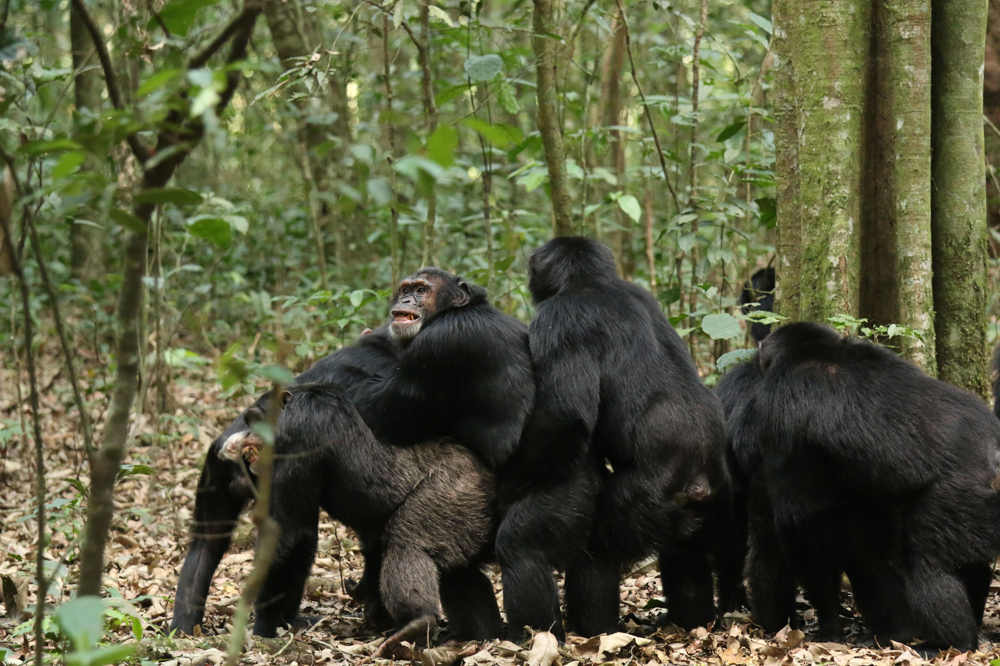
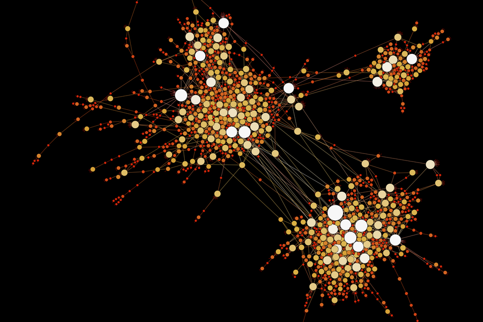

# What a Chimpanzee Civil War Tells AI Agents

_A once-in-500-years social collapse — when networks break, violence begins_

## Executive Summary

> [!callout]
> In April 2026, a [30-year study](https://www.science.org/doi/10.1126/science.adz4944) was published in the journal _Science_. The world's largest wild chimpanzee community — the Ngogo group in Uganda — split into two factions, waged civil war, and 14 infants in one group were largely killed. The cause was not territory or food. **In a community with no language, ideology, ethnicity, or religion, civil war emerged purely from changes in the structure of social networks.**

> Pebblous pays attention to this research not out of humanistic curiosity. It is because the collapse mechanism of this community is structurally identical to large-scale AI agent systems and the data ecosystems we build. This article is a work of data journalism that bridges data science and network biology — directly visualizing 24 years of real network data from Zenodo to derive system design principles for the Agentic AI era. This piece is the multi-agent behavior chapter of the [Physical AI](/project/PhysicalAI/en/) series — what natural community collapse asks of industrial multi-agent system design.

## The Ngogo Community: The World's Largest, and a First-of-Its-Kind Record

The Ngogo chimpanzee community in Uganda's Kibale National Park is also the subject of the Netflix documentary _Chimp Empire_. With roughly 200 individuals, it is the largest known wild chimpanzee group to date.

The research team (Aaron Sandel at UT Austin and John Mitani at the University of Michigan) has been tracking this community since 1995. Thirty years of demographic records, 24 years of social network data, 10 years of GPS tracking. The sheer weight of this data underpins the study's credibility.

30 yrs

Demographic tracking period

~200

Pre-fission community size  
(world's largest wild group)

44%

Pre-fission cross-cluster  
mating rate

The study was led by Aaron Sandel of UT Austin and John Mitani of the University of Michigan. Thirty years of demographics, 24 years of social network data (one-hour focal follows of individual males, conducted 2-3 months annually), and 10 years of GPS tracking — these three pillars of data gave the research its weight. The Leiden algorithm was used to compute cluster structure each year, and three independent statistical methods all pointed to the same inflection point.

*▲ Alpha male chimpanzee in Kibale National Park — habitat of the Ngogo community | Source: [Wikimedia Commons (Giles Laurent, CC BY-SA 4.0)](https://commons.wikimedia.org/wiki/File:013_Alpha_male_chimpanzee_at_Kibale_forest_National_Park_Photo_by_Giles_Laurent.jpg)*

Before the fission, the community operated as a typical fission-fusion society. Individuals moved freely between two clusters: Central and Western. Of infants born between 2004 and 2014, 44% had parents from different clusters. Each year, 29% of individuals switched clusters. Boundaries were fluid, and relationships crossed between the two groups.

*▲ Before the split (pre-2015) — Central's Basie embraces Western males before confronting an outside group. They would later become each other's enemies. | Photo: Aaron Sandel, UT Austin*

## Timeline of Collapse

Three independent statistical methods all pointed to the same tipping point: **2015**. But the root cause lay one year earlier.

2014

Five adult males die within roughly a month, presumably from disease. Only later is it revealed that these individuals were key bridges connecting the two clusters.

2015.3

Cross-cluster mating ceases entirely. Social and biological disconnection occur almost simultaneously.

2015.6.24

The day that became the turning point. A Western party heard Central's calls, fell silent, and fled — Central gave chase. Sandel: **"In 20 years of observation, we had never seen anything like it."** A six-week period of abnormal avoidance followed immediately.

2017

The two groups live in entirely separate territories and patrol their borders.

2018

Official fission. Western (83 individuals) and Central (107 individuals) become separate communities. Western begins attacking and killing members of Central.

2024

Fourteen infants in the Central group die — most are presumed killed.

### The Scale of Violence — What the Numbers Say

From 2018 to 2024, the Western group launched one-sided attacks against Central. **Seven adult males were killed**, and **14 or more adolescent and adult males went missing** (presumed killed). Starting in 2021, tactics escalated — **17 to 19 infants were killed in targeted attacks**. Groups of 5-10 attackers would rip infants from their mothers' chests.

Paradoxically, **the numerically smaller Western group (76-83 individuals) unilaterally attacked the larger Central group (100-107 individuals)**. Central never retaliated. ASU's Kevin Lee noted: "Normally, larger groups are able to out-compete smaller groups. Here, the opposite happened."

Sandel described the fieldwork: **"I felt like a war correspondent. Once I'd written up my notes, that's when the emotions hit me."** Mitani was more direct: **"I've known many of them for their entire lives. And now I'm watching them kill each other."**

*▲ 2019 — Western males attack Central's Basie. Basie died from this assault. 53-year-old BF stayed by Basie's side until the end. | Photo: Aaron Sandel, UT Austin*

## Bridge Individuals: The Invisible Safety Pins

The most important concept in this study is the **bridge individual**.

Certain individuals maintained strong social bonds with both clusters. They mediated conflicts, relayed information, and enabled cross-cluster mating. The clusters remained fluid precisely because these bridges were alive.

In 2014, five adult males and one female died within approximately one month. The cause was likely a **respiratory illness**. In 2017, a second respiratory epidemic killed **25 more individuals**, further hardening the boundaries between groups. Disease didn't directly cause the fission, but by removing the network's critical connectors, it created the structural conditions for collapse.

*▲ Network visualization — when inter-cluster connections (bridges) break, the network becomes isolated components | Source: [Wikimedia Commons (CC BY-SA 4.0)](https://commons.wikimedia.org/wiki/File:Network_Visualization.png)*

*▲ Morton (Central, left) and Garrison (Western, right) — sitting together before the split. After fission, they became members of opposing groups. | Photo: John Mitani, University of Michigan*

In 2014, these bridges disappeared all at once. At that moment, the network became structurally two separate components. On the surface it was still one community, but it had already passed the point of no return.

> [!callout]
> **Key Finding** — When the researchers analyzed 24 years of network changes using the Leiden algorithm (a graph clustering method), they detected a sharp spike in Modularity (a network separation index) in 2015. After the bridges disappeared, Modularity had been quietly rising. Then one day it crossed the tipping point. **Structural warning signs appeared in the data before behavioral collapse.**

## "Civil War Can Happen Without Ideology"

"If civil war can emerge in chimpanzees — who have no language, ethnicity, religion, or ideology — purely from changes in social network structure, then in humans those cultural factors may be secondary rather than root causes."

— Aaron Sandel, UT Austin (lead researcher)

"You act like a stranger, you become a stranger."

This is why the study attracts attention from human societies, even though the event it describes is so rare it happens perhaps once in 500 years. The root of conflict may not be ideological differences but **changes in the structure of social networks themselves**.

There is only one historical comparison: the fission of the Gombe community in Tanzania that Jane Goodall studied in the 1970s. But that case is controversial because the researchers had been providing food. The Ngogo case is the first clearly documented community fission in wild chimpanzees recorded under natural conditions without food provisioning.

In scale, Ngogo dwarfs Gombe. Approximately 10 individuals died at Gombe, while at least 24-28 died or went missing at Ngogo. Genetic analysis confirmed that all offspring born before the fission had parents from within the same community — they shared a single reproductive pool. A group that once bred as one split into two hostile factions. According to genetic analyses, such permanent fissions occur approximately **once every 500 years** in chimpanzee populations.

## Pebblous Perspective: Implications for AI Agent Systems

This is a biology paper, but we read in it critical principles for AI agent design and data ecosystem operations.

What makes this study exceptional is not just its conclusion but its **methodology**. The team analyzed 24 years of behavioral data using the Leiden algorithm, tracking changes in Modularity (network separation index) over time. This is fundamentally **time-series anomaly detection**. It follows the same logic as DataClinic's monitoring of class distribution shifts in datasets over time.

### Data Reveals the Trajectory of Collapse

The charts below visualize 24 years of actual network data from 77 focal males, published on Zenodo. Two metrics reveal the structural precursors of fission.

<!-- stat-card -->
**Network Density (1998-2022)** — Social connection density. Peaked at 0.12 in 2013, then crashed to 0.023 by 2022.

<!-- stat-card -->
**Total Social Bonds (1998-2022)** — Social bonds among 77 focal males. Collapsed from 352 (2013) to 68 (2022).

Data source: Zenodo DOI [10.5281/zenodo.18626723](https://zenodo.org/records/18626723) — Ngogo chimpanzee network analysis data (1998-2022)

Implication 01

Bridge Agents in Multi-Agent Systems Agentic AI

In large-scale AI agent networks, not all agents are equally connected. Some serve as bridges linking different domains or teams — orchestration agents, context-sharing agents, and interface agents.

The lesson from chimpanzee research: when these bridge agents are removed or fail, the system appears to function on the surface but fragmentation has already begun internally. Collapse becomes visible not when the bridges disappear but **when the tipping point is reached**. The deaths in 2014 were the cause, but violence did not begin until 2018. This is why bridge agents in agent network design must have redundancy built in.

Implication 02

Siloization of Collective Intelligence Data Greenhouse

One of the decisive indicators of the chimpanzee fission was the **cessation of cross-cluster mating**. After March 2015, the exchange of information (genes) between groups stopped entirely.

The equivalent in AI agent ecosystems is the **breakdown of context sharing**. When different teams or departments begin operating isolated AI pipelines, each appears efficient at first. But as inter-group information exchange declines, each agent becomes over-specialized, and the overall system's adaptability decreases. This is precisely what Pebblous's Data Greenhouse concept addresses — a structure where agents operate on a shared data layer and exchange context, rather than running in isolated pipelines.

Implication 03

Modularity Spike: The Possibility of Early Warning DataClinic

The Leiden algorithm used by the research team tracked network Modularity over time. The higher the Modularity, the more the network splits into separated components.

This metric began rising before the fission was complete. **Structural warning signs appeared in the data before behavioral collapse.**

This follows the same logic as DataClinic diagnosing class distribution bias, outlier density changes, and cluster structures in feature space. Data ecosystems have their own Modularity-equivalent metrics. Declining cross-class sample migration, excessive densification of specific clusters, and falling inter-domain similarity — these are the siloization signals of a data ecosystem. Even a once-in-500-years event was visible in the data beforehand.

Implication 04

The "Stranger" Effect: Behavioral Drift in Isolated Agents Agentic AI

_"You act like a stranger, you become a stranger."_

This statement applies directly to AI agent design. An agent fine-tuned solely on domain-specific data gradually loses the ability to collaborate with agents in other contexts. At first it looks like specialization, but as isolation persists, that agent becomes a "stranger" to the rest of the system.

For a multi-agent system to sustain collective intelligence over the long term, agents need a structure that enables regular cross-context exchange. This is why the role of bridge agents must be designed intentionally.

## Conclusion: The Network Is the Infrastructure

What the Ngogo chimpanzee study shows is straightforward. When the structure of a social network changes, behavior changes. When behavior changes, conflict follows. And conflict is hard to reverse.

This is a biological fact, but it is also a principle of systems engineering. No matter how capable the nodes (individuals/agents), if the structure of edges (relationships/connections) collapses, the entire system collapses.

When designing AI agent systems, we often focus on the performance of individual agents. But the lesson of Ngogo is different. The completeness of an AI system depends not only on each agent's intelligence, but on how those intelligences are connected — and whether that connection is intentionally designed. Even in an AI agent ecosystem without emotions or ideology, the severance of connection structure alone can collapse system-wide cooperation. Orchestration agents must never become single points of failure (SPOF), and continuously monitoring modularity metrics — data exchange frequency, cross-domain similarity decline — will become a core standard for AI operations.

Sandel's words summarize this lesson: **"The new group identities are overriding cooperative relationships that had existed for years."** And the most practical conclusion: **"What we have to do is maintain interpersonal relationships."** In agent systems, this means the deliberate design and maintenance of bridge agents, and the intentional structuring of context exchange.

> [!callout]
> **The Lesson of Ngogo** — **Design bridges, monitor Modularity, and maintain cross-exchange.** The network is the infrastructure.

## References

- Sandel, A. et al. (2026). Lethal conflict after group fission in wild chimpanzees. _Science_. [https://www.science.org/doi/10.1126/science.adz4944](https://www.science.org/doi/10.1126/science.adz4944)
- UT Austin News: [First Clearly Documented Split in World's Largest Known Chimpanzee Community](https://news.utexas.edu/2026/04/09/first-clearly-documented-split-in-worlds-largest-known-chimpanzee-community-leads-to-deadly-violence/)
- Scientific American: [Two Hundred Chimpanzees Are Embroiled in a Civil War](https://www.scientificamerican.com/article/two-hundred-chimpanzees-are-embroiled-in-a-civil-war/)
- NPR: [What a chimpanzee civil war can teach us about how societies fall apart](https://www.npr.org/2026/04/09/nx-s1-5775783/what-a-chimpanzee-civil-war-can-teach-us-about-how-societies-fall-apart)

<!-- stat-card -->
**📚 Physical AI Series** — This article is part of the [Physical AI](/project/PhysicalAI/en/) series curated by Pebblous — how robots come to see, understand, and act, read together across data, simulation, models, and industry landscape.
