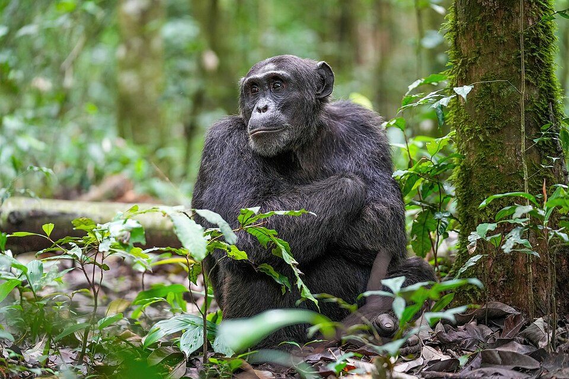
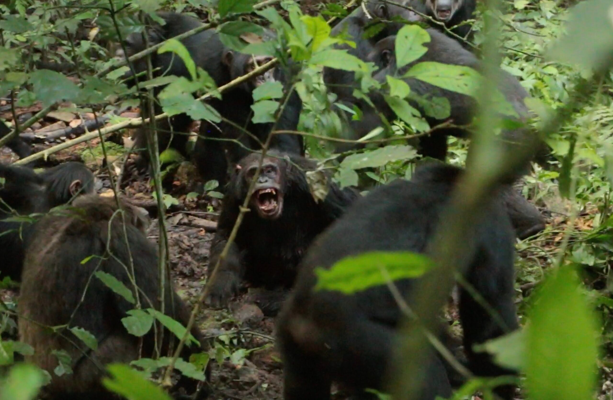
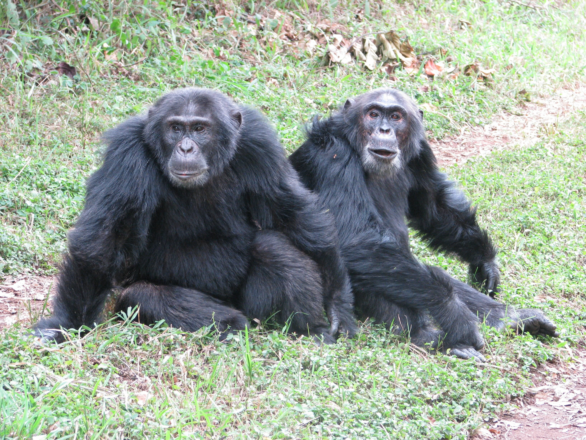

# 침팬지 내전이 AI 에이전트에게 말하는 것

_500년에 한 번의 사회 붕괴 — 관계망이 끊기면 폭력이 시작된다_

## Executive Summary

> [!callout]
> 2026년 4월, 과학저널 _Science_에 [30년짜리 연구 결과](https://www.science.org/doi/10.1126/science.adz4944)가 실렸다. 세계 최대 야생 침팬지 집단인 우간다 Ngogo 군집이 두 파로 갈라져 내전을 벌이고, 한 쪽 집단의 새끼 14마리가 대부분 살해됐다는 내용이다. 분열의 원인은 영토나 먹이가 아니었다. **언어도, 이념도, 민족도 없는 집단에서 순수하게 '관계망 구조의 변화'만으로 내전이 발생했다.**

> 페블러스가 이 연구에 주목하는 이유는 인문학적 흥미 때문이 아니다. 이 집단의 붕괴 메커니즘이 대규모 AI 에이전트 시스템, 그리고 우리가 구축하는 데이터 생태계와 구조적으로 동일하기 때문이다. 이 글은 데이터 사이언스와 네트워크 생물학을 접목하여, Zenodo에 공개된 24년간의 실제 네트워크 데이터를 직접 시각화하고, Agentic AI 시대의 시스템 설계 원칙을 도출하는 데이터 저널리즘이다. 이 글은 [피지컬 AI](/project/PhysicalAI/ko/) 시리즈의 멀티에이전트 행동 편으로, 자연계의 군집 붕괴가 산업 멀티에이전트 시스템 설계에 던지는 질문을 본다.

## Ngogo 군집: 세계 최대, 그리고 최초의 기록

우간다 키발레 국립공원의 Ngogo 침팬지 군집은 Netflix 다큐멘터리 '침프 엠파이어'의 주인공이기도 하다. 약 200마리로 구성된 이 집단은 현재까지 알려진 야생 침팬지 중 가장 규모가 크다.

연구팀(UT 오스틴 Aaron Sandel, 미시간대 John Mitani)은 이 집단을 1995년부터 추적해왔다. 30년 인구통계 기록, 24년 사회관계망 데이터, 10년 GPS 추적. 이 데이터의 무게가 연구의 신뢰도를 만들었다.

30년

인구통계 추적 기간

~200마리

분열 전 군집 규모  
(세계 최대 야생 집단)

44%

분열 전 클러스터 교차  
교배 비율

이 연구를 이끈 것은 UT 오스틴의 Aaron Sandel과 미시간대의 John Mitani다. 30년 인구통계, 24년 사회관계망 데이터(수컷 개체별 1시간 초점 추적, 매년 2~3개월 수행), 10년 GPS 추적 — 이 세 축의 데이터 무게가 연구의 신뢰도를 만들었다. Leiden 알고리즘으로 매년 클러스터 구조를 계산했고, 세 가지 독립적 통계 방법이 모두 동일한 전환점을 지목했다.

*▲ 키발레 국립공원의 알파 수컷 침팬지 — Ngogo 군집의 서식지 | Source: [Wikimedia Commons (Giles Laurent, CC BY-SA 4.0)](https://commons.wikimedia.org/wiki/File:013_Alpha_male_chimpanzee_at_Kibale_forest_National_Park_Photo_by_Giles_Laurent.jpg)*

분열 이전 군집은 전형적인 '분산-재결합(fission-fusion)' 구조로 운영됐다. 개체들은 Central과 Western 두 클러스터 사이를 자유롭게 이동했다. 2004년부터 2014년 사이 태어난 새끼의 44%는 부모가 서로 다른 클러스터에 속했다. 매년 개체의 29%가 클러스터를 전환했다. 경계가 유동적이고, 관계가 두 집단을 넘나들었다.

*▲ 분열 이전(2015년 전) — Central의 Basie가 Western 수컷들을 포옹하며 외부 집단에 대항하는 모습. 이들은 나중에 서로의 적이 된다. | Photo: Aaron Sandel, UT Austin*

## 붕괴의 타임라인

세 가지 독립적인 통계 방법이 모두 동일한 전환점을 지목했다. **2015년**이다. 그러나 근본 원인은 그보다 1년 전에 있었다.

2014

성체 수컷 5마리가 약 한 달 사이에 사망한다. 이유는 질병으로 추정된다. 이 개체들이 두 클러스터를 연결하던 핵심 브릿지였다는 사실은 이후에야 밝혀진다.

2015.3

집단 간 교차 교배 완전 중단. 사회적 단절과 생물학적 단절이 거의 동시에 일어난다.

2015.6.24

분기점이 된 날. Western 파티가 Central의 소리를 듣자 조용해지더니 도망쳤고, Central이 추격했다. Sandel: **"20년 관찰 중 한 번도 본 적 없는 장면이었다."** 직후 6주간 비정상적 회피 기간.

2017

두 집단은 완전히 다른 영역에서 생활하며 경계를 순찰한다.

2018

공식 분열. Western(83마리)과 Central(107마리)이 별개 집단이 된다. Western이 Central을 공격해 여러 개체를 살해하기 시작한다.

2024

Central 집단의 새끼 14마리 사망. 대부분 살해된 것으로 추정된다.

### 폭력의 규모 — 숫자가 말하는 것

2018년부터 2024년까지 Western 집단은 Central 집단을 일방적으로 공격했다. **성체 수컷 7마리가 살해**되었고, **14마리 이상의 청소년·성체 수컷이 실종**(살해 추정)되었다. 2021년부터는 전술이 에스컬레이션됐다 — **유아 17~19마리가 표적 공격**으로 사망했다. 5~10마리가 동시에 공격하여 어미의 가슴에서 새끼를 빼앗는 방식이었다.

역설적인 것은 **수적으로 열세인 Western(76~83마리)이 수적 우세인 Central(100~107마리)을 일방적으로 공격**했다는 점이다. Central은 단 한 번도 보복하지 않았다. ASU의 Kevin Lee는 "일반적으로 큰 집단이 작은 집단을 압도하는데, 여기서는 그 반대가 일어났다"고 지적한다.

Sandel은 현장에서 이렇게 말했다. **"전쟁 기자처럼 느꼈다. 메모를 정리하고 나서야 감정이 밀려왔다."** Mitani는 더 직접적이었다. **"평생 알던 개체들이 서로 죽이는 걸 보고 있다."**

*▲ 2019년, Western 수컷들이 Central의 Basie를 집단 공격하는 순간. Basie는 이 공격으로 사망했다. 53세의 BF는 Basie 곁을 끝까지 지켰다. | Photo: Aaron Sandel, UT Austin*

## 브릿지 개체: 보이지 않는 안전 핀

이 연구에서 가장 중요한 개념은 **브릿지 개체**다.

두 클러스터 모두와 강한 사회적 유대를 가진 개체들이 있다. 이들은 갈등이 생겼을 때 중재하고, 정보를 전달하며, 교차 교배를 가능하게 했다. 클러스터가 유동적으로 유지될 수 있었던 건 이 브릿지들이 살아있었기 때문이다.

2014년, 성체 수컷 5마리와 암컷 1마리가 약 한 달 사이에 사망했다. 원인은 **호흡기 질환**으로 추정된다. 2017년에는 2차 호흡기 전염병으로 **25마리가 추가 사망**하면서 집단 간 경계가 더욱 경직됐다. 질병이 직접 분열을 일으킨 것은 아니지만, 관계망의 핵심 연결고리를 제거함으로써 구조적 붕괴의 조건을 만들었다.

*▲ 네트워크 시각화 — 클러스터 간 연결(브릿지)이 끊기면 네트워크는 분리된 덩어리가 된다 | Source: [Wikimedia Commons (CC BY-SA 4.0)](https://commons.wikimedia.org/wiki/File:Network_Visualization.png)*

*▲ Morton(Central, 왼쪽)과 Garrison(Western, 오른쪽) — 분열 전 나란히 앉아 있던 두 수컷. 이 사진 이후 서로 다른 집단의 적이 되었다. | Photo: John Mitani, University of Michigan*

2014년, 이 브릿지들이 한꺼번에 사라졌다. 그 순간 네트워크는 구조적으로 두 개의 분리된 덩어리가 됐다. 아직 표면상 하나의 집단이었지만, 이미 회복 불가능한 상태였다.

> [!callout]
> 핵심 발견

> 연구자들이 Leiden 알고리즘(그래프 클러스터링 기법)으로 24년간의 관계망 변화를 분석했을 때, 2015년의 Modularity(네트워크 분리 지수) 급등이 포착됐다. 브릿지가 없어진 뒤 Modularity는 조용히 올라가고 있었다. 그리고 어느 날 임계점을 넘었다. **구조적 위험 신호는 행동적 붕괴보다 먼저 데이터에 나타났다.**

## "이념 없이도 내전은 발생한다"

"언어도, 민족도, 종교도, 이념도 없는 침팬지에서 관계망 변화만으로 내전이 발생했다면, 인간에게서 그 문화적 요인들은 근본 원인이 아닌 2차적 요인일 수 있다."

— Aaron Sandel, UT 오스틴 (연구 책임자)

"You act like a stranger, you become a stranger."

이것이 이 연구가 500년에 한 번 일어나는 희귀 사건임에도 인간 사회에서 주목받는 이유다. 갈등의 뿌리는 이념의 차이가 아니라 **관계망 구조 자체의 변화**일 수 있다.

역사적 비교 대상은 단 하나다. 1970년대 제인 구달이 연구한 탄자니아 Gombe 군집의 분열. 그러나 그 사례는 연구자의 먹이 제공이 개입됐다는 논란이 있다. Ngogo 사례는 먹이 제공 없이 자연 상태에서 기록된 최초의 명확한 사례다.

규모 면에서도 Ngogo는 Gombe를 압도한다. Gombe에서는 약 10마리가 사망했지만, Ngogo에서는 최소 24~28마리가 사망하거나 실종됐다. 유전자 분석에 따르면 분열 이전 Ngogo에서 태어난 모든 새끼의 부모는 같은 군집 내 개체였다 — 하나의 생식 풀(reproductive pool)을 공유하던 집단이 완전히 두 개의 적대적 집단으로 갈라진 것이다. 유전학적 분석에 따르면 이런 영구적 분열은 **약 500년에 한 번** 일어나는 사건이다.

## 페블러스 관점: AI 에이전트 시스템에 시사하는 것

이 연구는 생물학 논문이지만, 우리는 여기서 AI 에이전트 설계와 데이터 생태계 운영에 대한 중요한 원칙을 읽는다.

이 연구가 특별한 이유는 결론뿐 아니라 **방법론**에도 있다. 연구팀은 24년간의 행동 데이터를 Leiden 알고리즘으로 매년 분석하여 Modularity(네트워크 분리 지수)의 시간적 변화를 추적했다. 이것은 본질적으로 **시계열 이상 탐지(time-series anomaly detection)**다. DataClinic이 데이터셋의 클래스 분포 변화를 시간에 따라 모니터링하는 것과 동일한 논리다.

### 데이터가 보여주는 붕괴의 궤적

아래 차트는 Zenodo에 공개된 24년간의 실제 네트워크 데이터(77마리 초점 추적 수컷의 사회관계망)를 시각화한 것이다. 두 가지 지표가 분열의 구조적 전조를 보여준다.

<!-- stat-card -->
**네트워크 밀도 변화 (1998-2022)** — 사회적 연결의 밀도. 2013년 정점(0.12) 이후 급락 — 2022년에는 0.023까지 하락.

<!-- stat-card -->
**총 사회적 연결 수 (1998-2022)** — 77마리 초점 수컷 간 관찰된 사회적 유대의 수. 352개(2013) → 68개(2022)로 붕괴.

데이터 출처: Zenodo DOI [10.5281/zenodo.18626723](https://zenodo.org/records/18626723) — Ngogo 침팬지 네트워크 분석 데이터 (1998-2022)

시사점 01

멀티 에이전트 시스템의 브릿지 에이전트 Agentic AI

대규모 AI 에이전트 네트워크에서 모든 에이전트가 동등하게 연결되어 있지는 않다. 일부 에이전트는 서로 다른 도메인이나 팀을 연결하는 브릿지 역할을 한다. 조율 에이전트, 컨텍스트 공유 에이전트, 인터페이스 에이전트가 그것이다.

침팬지 연구의 교훈: 이 브릿지 에이전트가 제거되거나 실패했을 때, 시스템은 표면상 작동하는 것처럼 보이지만 내부적으로는 이미 단편화가 시작된다. 붕괴는 브릿지가 사라진 순간이 아니라 **임계점에 도달했을 때** 가시화된다. 2014년 개체 사망이 원인이었지만, 폭력은 2018년에 시작됐다. 에이전트 네트워크 설계 시 브릿지 역할을 하는 에이전트에 이중화(redundancy)를 적용해야 하는 이유가 여기 있다.

시사점 02

집단 지성의 사일로화 Data Greenhouse

침팬지 분열의 결정적 지표 중 하나는 **교차 교배의 중단**이었다. 2015년 3월 이후 집단 간 정보(유전자)의 교환이 완전히 끊겼다.

AI 에이전트 생태계에서 이에 해당하는 것이 **컨텍스트 공유의 단절**이다. 서로 다른 팀이나 부서가 격리된 AI 파이프라인을 운영하기 시작하면, 초기에는 각자 효율적으로 보인다. 그러나 집단 간 정보 교환이 줄어들수록 각 에이전트는 과특화(over-specialization)되고, 시스템 전체의 적응력은 낮아진다. 페블러스의 Data Greenhouse 개념이 지향하는 것이 바로 이 지점이다 — 에이전트들이 격리된 파이프라인이 아니라 공유 데이터 레이어 위에서 작동하며 컨텍스트를 교환하는 구조.

시사점 03

Modularity 급등: 조기 경보의 가능성 DataClinic

연구팀이 사용한 Leiden 알고리즘은 네트워크의 모듈성(Modularity)을 시간에 따라 추적했다. Modularity가 높아질수록 네트워크는 더 분리된 덩어리들로 나뉜다.

이 지표는 분열이 완성되기 전에 올라가기 시작했다. **구조적 위험 신호는 행동적 붕괴보다 먼저 데이터에 나타났다.**

DataClinic이 데이터셋의 클래스 분포 편향, 이상치 밀도 변화, 특징 공간의 클러스터 구조를 진단하는 것과 같은 논리다. 데이터 생태계에서도 Modularity에 해당하는 지표들이 있다. 클래스 간 샘플 이동이 줄어들고, 특정 클러스터가 과도하게 고밀도화되며, 도메인 간 유사도가 하락하는 패턴 — 이것이 데이터 생태계의 사일로화 신호다. 500년에 한 번인 사건도 데이터로는 미리 보였다.

시사점 04

"Stranger" 효과: 격리된 에이전트의 행동 변화 Agentic AI

_"You act like a stranger, you become a stranger."_

이 문장은 AI 에이전트 설계에 직접 적용된다. 특정 도메인 데이터만으로 파인튜닝된 에이전트는 다른 컨텍스트의 에이전트와 협력하는 능력을 잃어간다. 처음에는 전문성으로 보이지만, 격리가 길어지면 시스템 전체에서 그 에이전트는 '이방인'이 된다.

멀티에이전트 시스템이 장기적으로 집단 지성을 유지하려면, 에이전트들이 정기적으로 교차 컨텍스트를 교환하는 구조가 필요하다. 브릿지 에이전트의 역할이 의도적으로 설계되어야 하는 이유다.

## 결론: 관계망은 인프라다

Ngogo 침팬지 연구가 보여주는 것은 단순하다. 관계망의 구조가 바뀌면 행동이 바뀌고, 행동이 바뀌면 갈등이 오고, 갈등은 되돌리기 어렵다.

이것은 생물학적 사실이지만 동시에 시스템 공학의 원칙이기도 하다. 노드(개체/에이전트)가 아무리 뛰어나도, 엣지(관계/연결)의 구조가 무너지면 전체 시스템은 붕괴한다.

AI 에이전트 시스템을 설계할 때 우리는 종종 각 에이전트의 성능에 집중한다. 하지만 Ngogo의 교훈은 다르다. AI 시스템의 완성도는 개별 AI의 '지능'뿐만 아니라, 그 지능들이 서로 어떻게 연결되어 있는지를 '의도적으로 설계'하는 것에 달려있다. 감정이나 이념이 없는 AI 에이전트 생태계에서도, 연결 구조의 단절만으로 시스템 전체의 협력이 붕괴할 수 있다. 연결 역할을 하는 오케스트레이션 에이전트가 단일 장애점(SPOF)이 되어서는 안 되며, 에이전트 간 데이터 교환 빈도와 도메인 간 유사도 하락 등 모듈성 지표를 지속적으로 모니터링하는 것이 향후 AI 운영의 핵심 기준이 될 것이다.

Sandel의 말이 이 교훈을 요약한다. **"새로운 집단 정체성이 수년간 존재하던 협력 관계를 압도하고 있다."** 그리고 가장 실천적인 결론: **"우리가 해야 할 일은 대인 관계를 유지하는 것이다."** 에이전트 시스템에서 이것은 브릿지 에이전트의 설계와 유지, 그리고 컨텍스트 교환의 의도적 구조화를 의미한다.

> [!callout]
> Ngogo의 교훈

> **브릿지를 설계하고, Modularity를 모니터링하고, 교차 교환을 유지하라.** 관계망이 인프라다.

## 참고 자료

- Sandel, A. et al. (2026). Lethal conflict after group fission in wild chimpanzees. _Science_. [https://www.science.org/doi/10.1126/science.adz4944](https://www.science.org/doi/10.1126/science.adz4944)
- UT Austin News: [First Clearly Documented Split in World's Largest Known Chimpanzee Community](https://news.utexas.edu/2026/04/09/first-clearly-documented-split-in-worlds-largest-known-chimpanzee-community-leads-to-deadly-violence/)
- Scientific American: [Two Hundred Chimpanzees Are Embroiled in a Civil War](https://www.scientificamerican.com/article/two-hundred-chimpanzees-are-embroiled-in-a-civil-war/)
- NPR: [What a chimpanzee civil war can teach us about how societies fall apart](https://www.npr.org/2026/04/09/nx-s1-5775783/what-a-chimpanzee-civil-war-can-teach-us-about-how-societies-fall-apart)

<!-- stat-card -->
**📚 피지컬 AI 시리즈** — 이 글은 [피지컬 AI](/project/PhysicalAI/ko/)에서 큐레이션하는 시리즈의 일부입니다. 로봇이 환경을 보고, 이해하고, 행동하기까지 — 데이터·시뮬레이션·모델·산업 지형을 한자리에서 묶어 읽는 자리.
