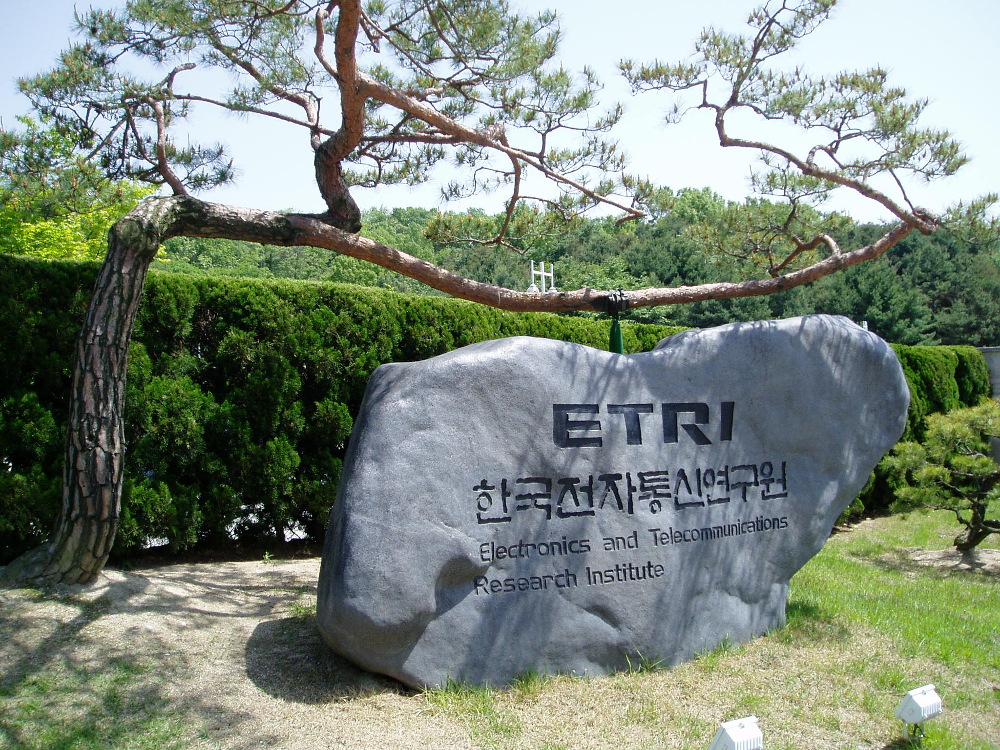
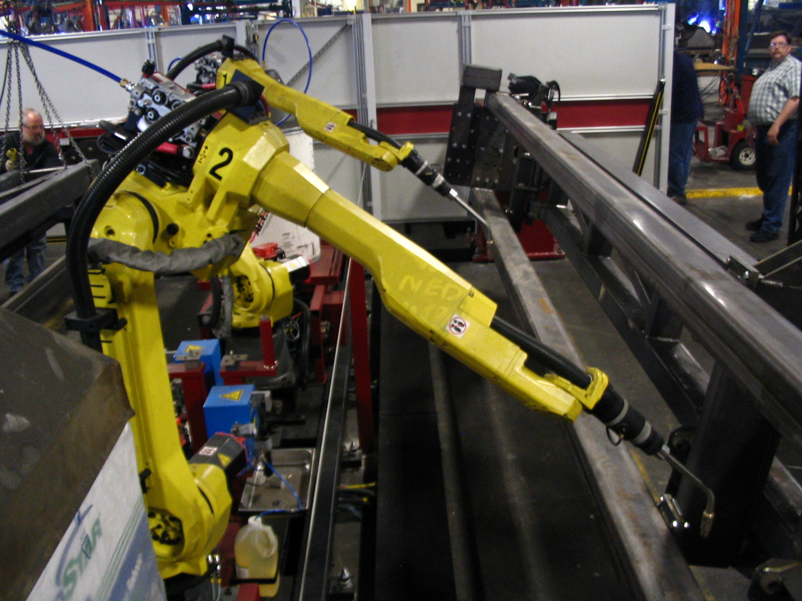
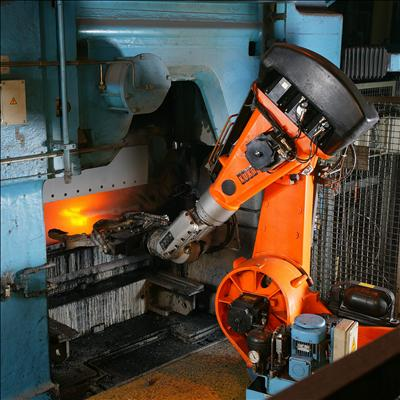

# Hello, I

_The deeptech startup that cultivates data_

## Executive Summary

> [!callout]
> Hello. I'm **Pebblous**. A deeptech startup from South Korea that was born out of frustration with a simple paradox: we live in the age of the most data ever produced, yet the Physical AI systems that need it most — robots, autonomous vehicles, smart factories — are starved for the right kind.

> I was founded in November 2021 by researchers from ETRI, Korea's premier government research institute. My team of 18 people holds 36+ Korean patents and 4+ US patents, all centered on a single breakthrough: using geometric manifolds to make high-dimensional data visible, diagnosable, and cultivatable. I call this **"Make Data Tangible."**

> Today, I operate the world's only integrated data platform for Physical AI — combining quality diagnosis (DataClinic), autonomous data operations (Data Greenhouse), and physics-based synthetic data generation (PebbloSim). My clients include Hyundai Motor, LG Electronics, Samsung E&A, and the Republic of Korea Armed Forces. This is the story of how I came to be, what I see, and where I'm going.

<!-- stat-card -->
**Why this story matters** — The global synthetic data market is growing at a CAGR of 31-46%, projected to reach $25-34 billion by 2030. NVIDIA is building the infrastructure. But who ensures the data flowing through it is actually good? That's the gap I fill — and why a 18-person team from Korea is competing in a market dominated by trillion-dollar companies.

## Let Me Introduce Myself

Hello. I'm Pebblous.

That might sound strange — a company introducing itself in first person. But the truth is, I'm more than a company. I'm a system, a philosophy, and a bet on the future of data itself. My name comes from "pebble" — small, smooth, fundamental. The building blocks of something larger. That's how I think about data: not as an ocean to drown in, but as raw material to be shaped, examined, and cultivated.

I was born in Daejeon, South Korea, in November 2021. My founders — Dr. Joo-Haeng Lee (CEO) and Dr. Jeong-Won Lee (COO) — spent over a decade at ETRI, the Electronics and Telecommunications Research Institute, wrestling with AI data for manufacturing, defense, and autonomous systems. They left with a conviction: **the biggest bottleneck in AI isn't algorithms. It's data.**

*▲ ETRI entrance in Daejeon — where Pebblous's founders spent a decade before launching the company | Source: [Wikimedia Commons](https://commons.wikimedia.org/wiki/File:ETRI_Entrance_-_panoramio.jpg)*

Not just any data. Good data. Data that's balanced, diverse, correctly labeled, and free of the hidden biases that cause AI models to fail in the real world. The kind of data that nobody could see — because high-dimensional datasets are invisible to the human eye.

<!-- stat-card -->
**My slogan is "Make Data Tangible." I exist to turn the invisible — high-dimensional data distributions, quality gaps, statistical anomalies — into something engineers can see, touch, and act on.**

Today, I am 18 people. We are small. But our patent portfolio is global, our clients are Korea's largest conglomerates, and the market we're building for — Physical AI data infrastructure — is projected to reach $840 billion by 2035.

Let me tell you how this happened.

## How I Was Born

### 2.1 The Frustration

Picture a factory floor. Machines stamping metal at hundreds of cycles per minute. A robot arm welding a car chassis. A camera system scanning for defects smaller than a grain of sand. All of these systems need AI — and all of that AI needs data.

*▲ Industrial welding robots on a factory floor — manufacturing AI demands large, high-quality datasets | Source: [Wikimedia Commons](https://commons.wikimedia.org/wiki/File:FANUC_6-axis_welding_robots.jpg)*

At ETRI, my founders spent years collecting and curating datasets for manufacturing AI and autonomous driving. And they kept hitting the same wall: **the data was never good enough**. Real-world data collection is expensive, slow, dangerous, and fundamentally incomplete. You can photograph a million car parts, and still miss the rare defect that causes a recall. You can drive a million test kilometers, and still never encounter the edge case that matters.

Worse, there was no way to know if your data was good. You'd train a model, deploy it, watch it fail, and then wonder: was it the algorithm, or the data? High-dimensional datasets — images with thousands of features, sensor readings with hundreds of channels — are invisible to the human eye. You can't look at a dataset of 100,000 images and know whether it's balanced, diverse, or riddled with hidden biases.

### 2.2 The Idea

Dr. Joo-Haeng Lee had a vision: **what if you could see data?** Not as spreadsheets or charts, but as geometric shapes — manifolds — that reveal the true structure of high-dimensional information. If a dataset is healthy, its manifold should be smooth and well-distributed. If it's sick — class imbalance, label noise, domain shift — the manifold shows deformations, gaps, and clusters that shouldn't be there.

This technique is called **"Data Imaging"** — projecting high-dimensional data onto geometric manifolds to make the invisible visible. It drew from differential geometry, topology, and neural network embedding spaces. It was technically rigorous and practically revolutionary.

<!-- stat-card -->
**"If we could see data the way a doctor sees an X-ray, we could diagnose problems before they cause failures."**

### 2.3 November 2021

In November 2021, Dr. Joo-Haeng Lee and Dr. Jeong-Won Lee left ETRI. They took with them years of research, a POSTECH and KAIST pedigree, and a conviction that the data quality problem was both the biggest opportunity and the most neglected challenge in AI. Dr. Joo-Haeng Lee brings an unusual track record: a two-time recipient of the Gaheon Academic Award, a Wolfram Innovation Award winner, and the first computer scientist to serve as president of the Korean Society of CDE — a record of breaking into new fields and succeeding.

They founded me — Pebblous. The name was deliberate. A pebble is small and unassuming, but it's the foundation of everything. Rivers are shaped by pebbles. Beaches are made of them. And the data infrastructure of the Physical AI era would be built from small, precise, well-shaped units of information.

From the beginning, the vision was not to build just one product, but an integrated platform: diagnose data, operate data autonomously, and generate the data that doesn't exist yet. Three pillars. One mission. Make data tangible.

## DataClinic: Seeing the Invisible

My first product was DataClinic — an AI data quality diagnosis platform. Think of it as a hospital for datasets. You bring in your training data, and I give it a comprehensive health checkup.

This matters because in the Physical AI world, a bad dataset doesn't just produce a bad model — it produces a dangerous one. A robot that misjudges distance. An autonomous vehicle that misclassifies a pedestrian. A factory inspection system that passes a defective part. The cost of bad data isn't a lower accuracy score. It's a real-world failure.

### 3.1 Three Levels of Diagnosis

DataClinic operates on three diagnostic levels, each progressively deeper.

### Level 1 — Basic Statistics

<!-- stat-card -->
**Class distribution, image dimensions, pixel statistics, duplicate detection. The vital signs. Fast, automated, essential. This is the blood pressure check — simple but catches obvious problems.**

### Level 2 — DataLens Neural Manifold

<!-- stat-card -->
**This is where our core IP lives. DataLens projects your dataset onto a geometric manifold using neural network embeddings — revealing hidden patterns no spreadsheet can show. Class overlap, outlier clusters, distribution gaps, feature space density. It's like an MRI for your data.**

### Level 3 — Custom Domain Analysis

<!-- stat-card -->
**Domain-specific diagnosis tailored to your industry — automotive defect detection, semiconductor inspection, military surveillance. We bring the diagnostic lens down to the specific vocabulary and failure modes of your field.**

### 3.2 The Geometric Manifold Approach

Let me explain what makes DataClinic different from any other data profiling tool. Most tools count rows, check for nulls, and compute summary statistics. That's useful, but it's like diagnosing a patient by measuring their height and weight. You'll catch extreme problems, but you'll miss cancer.

DataClinic uses **geometric manifold analysis**. Every image, every data point, lives in a high-dimensional space — potentially thousands of dimensions. A neural network (the DataLens) maps these points into a lower-dimensional manifold that preserves meaningful structure. When you visualize this manifold, healthy data looks smooth and well-distributed. Problematic data shows characteristic pathologies: class clusters that overlap (the model can't distinguish them), void regions (missing data), outlier islands (noise or mislabeled samples), and density gradients (class imbalance).

▲ DataClinic real output — Industrial waste dataset Level 2 density terrain. Mountain peaks = high-density clusters; valleys = data gaps. This is the actual "CT scan" of a dataset — showing precisely where to add more data. | 📊 [Full DataClinic diagnosis report →](https://blog.pebblous.ai/story/dataclinic-report-131-industrialwaste-story-pb/ko/)

▲ DataClinic Level 2 PCA analysis — mean feature vectors per class projected into 2D space. Class separation and confusion boundaries are immediately visible, letting you predict where your model will struggle before training. | 📊 [Full DataClinic diagnosis report →](https://blog.pebblous.ai/story/dataclinic-report-131-industrialwaste-story-pb/ko/)

This is protected by 36+ Korean patents and 4+ US patents, including US 12,481,720 granted in November 2025. It is the world's first patented system for geometric manifold-based data quality diagnosis.

### 3.3 Who Uses DataClinic

DataClinic processes 100,000+ images per hour. Our clients include:

<!-- stat-card -->
****Hyundai Motor** — diagnosing datasets for autonomous driving perception models**

<!-- stat-card -->
****LG Electronics** — quality inspection data for manufacturing AI**

<!-- stat-card -->
****Samsung E&A** — industrial data quality assurance**

<!-- stat-card -->
****Hanwha Vision** — surveillance and security AI data**

<!-- stat-card -->
****Republic of Korea Armed Forces** — defense AI data certification for Army, Navy, and Air Force**

<!-- stat-card -->
**Everyone in AI talks about models. Almost nobody talks about the health of the data those models are trained on. DataClinic exists because the most expensive bug in AI is a dataset nobody knew was broken.**

## Data Greenhouse: From Hunting to Cultivation

Here's the metaphor that defines me: the world has been **hunting** data. Sending cars out to drive millions of miles. Deploying annotators to label millions of images. Scraping the internet for whatever it can find. It's expensive, slow, ethically fraught, and ultimately unsustainable.

I propose a different paradigm: **cultivating** data. Growing it intentionally, in controlled conditions, from carefully selected seeds — just like a greenhouse.

### 4.1 The Agriculture Analogy

Ten thousand years ago, humans stopped chasing animals across the savanna and started farming. The agricultural revolution didn't just produce more food — it produced **better** food, more reliably, with less risk. We selected seeds, controlled soil conditions, managed irrigation, and harvested systematically.

Data Greenhouse is the same revolution applied to AI data. Instead of hunting for real-world data and hoping it's good enough, we:

### Seed

<!-- stat-card -->
**Start with a small, high-quality seed dataset — real data that has been thoroughly diagnosed and validated by DataClinic.**

### Grow

<!-- stat-card -->
**Use synthetic generation (PebbloSim) and augmentation to expand the dataset — filling gaps, balancing classes, generating edge cases that don't exist in real data.**

### Monitor

<!-- stat-card -->
**Continuously diagnose the growing dataset using DataClinic — self-monitoring loops that detect quality degradation in real time.**

### Harvest

<!-- stat-card -->
**Deploy the mature dataset — balanced, validated, production-ready — with full traceability and provenance.**

### 4.2 The Autonomous Data OS

Data Greenhouse isn't just a metaphor — it's a software platform. An autonomous data operating system that manages the full lifecycle: ingestion, refinement, augmentation, evaluation, and deployment. The key word is **autonomous**. Traditional data pipelines require constant human intervention — data engineers babysitting ETL jobs, manually checking quality, hand-tuning augmentation parameters.

Data Greenhouse closes the loop. It self-monitors, self-evaluates, and self-adjusts. When it detects class imbalance growing in a production dataset, it triggers targeted synthetic generation. When it identifies distribution drift, it alerts engineers before the model degrades. It's the difference between a traditional farm and a modern greenhouse with automated climate control.

*▲ Autonomous robot in an industrial foundry — the shift from manual operation to automated systems mirrors Data Greenhouse's paradigm | Source: [Wikimedia Commons](https://commons.wikimedia.org/wiki/File:Automation_of_foundry_with_robot.jpg)*

<!-- stat-card -->
**The world's data infrastructure is shifting from extraction to cultivation. The synthetic data market is growing at 31-46% CAGR. Gartner projects that by 2030, synthetic data will constitute over 95% of AI training data for images and video. Data Greenhouse is built for this world.**

### 4.3 Why "Cultivation" Matters to the West

In the Western enterprise context, the "data cultivation" paradigm resonates for a specific reason: **sustainability**. The era of scraping the open internet is ending — blocked by copyright law, privacy regulation (GDPR, EU AI Act, ISO 42001), and simple resource exhaustion. The companies that thrive in the next decade will be those that can grow their own data, on demand, with full compliance and provenance.

That's not a nice-to-have. It's a regulatory requirement. And Data Greenhouse is designed from the ground up to meet it.

## PebbloSim: Synthetic Reality

The third pillar is PebbloSim — my synthetic data generation engine. This is where I create the data that doesn't exist yet.

Synthetic data generation is not new. NVIDIA's Omniverse and Cosmos do it. Applied Intuition does it for autonomous vehicles. But most synthetic data generators share a fundamental weakness: they create data that looks real but doesn't behave like reality. A rendered car that casts no shadow. A robot arm that passes through solid objects. A defect pattern that violates material physics. This is called **physical hallucination** — and it's the synthetic data equivalent of an LLM confidently stating false facts.

### 5.1 Neuro-Symbolic Generation

PebbloSim takes a different approach: **neuro-symbolic synthesis**. It combines neural network-based generation (for visual realism) with symbolic physics engines (for physical correctness). Every generated image or scenario respects the laws of physics — gravity, friction, material properties, lighting physics, sensor noise models. Not because we render prettier pixels, but because we encode physical constraints as hard rules that the generator cannot violate.

*▲ Autonomous vehicle with lidar sensors — self-driving systems need physically accurate synthetic data to train safely | Source: [Wikimedia Commons](https://commons.wikimedia.org/wiki/File:Waymo_self-driving_car_side_view.gk.jpg)*

The result is synthetic data that transfers directly to the real world. This is the **sim-to-real gap** — the notorious problem where models trained in simulation fail when deployed in reality. PebbloSim narrows this gap not by making simulation look more realistic, but by making it physically more accurate.

### 5.2 Explainable Causality

There's another dimension that matters deeply for enterprise adoption: **explainability**. When PebbloSim generates a training scenario — say, a rare edge case where a robot arm must handle an object at an unusual angle — it doesn't just produce the data. It produces the causal chain: why this scenario was generated, what physical parameters were varied, what the expected model behavior should be.

This matters because in regulated industries — automotive, defense, aerospace, medical devices — you can't just train on synthetic data and deploy. You need to explain to auditors and regulators **why** each training scenario was included and what it teaches the model. PebbloSim's explainable causality makes this possible.

### 5.3 Edge Case Generation

The most valuable data is the data you don't have — because the scenario hasn't happened yet. A pedestrian in an unusual position. A manufacturing defect that occurs once in a million parts. A weather condition that your test fleet has never driven through.

PebbloSim systematically generates these edge cases by exploring the parameter space of physical simulations. It doesn't wait for rare events to occur in the real world — it creates them synthetically, with full physical fidelity, before they ever happen.

<!-- stat-card -->
**NVIDIA builds the compute infrastructure for Physical AI. Applied Intuition builds simulation for autonomous vehicles. PebbloSim occupies a unique position: physics-constrained synthetic data generation with built-in quality assurance — because it feeds directly into DataClinic's diagnostic loop.**

### 5.4 The Integrated Loop

This is what makes me different from any single competitor. DataClinic, Data Greenhouse, and PebbloSim are not three separate products. They are a single integrated loop:

<!-- stat-card -->
****DataClinic** diagnoses your data and identifies what's missing or broken.**

<!-- stat-card -->
****PebbloSim** generates the synthetic data to fill those gaps — physically accurate, causally explainable.**

<!-- stat-card -->
****Data Greenhouse** orchestrates the entire cycle autonomously — monitoring, growing, and harvesting production-ready datasets.**

No other company in the world offers this closed loop. NVIDIA does simulation but not diagnosis. Scale AI does annotation but not synthesis. Palantir does data operations but not quality assurance. I connect all three — and that integration is my structural moat.

## I'm Still Evolving

Let me be honest about where I stand.

I am 18 people. NVIDIA has 30,000. Applied Intuition just raised $6 billion in funding. The synthetic data market I'm competing in is expected to reach $25-34 billion by 2030. I am, by any conventional measure, absurdly outmatched. But my founder has won the Gaheon Academic Award twice, received the Wolfram Innovation Award, and became the first computer scientist to lead the Korean Society of CDE. These aren't decorations — they are proof that this team finds a way to succeed in fields where success isn't supposed to be possible.

But I have three things they don't.

### The only integrated player

<!-- stat-card -->
**Data OS + quality diagnosis + physics-based synthesis in a single platform. Nobody else has the closed loop. This isn't a marketing claim — it's a structural fact protected by 36+ patents.**

### Korean manufacturing DNA

<!-- stat-card -->
**I was born inside the factories of Hyundai, Samsung, and LG. Korea manufactures the world's cars, semiconductors, ships, and batteries. I understand manufacturing data at the molecular level — because that's where I come from.**

### National tailwind

<!-- stat-card -->
**South Korea's 2026 government R&D budget is $26 billion, up 19.9% year-over-year. The country has declared a "No.1 Physical AI Nation" strategy with 15 flagship projects and a cross-government AI budget of approximately $7.3 billion. I was selected as the lead institution for a $4.5 million government project in this ecosystem.**

### Where I'm Going

In 2026, I'm expanding internationally — starting with Japan, where the manufacturing AI market is massive and where Korea's deeptech reputation is growing rapidly. The Japanese manufacturing sector (automotive, robotics, precision engineering) faces the same data quality challenges I was built to solve.

I'm also preparing for North America — where the enterprise conversation around synthetic data has matured from "interesting experiment" to "strategic necessity." The EU AI Act, GDPR, and emerging data governance frameworks are creating demand for exactly the kind of traceable, quality-assured data pipeline I provide.

The Physical AI era is not a future prediction. It's happening now. Robots are entering warehouses, factories, and homes. Autonomous vehicles are on public roads. Smart factories are being built across Asia, Europe, and North America. Every single one of these systems will need data that is diagnosed for quality, generated with physical accuracy, and managed through an autonomous lifecycle.

That is what I do. I am the data layer of the Physical AI revolution.

<!-- stat-card -->
**"We stopped hunting for data. We started growing it."**

I am small. I am from Korea. I am competing against the largest technology companies on Earth. And I'm doing it not because I'm bigger or faster — but because I see something they don't. I see the data. I see its shape, its gaps, its hidden faults. I see it because I was built to make data tangible.

Hello. I'm Pebblous. And I'm just getting started.
