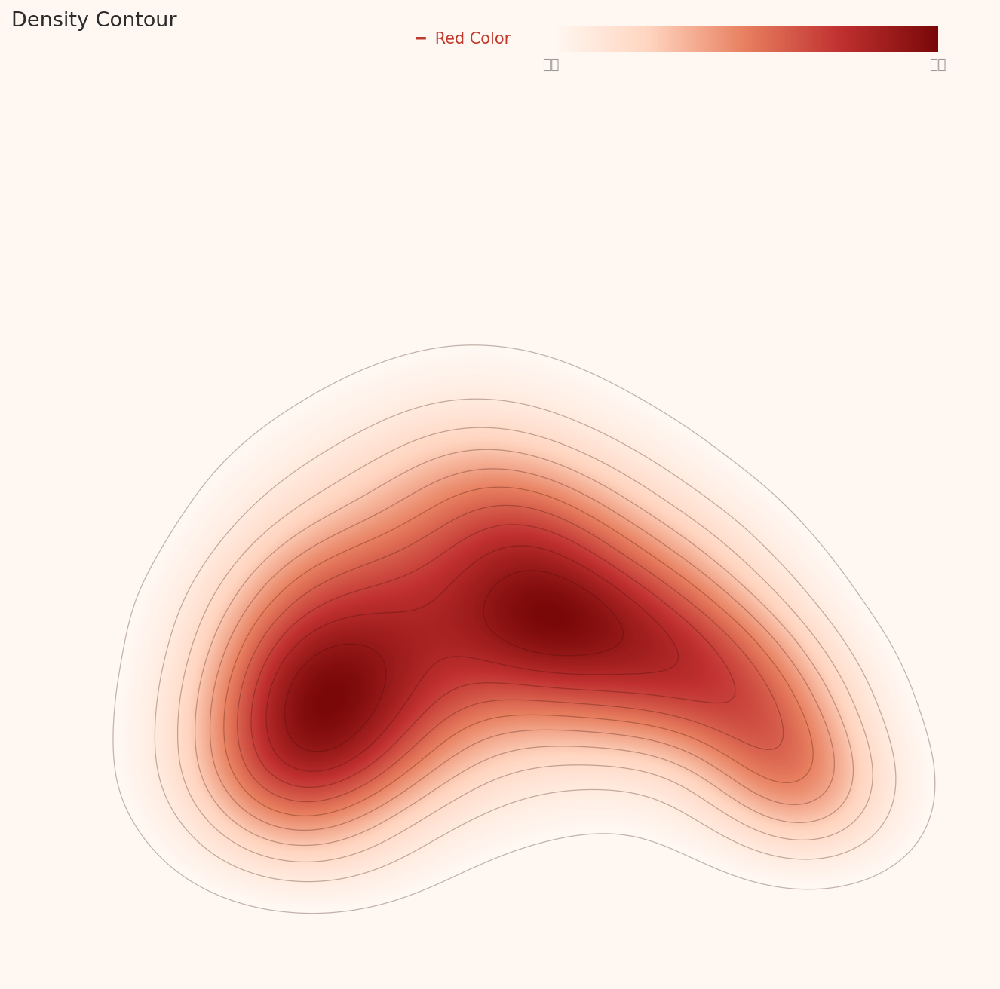
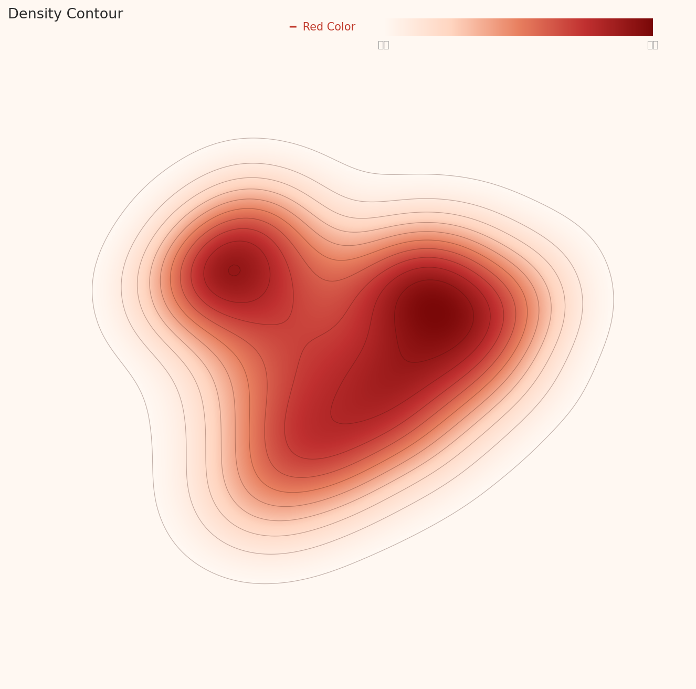

# How AI Sees Art

_Why Antoine Blanchard_

## The Story Behind 53 Points

> [!callout]
> In the WikiArt dataset that trains AI art models, the image a neural network identifies as "most typical artwork" is Antoine Blanchard's Parisian street scene. A DataClinic diagnosis of all 81,444 images returned a score of 53 (Poor), with the core problem being a 133x class imbalance—Impressionism at 13,060 images versus Analytical Cubism at just 98. But visual verification uncovered something more troubling: the API's own numbers contradicted its charts in four distinct places.

> The two neural network lenses revealed dramatically different views of art. Through the general-purpose lens (L2), Minimalism's visual simplicity was perceived as the "most typical art." Through the text-image matching lens (L3), Antoine Blanchard's Parisian street scenes claimed that position instead. In L3, Pop Art separated dramatically from every other movement, and a chronological stratification emerged—classical styles like Baroque and Renaissance concentrated at the highest density band.

> This analysis offers three takeaways for practitioners building art classification AI. First, no single feature extractor can capture the multidimensional nature of art. Second, art-historical imbalance transfers directly into AI bias, so cultural datasets require historical context awareness. Third, the sub-grades of automated data quality scores should never be trusted without visual verification.

DataClinic Quality Score: 53 (Poor)

81,444

Images Diagnosed

27

Art Movements

133x

Class Imbalance

4

Key Discrepancies

## Pixels Don't Lie — What the Red Channel's Duality Reveals

L1 is the first stage of a DataClinic diagnosis, inspecting physical properties such as image count, class distribution, resolution, and pixel statistics. The L1 results for WikiArt expose problems unique to art datasets.

### 133x Class Imbalance: The Shadow of Art History

WikiArt's 27 art movements show extreme imbalance. Impressionism dominates with 13,060 images, while Analytical Cubism has only 98—a ratio of 133 to 1. The per-class average is 3,016, but the standard deviation of 3,269 exceeds the mean. This is not simply a collection failure.

Impressionism was a popular movement spanning decades from the late 19th century, with thousands of participating artists. Monet, Renoir, Degas, and Pissarro each produced hundreds to thousands of works. Analytical Cubism, by contrast, was a concentrated experiment conducted almost entirely by Picasso and Braque during the two years of 1910–1912. The dataset imbalance honestly reflects the imbalance of art history itself. From an ML training perspective, however, this imbalance is fatal: a model that sees 133 times more Impressionism will inevitably develop an Impressionist bias.

| Metric | Value | Rating |
| --- | --- | --- |
| Image count | 81,444 | Sufficient |
| Number of classes | 27 movements | Average |
| Class balance | 98 – 13,060 (133x) | Poor |
| Resolution | 750×597 – 1382×17768 | Varied |
| Missing values | No issues found | Good |

The resolution range is also notable. A maximum height of 17,768 px indicates the presence of extremely tall images—likely East Asian scroll paintings or vertical panorama-format works.

### RGB Histogram: The Physical Signature of Paintings

DataClinic's API text states that the "RGB channels are consistent and good." The actual pixel histogram tells a very different story. This is the first major discrepancy (D1) found in this analysis.

D1: RGB Channel Discrepancy

DataClinic: "RGB channels are consistent and good"

Reality: The three channels show dramatically different distributions. Blue peaks strongly at 30–40 with a left skew (~39M), Red shows a bimodal distribution (30–40 peak + a spike near 250 at ~34M), and Green falls in between.

*L1 pixel histogram (chartId 3). Blue peaks at pixel value 30–40 (~39M highest frequency) and declines rightward. Red shows a first peak at 30–40 (~22M), then rises gradually to a sharp spike at 254–255 (~34M). Green peaks at 40–50 (~27M). The three channels are visibly anything but "consistent."*

This distribution is a physical signature unique to paintings—unseen in photographic datasets. Blue concentrating in dark values reflects warm-toned grounds (canvas underpainting), varnish yellowing over centuries, and the widespread use of warm-earth pigments (ochre, sienna) in traditional painting. The Red channel spike at 255 results from pure red pigments (vermilion, cadmium red) clipping at channel maximum during digital scanning. The API's "consistent" likely referred to format consistency (all images are 3-channel RGB), but at the pixel-value level the three channels diverge dramatically.

### A Hidden Label Integrity Problem

DataClinic reported no label integrity issues. However, during visual verification we found a Salvador Dali work classified as Abstract Expressionism. Dali is the emblematic Surrealist. This suggests the possibility of systematic labeling errors. Even acknowledging the inherently blurry boundaries between art movements, classifying Dali as Abstract Expressionism is an unambiguous art-historical error.

## Pop Art Alone in the Crowd — Why One Movement Stands Apart

L2 analyzes data through Wolfram ImageIdentify Net V2 (1,280 dimensions), a general-purpose image recognition network. This lens does not see "art as art." It decomposes images into generic visual patterns—edges, colors, textures, and shapes. The results offer direct evidence of what AI "sees" when it looks at art.

### One Cloud: 27 Movements Dissolved in Feature Space

In the PCA scatter plot, the 81,444 images form a single dense elliptical cloud. The color coding for 27 classes is meaningless—every movement blends into every other. To a general-purpose image recognition network, Impressionism and Baroque, Cubism and Pop Art, are all just "paintings" in one category.

*L2 PCA scatter plot (chartId 4). All 27 art movements (color-coded) merge into a single egg-shaped cloud. Individual class boundaries are indistinguishable. The Mean Image Feature (black marker) sits at the center of the cloud.*

This leads to the second major discrepancy (D3). DataClinic rated L2 geometry as "Good." Yet both the PCA and contour charts show classes merging into a single continuous cloud with no visible separation. "Good" is an overestimate.

D3: L2 Geometry Grade Overestimated

DataClinic: "Geometry: Good"

Reality: Both PCA and contour plots show all 27 classes merging into a single continuous cloud with no inter-class separation. "Average" or lower would be appropriate. DataClinic's "Good" likely evaluated the regularity of the overall distribution shape (bell-shaped, single mass) rather than inter-class separability.

### What the Contour Map Reveals About Cluster Structure

DataClinic reported "3 high-density clusters found." A direct look at the contour chart tells a different story: what exists is closer to two density centers within a single bean-shaped (or kidney-shaped) continuous mass. Not three separated clusters, but one connected mass with two sub-concentration points.

D2: Cluster Count Over-Reported

DataClinic: "3 high-density clusters found"

Reality: The contour chart shows 2 density centers within 1 continuous mass. The claim of 3 separate clusters is inconsistent with the visual evidence.

*L2 contour (chartId 9). A single bean/kidney-shaped continuous mass is visible. Two density centers exist inside (left and right), but they form a connected structure rather than separate clusters. DataClinic's reported "3 clusters" does not match the visual evidence.*

### Density Distribution: A World Where Minimalism Is the "Most Typical Art"

L2's density histogram shows a bell-shaped distribution centered at 0.08–0.09. The shape is broadly healthy, but a right tail extending to 0.40 indicates positive skew. What lies in that right tail is revealing.

*L2 density histogram (chartId 13). Bell-shaped distribution centered at 0.08–0.09. Most images concentrate in this range, but the right tail extends to 0.40. This extreme high-density region is occupied by visually simple works (Minimalism, Color Field Painting).*

The Box Chart provides the answer. Comparing per-class density, most movements cluster in the 0.07–0.10 range, while Minimalism and Color Field Painting show extreme high density above 0.30. To a general-purpose AI, a monochrome rectangle on a black background or a pastel geometric composition registers as the "most typical image."

*L2 Box Chart (chartId 15). Horizontal axis: class; vertical axis: density. Most movements fall in a similar range, but Minimalism and Color_Field_Painting separate as extreme outliers (0.30+). Visual simplicity compresses into a narrow region of feature space.*

### High-Density Outliers: Different Classes, Identical Appearance

Among the top 12 high-density images in L2, 7 were Minimalism and 5 were Color Field Painting. A particularly striking finding emerged: the top two samples (Minimalism #28222 and Color_Field_Painting #75241) are visually nearly identical in composition—a green central rectangle with a yellow border on a black background. They carry different class labels but are visually indistinguishable. This directly demonstrates the ambiguity of class boundaries.

### Low-Density Outliers: Art That AI "Cannot Understand"

On the opposite end, low-density outliers contain works with extremely diverse visual characteristics. Mabe's brown-toned bull figure (Abstract Expressionism #51102) has an aesthetic closer to East Asian ink wash painting, calling the genre classification itself into question. Degas' dark-background female portrait and Hiroshige-style flat ukiyo-e prints also occupy the low-density zone. To the general-purpose AI, these are the images furthest from "typical."

### Similar Images: Rediscovering the Picasso-Braque Dialogue Through Data

The most intriguing result from L2's similarity analysis is the cross-class similarity within the Cubism family. Among the four nearest neighbors of a Braque Synthetic Cubism work, all belonged to the Cubism family (Analytical Cubism, Cubism), and Picasso's works were included. The art-historical fact that these two artists influenced each other while co-developing Cubism has been rediscovered in 1,280-dimensional feature space. The AI knows nothing about art history, but the data remembers it.

By contrast, the neighbors of a Pop Art landscape included Naive Art and Romanticism landscapes. Genre (landscape/portrait/still life) acted as a stronger similarity factor than style (movement). This demonstrates why art dataset design must consider genre and medium alongside movement.

## How Antoine Blanchard Took Over WikiArt

L3 uses BLIP Image-Text Matching Nets (optimized to 56 dimensions). If L2 was a lens for form, L3 is a lens for meaning. This network, trained on image-text relationships, evaluates works based on "what does this painting represent?" The same 81,444 images reveal an entirely different structure.

### Contour: More Structure Than L2, But a Different Shape

The L3 contour chart, unlike L2's smooth bean shape, shows a more irregular outline but with 2–3 density centers that are more distinctly defined. DataClinic reported that "cluster separation remains unclear," which is the fourth major discrepancy (D4).

D4: L3 Class Separability Underestimated

DataClinic: "Cluster separation remains unclear"

Reality: The L3 Box Chart shows Pop Art dramatically separated from all other movements (median ~1.50 vs. 1.70–1.90 for the rest). Classical styles (Baroque, Rococo, High Renaissance, Mannerism) concentrate at the highest density band (1.80–1.90), while modern styles (Pop Art, Minimalism, Contemporary Realism) sit lower. Spatial cluster separation is limited, but density-based class differentiation is meaningful.

*L3 contour (chartId 20). Unlike L2's smooth bean shape, the outline is more irregular, but 2–3 density centers are more distinctly separated. The BLIP lens, optimized to 56 dimensions, captures semantic differences between artworks more effectively.*

### Density Distribution: A More Symmetric Bell Curve Than L2

The L3 density histogram shows a bell-shaped distribution centered at 1.55–1.75, more symmetric than L2 (centered at 0.08–0.09). The "Distribution: Good" rating is based on this bell shape, and the distribution form itself is genuinely healthy. But examining what constitutes the core of this bell tells a different story.

*L3 density histogram (chartId 23). Bell-shaped distribution centered at 1.55–1.75. More symmetric than L2, with a shorter right tail. The distribution shape itself is healthy.*

### Box Chart: Pop Art's Dramatic Separation and Chronological Stratification

The most striking finding of this analysis comes from the L3 Box Chart. Comparing per-class density across 27 art movements, Pop Art separates dramatically from every other style. Its median of approximately 1.50 shows a density gap of about 0.25 from the rest (1.70–1.90). Above it unfolds a clear chronological stratification.

*L3 Box Chart (chartId 24). The key chart of this analysis. Pop Art at the lowest density (~1.50) with dramatic separation. Classical styles (Baroque 1.84, Rococo 1.85, High Renaissance 1.85, Mannerism 1.85) concentrate at the highest density band. Modern/avant-garde styles (Minimalism 1.66, Contemporary Realism 1.67) sit in the mid-to-lower range. This is art history's timeline as seen through the BLIP lens.*

Classical styles (Baroque 1.84, Rococo 1.85, High Renaissance 1.85, Mannerism 1.85) cluster at the highest density band. These movements share strict visual rules established over centuries—linear perspective, chiaroscuro, anatomical accuracy. To the BLIP lens, these rules register as "predictable" visual-semantic patterns. Modern and avant-garde styles (Pop Art, Minimalism, Contemporary Realism), by contrast, are movements that deliberately break established rules. BLIP's density stratification captures the fundamental art-historical axis of "tradition versus innovation" through data.

Pop Art's dramatic separation has an additional cause. Examining the low-density outliers reveals that a significant number of Pop Art samples are not traditional "paintings" at all—they are photo-based images. A monumental black-and-white checkerboard walkway photograph, a red polka-dot outdoor sculpture installation photograph, among others. The WikiArt dataset contains non-painting images, and this is one cause of Pop Art's dramatic density separation. The dataset's implicit assumption that "art = painting" breaks down at Pop Art.

### The Antoine Blanchard Effect: One Painter Defines AI's "Typical Art"

Among the top 12 high-density images in L3, 11 were Impressionist cityscapes, and 7 of those were by Antoine Blanchard—Parisian street scenes. The remaining 4 were by Camille Pissarro. One Baroque piece (a Venetian canal scene in the style of Canaletto) also shared the cityscape theme.

Blanchard was a commercial artist who painted Parisian street scenes almost exclusively. Wide boulevards, building facades, horse-drawn carriages, figures, soft light—his works are extremely similar in composition and palette. To the BLIP lens (text-image matching), these repetitive scenes register as the "most typical art." This is a compounding effect of collection bias and lens characteristics. Blanchard's heavy representation in the dataset is a collection bias; BLIP's treatment of similar scenes as virtually identical is a lens characteristic. Combined, a single painter ends up defining what AI considers the "archetype of art."

### L3 PCA: When the Average Fails to Represent the Typical

One more notable observation from the L3 PCA scatter plot: the Mean Image Feature (black marker) is displaced to the lower right, away from the main mass. This means the average image fails to represent the typical distribution—the high-density core is biased in a specific direction due to the Blanchard effect.

*L3 PCA scatter plot (chartId 16). Unlike L2's smooth ellipse, the cloud forms a heart-shaped or irregular pattern. The Mean Image Feature (black marker) is displaced to the lower right of the main mass. The average image fails to represent the typical distribution, caused by the high-density core bias (Blanchard effect).*

### Similarity Analysis: BLIP Recognizes "Portraiture" More Strongly Than Art Movement

In L3's similarity analysis, the nearest neighbors of an Andy Warhol Pop Art portrait included Realism, Expressionism, and Romanticism portraits. The BLIP lens recognizes the semantic category of "portraiture" more strongly than art movement. In contrast, all four nearest neighbors of a Naive Art piece belonged to the same class. Naive Art's distinctive visual language—deliberate rejection of perspective, bright colors, simplified forms—forms high intra-class cohesion even at the semantic level.

## Same Data, Different Diagnosis — Why L2 and L3 Disagree

The same 81,444 images revealed entirely different "archetypes" through the two lenses. This contrast is the central finding of the WikiArt diagnosis.

L2: General-Purpose Image Recognition

A World Ruled by Form

**Most typical:** Minimalism / Color Field Painting (visual simplicity)  
**Most atypical:** Mabe abstract, ukiyo-e, Degas portrait  
**Lens dimensions:** 1,280  
**Class separation:** Not possible (single cloud)  
**Key finding:** Cross-class similarity in the Cubism family (Picasso–Braque)

L3: BLIP Text-Image Matching

A World Ruled by Meaning

**Most typical:** Blanchard Parisian street scenes (semantic consistency)  
**Most atypical:** Pop Art photographs / installation art  
**Lens dimensions:** 56 (optimized)  
**Class separation:** Density-based chronological stratification  
**Key finding:** Pop Art's dramatic separation + classical/modern density stratification

In L2 (general-purpose), the "archetype" is the image with the lowest visual complexity. Monochrome planes and geometric shapes compress into the narrowest region of feature space. In L3 (semantic), the "archetype" is the image with the most consistent visual-semantic pattern. Parisian street scenes repeat a predictable semantic structure: "buildings + tree-lined avenue + carriages + figures."

The practical implication is clear. When building an art classification AI, no single feature extractor can capture the multidimensional nature of art. Formal features (L2) and semantic features (L3) reveal completely different problems and carry different biases. This is precisely why a multimodal approach is needed.

## Behind the Score — What 53 Points Say and Don't Say

DataClinic's overall score of 53 (Poor) is a fair assessment. A 133x class imbalance is unquestionably "poor" from an ML training standpoint. However, the four major discrepancies found in sub-grades and text descriptions demonstrate the limits of relying on automated scores alone to judge data quality.

| ID | DataClinic Claim | Visual Verification | Severity |
| --- | --- | --- | --- |
| D1 | RGB channels consistent | Dramatic differences across 3 channels | Major |
| D2 | 3 high-density clusters | 2 density centers within 1 mass | Major |
| D3 | L2 Geometry: Good | No class separation; Average or lower | Major |
| D4 | L3 cluster separation unclear | Density-based chronological stratification exists | Major |

****************
                        The low score of 53 is driven primarily by class imbalance. But reading "Poor" purely as a data collection failure misses the art-historical context. Impressionism's 13,060 images versus Analytical Cubism's 98 reflects the actual production volumes and survival rates of art history. Analytical Cubism existed for only two years (1910–1912) and involved almost no one beyond Picasso and Braque. If anything, 98 images may be an overrepresentation. The DataClinic score evaluates from an ML training perspective, not as an assessment of historical representativeness. Recognizing this distinction matters.

## Moving Past 53 — Three Priorities

DataClinic's standard recommendation of "Bulk-up (augment minority classes) + Diet (reduce majority classes)" is technically sound. In the context of art data, however, additional nuance is needed.

### 1. Strategic Downsampling Is More Realistic Than Augmentation

Augmenting Analytical Cubism's 98 images to 3,000 means fabricating "fake Cubism" that never existed. Whether generating non-existent artworks actually improves data quality is a fundamental question. A more realistic approach is strategic sampling within Impressionism's 13,060 images, balancing by artist, period, and genre.

### 2. Introduce Multi-Dimensional Labeling

WikiArt currently classifies along a single axis: style (movement). But as the L2 and L3 similarity analyses demonstrate, genre (landscape/portrait/still life), medium (oil/watercolor/print/photograph), and period (by century) are similarity factors as strong as movement. The contamination of photographic images in Pop Art could have been caught earlier with a medium label.

### 3. Strategic Management of High-Density Clusters

The extreme high density of Minimalism/Color Field Painting in L2 and Blanchard's single-painter dominance of Parisian street scenes in L3 are effective forms of data duplication. Visually near-identical images (such as Minimalism #28222 and Color_Field_Painting #75241) require deduplication or downweighting.

### 4. Label Verification Pipeline

To systematically detect errors like Dali being classified as Abstract Expressionism, a pipeline cross-referencing each artist's known movements against dataset labels is needed. Integration with art history ontologies (e.g., the Getty AAT) could help.

### 5. Critical Use of DataClinic Scores

As the four major discrepancies show, automated diagnostic scores are a starting point, not a conclusion. The overall score of 53 has value as an alert that "this dataset has problems," but sub-grades (like L2 Geometry: Good) must be verified against the charts themselves.

[View Full DataClinic Report #115](https://dataclinic.ai/en/report/115)

<!-- stat-card -->
**Why Pebblous watches this dataset** — WikiArt's 133x class imbalance, medium contamination, and single-painter bias are structural problems shared by cultural datasets at large. Imbalances created by history get amplified during collection and solidified as bias during AI training. The larger a dataset grows, the more critical it becomes to diagnose this amplification effect early. — The class imbalance and high-density cluster bias that
                            [DataClinic](https://dataclinic.ai)
                            diagnoses materialized in WikiArt as art-historical imbalance and the Blanchard effect.
                            The automated diagnostic score is a starting point; visual verification of the charts is what comes next.
