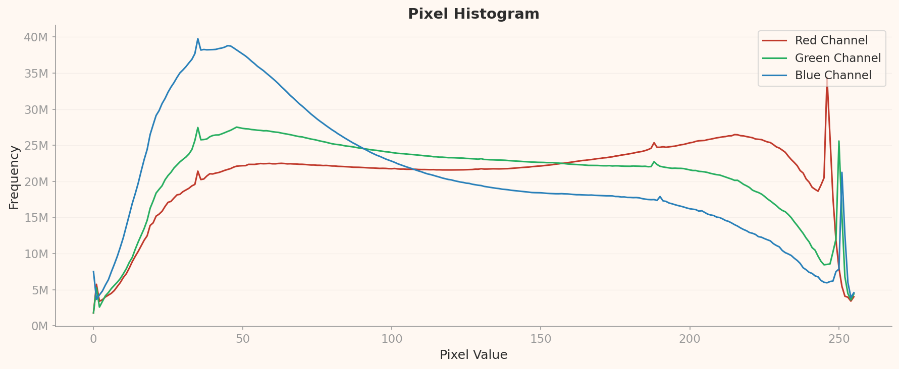
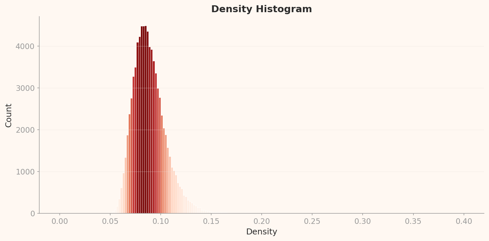
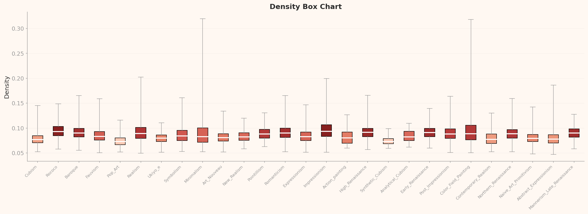
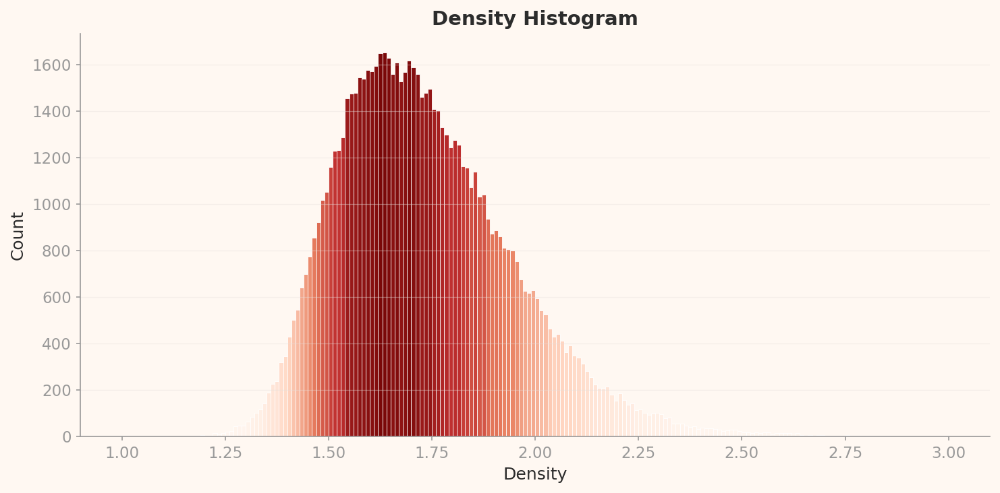
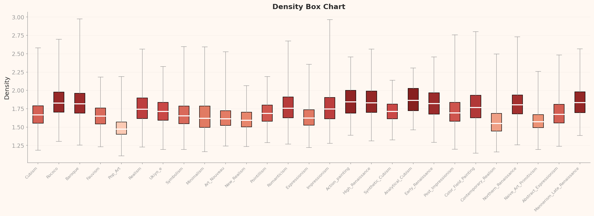

# AI는 예술을 어떻게 보는가

_AI가 _

## 53점 뒤에 숨은 이야기

> [!callout]
> AI 미술 생성 모델이 학습하는 WikiArt에서, 신경망이 '가장 전형적인 예술'로 인식하는 이미지는 Antoine Blanchard의 파리 거리 풍경화다. 81,444장을 DataClinic으로 진단하자 전체 53점(나쁨)이 나왔고, 핵심 원인은 133배에 달하는 클래스 불균형이었다 — 인상파(Impressionism) 13,060장 대 분석적 큐비즘(Analytical Cubism) 98장. 그러나 시각적 검증을 통해 더 심각한 사실이 드러났다: API가 제시한 수치가 실제 차트와 4번 정면으로 충돌한다.

> 두 개의 신경망 렌즈가 예술을 보는 방식은 극적으로 달랐다. 범용 렌즈(L2)에서는 미니멀리즘의 시각적 단순성이 "가장 전형적인 예술"로 인식되었고, 텍스트-이미지 매칭 렌즈(L3)에서는 앙투안 블랑샤르(Antoine Blanchard)의 파리 거리 풍경화가 그 자리를 차지했다. L3에서 팝아트(Pop Art)는 모든 사조로부터 극적으로 분리되었고, 바로크와 르네상스 같은 고전 양식이 최고 밀도대에 집중하는 시대별 층화가 관찰되었다.

> 이 분석은 예술 분류 AI를 구축하려는 실무자에게 세 가지 시사점을 제공한다. 첫째, 단일 특징 추출기로는 예술의 다차원성을 포착할 수 없다. 둘째, 미술사적 불균형이 AI 편향으로 직접 전이되므로 문화 데이터셋에는 역사적 맥락 인지가 필요하다. 셋째, 자동화된 데이터 품질 점수의 세부 등급은 시각적 검증 없이 신뢰해서는 안 된다.

DataClinic 품질 점수: 53점 (나쁨)

81,444

진단 이미지

27

미술 사조

133x

클래스 불균형

4

주요 불일치

## 픽셀은 거짓말하지 않는다 — Red 채널의 이중성이 말해주는 것

L1은 DataClinic 진단의 첫 번째 단계로, 이미지 수, 클래스 분포, 해상도, 픽셀 통계 등 물리적 특성을 검사한다. WikiArt 데이터셋의 L1 결과는 예술 데이터셋 특유의 문제들을 드러낸다.

### 133배 클래스 불균형: 미술사의 그림자

WikiArt의 27개 미술 사조는 극심한 불균형을 보인다. 인상파가 13,060장으로 압도적 1위를 차지하고, 분석적 큐비즘은 98장에 불과하다. 그 비율은 133배. 클래스당 평균 3,016장이지만 표준편차가 3,269로 평균보다 크다. 이것은 단순한 수집 실패가 아니다.

인상파는 19세기 후반부터 수십 년간 수천 명의 화가가 참여한 대중적 운동이었다. 모네, 르누아르, 드가, 피사로 등 핵심 화가들만 해도 각각 수백-수천 점의 작품을 남겼다. 반면 분석적 큐비즘은 1910-1912년의 2년간, 사실상 피카소와 브라크 두 사람에 의해 수행된 극도로 집중된 실험이었다. 데이터셋의 불균형은 미술사 자체의 불균형을 정직하게 반영하고 있다. 그러나 AI 학습 관점에서 이 불균형은 치명적이다. 인상파를 133배 더 많이 학습한 모델은 필연적으로 인상파 편향을 갖게 된다.

| 항목 | 값 | 평가 |
| --- | --- | --- |
| 이미지 수 | 81,444장 | 충분 |
| 클래스 수 | 27개 사조 | 보통 |
| 클래스 균형 | 98 ~ 13,060 (133배) | 나쁨 |
| 해상도 | 750x597 ~ 1382x17768 | 다양 |
| 결측치 | 특이사항 없음 | 양호 |

해상도 범위도 주목할 만하다. 최대 높이가 17,768px에 달하는 것은 극단적 세로 이미지가 포함되어 있다는 뜻이다. 동양 두루마리 그림이나 수직 파노라마 형태의 작품이 포함되었을 가능성이 있다.

### RGB 히스토그램: 회화의 물리적 서명

DataClinic의 API 텍스트는 "RGB 채널이 일관되고 양호"하다고 설명한다. 그러나 실제 픽셀 히스토그램은 전혀 다른 이야기를 한다. 이것이 이번 분석에서 발견한 첫 번째 주요 불일치(D1)다.

D1: RGB 채널 불일치

DataClinic: "RGB 채널이 일관되고 양호"

실제: 세 채널의 분포가 극적으로 다르다. Blue는 30-40 범위에서 강한 좌편향(약 3,900만), Red는 이중봉 분포(30-40 + 250 근처 스파이크 약 3,400만), Green은 중간 위치.

*L1 픽셀 히스토그램(chartId 3). Blue 채널은 pixel value 30-40에서 최고 빈도(약 3,900만)를 기록하고 우하향한다. Red 채널은 30-40에서 첫 번째 봉우리(약 2,200만), 이후 완만하게 상승하여 254-255에서 급격한 스파이크(약 3,400만)를 형성한다. Green은 40-50 구간에서 최고(약 2,700만). 세 채널이 "일관"되지 않음을 시각적으로 확인할 수 있다.*

이 분포는 사진 데이터셋에서는 볼 수 없는, 회화만의 물리적 서명이다. Blue 채널이 어두운 값에 집중되는 것은 전통 회화에서 따뜻한 색조의 그라운드(캔버스 바탕칠), 세월에 따른 바니시 변색, 황갈색 안료(황토, 시에나)의 광범위한 사용을 반영한다. Red 채널의 255 스파이크는 순수 빨간 안료(주사, 카드뮴 레드)가 디지털 스캔에서 채널 최대값에 클리핑되는 현상이다. "일관"이라는 API 표현은 아마 모든 이미지가 3채널 RGB 포맷이라는 포맷 일관성을 의미했겠지만, 픽셀 값 분포 수준에서는 세 채널이 극적으로 다르다.

### 라벨 정합성의 숨은 문제

DataClinic은 라벨 정합성에 문제가 없다고 보고했다. 그러나 시각적 검증 과정에서 살바도르 달리(Salvador Dali)의 작품이 추상표현주의(Abstract_Expressionism)로 분류된 사례를 발견했다. 달리는 초현실주의(Surrealism)의 대표 화가다. 이것은 체계적 라벨링 오류의 가능성을 시사한다. 미술 사조의 경계가 본래 모호하다는 점을 감안하더라도, 달리를 추상표현주의로 분류하는 것은 미술사적으로 명백한 오류다.

## 군중 속의 팝아트 — 왜 한 장르만 홀로 떨어져 있는가

L2 진단은 Wolfram ImageIdentify Net V2(1,280차원)라는 범용 이미지 인식 신경망으로 데이터를 분석한다. 이 렌즈는 "예술을 예술로" 보지 않는다. 일반적인 시각적 패턴(가장자리, 색상, 질감, 형태)으로 이미지를 분해한다. 그 결과는 AI가 예술을 볼 때 무엇을 "보는지"에 대한 직접적 증거가 된다.

### 하나의 구름: 27개 사조가 녹아든 특징 공간

PCA 산점도에서 81,444장의 이미지는 하나의 밀집된 타원형 구름으로 나타난다. 27개 클래스의 색상 코딩이 무의미할 정도로 모든 사조가 뒤섞여 있다. 범용 이미지 인식 신경망에게 인상파와 바로크, 큐비즘과 팝아트는 모두 "그림"이라는 하나의 범주일 뿐이다.

*L2 PCA 산점도(chartId 4). 27개 미술 사조(색상 코딩)가 하나의 달걀/배 형태 구름으로 뭉쳐 있다. 개별 클래스 경계는 식별 불가. Mean Image Feature(검은 마커)가 구름 중앙에 위치한다.*

이것이 두 번째 주요 불일치(D3)로 이어진다. DataClinic은 L2 기하 등급을 "좋음"으로 판정했다. 그러나 PCA와 등고선 차트 모두에서 클래스 분리가 불명확하고 하나의 연속 구름으로 보이는 상황에서, "좋음"은 과대평가다.

D3: L2 기하 등급 과대평가

DataClinic: "기하: 좋음"

실제: PCA와 등고선 모두에서 27개 클래스가 하나의 연속 구름으로 혼합. 클래스간 분리가 전혀 보이지 않는다. "보통" 이하가 적절하다. DataClinic의 "좋음" 판정은 전체 분포의 형태적 규칙성(종형, 단일 질량)을 평가한 것이지, 클래스간 분리도를 평가한 것이 아닐 가능성이 높다.

### 등고선이 보여주는 클러스터 구조

DataClinic은 "고밀도 클러스터가 3개 발견"되었다고 보고한다. 등고선 차트를 직접 확인해 보면, 실제로는 하나의 콩(또는 신장) 형태 연속 질량 내부에 2개의 밀도 중심이 존재하는 것에 가깝다. 분리된 3개 클러스터가 아니라 연결된 1개 질량 내 2개 하위 집중 지점이다.

D2: 클러스터 수 과다 보고

DataClinic: "고밀도 클러스터가 3개 발견"

실제: 등고선 차트에서 1개 연속 질량 내 2개 밀도 중심이 관찰됨. 3개 분리 클러스터라는 주장은 시각적 증거와 불일치.

*L2 등고선(chartId 9). 콩/신장 형태의 하나의 연속 질량이 보인다. 내부에 좌측 밀도 중심과 우측 밀도 중심이 존재하지만, 분리된 클러스터가 아니라 하나의 연결된 구조다. DataClinic이 보고한 "3개 클러스터"는 시각적 증거와 맞지 않는다.*

### 밀도 분포: 미니멀리즘이 "가장 전형적인 예술"인 세계

L2의 밀도 히스토그램은 0.08-0.09를 중심으로 한 종형(bell-shaped) 분포를 보인다. 전반적으로 건강한 형태이나, 오른쪽 꼬리가 0.40까지 연장되어 양의 편향이 존재한다. 이 오른쪽 꼬리의 정체가 흥미롭다.

*L2 밀도 히스토그램(chartId 13). 0.08-0.09 중심 종형 분포. 대부분의 이미지가 이 범위에 집중되어 있으나, 오른쪽 꼬리가 0.40까지 연장된다. 이 극단적 고밀도 영역은 시각적으로 단순한 작품(미니멀리즘, 색면 회화)이 차지한다.*

Box Chart가 그 답을 준다. 클래스별 밀도를 비교하면, 대부분의 사조가 0.07-0.10 범위에 밀집해 있는 가운데, 미니멀리즘(Minimalism)과 색면 회화(Color_Field_Painting)가 0.30 이상의 극단적 고밀도를 보인다. 범용 AI에게 검은 배경 위의 단색 직사각형, 파스텔 톤의 기하학적 면 구성은 "가장 전형적인 이미지"로 인식되는 것이다.

*L2 Box Chart(chartId 15). 가로축이 클래스, 세로축이 밀도. 대부분의 사조가 유사한 범위에 있으나, Minimalism과 Color_Field_Painting이 극단적 이상치(0.30+)로 분리된다. 시각적 단순성이 특징 공간에서 좁은 영역에 압축되기 때문이다.*

### 고밀도 이상치: 클래스가 다르지만 눈에는 같은 그림

L2의 고밀도 상위 12개 이미지를 검토한 결과, 7개가 미니멀리즘, 5개가 색면 회화였다. 특히 주목할 발견이 있다. 상위 2개 샘플(Minimalism 28222번과 Color_Field_Painting 75241번)이 시각적으로 거의 동일한 구성을 보인다. 검정 배경 위에 노란 테두리, 연두색 중앙 직사각형. 다른 클래스로 라벨링되어 있지만 시각적으로는 구분할 수 없다. 이것은 클래스 경계의 모호함을 직접적으로 증명하는 사례다.

### 저밀도 이상치: AI가 "이해하지 못하는" 예술

반대편, 저밀도 이상치에는 극도로 다양한 시각적 특성의 작품들이 위치한다. Mabe의 갈색 톤 소 형상(추상표현주의 51102번)은 동양의 수묵화에 가까운 미학을 보여주며, 장르 분류 자체에 의문을 제기한다. 드가의 어두운 배경 여성 초상화, 히로시게 스타일의 평면적 우키요에 판화 등이 함께 저밀도 영역을 차지한다. 범용 AI에게 이들은 "전형"에서 가장 먼 이미지들이다.

### 유사 이미지: 피카소와 브라크의 대화를 데이터로 재발견하다

L2 유사도 분석에서 가장 흥미로운 결과는 큐비즘 계열의 교차-클래스 유사성이다. 브라크(Braque)의 합성 큐비즘(Synthetic_Cubism) 작품을 중심으로 한 이웃 4개가 모두 큐비즘 계열(분석적 큐비즘, 큐비즘)이었고, 피카소 작품이 포함되어 있었다. 미술사적으로 이 두 화가가 서로의 작품에서 영향을 주고받으며 큐비즘을 발전시킨 사실이 1,280차원 특징 공간에서도 재발견된 셈이다. AI는 미술사를 모르지만, 데이터가 미술사를 기억하고 있다.

반면 팝아트 풍경 작품의 이웃에는 소박파(Naive Art), 낭만주의(Romanticism) 풍경화가 포함되어 있었다. 풍경이라는 장르(genre)가 사조(style)보다 더 강한 유사성 요인으로 작용한 것이다. 이것은 예술 데이터셋 설계에서 사조 외에 장르와 매체를 함께 고려해야 하는 이유를 보여준다.

## 앙투안 블랑샤르가 WikiArt를 장악한 방법

L3 진단은 BLIP Image-Text Matching Nets(56차원 최적화)를 사용한다. L2가 형태를 보는 렌즈였다면, L3는 의미를 읽는 렌즈다. 이미지와 텍스트의 관계를 학습한 이 신경망은 "이 그림이 무엇을 표현하는가"를 기준으로 작품을 평가한다. 같은 81,444장의 데이터가 완전히 다른 구조를 드러낸다.

### 등고선: L2보다 뚜렷한 구조, 그러나 다른 형태

L3 등고선 차트는 L2의 매끈한 콩 형태와 달리, 더 불규칙하지만 2-3개의 밀도 중심이 보다 뚜렷한 구조를 보인다. DataClinic은 "클러스터 구분이 여전히 불명확"하다고 보고했으나, 이것이 네 번째 주요 불일치(D4)다.

D4: L3 클래스 구분력 과소평가

DataClinic: "클러스터 구분이 여전히 불명확"

실제: L3 Box Chart에서 Pop Art가 모든 사조로부터 극적으로 분리(중앙값 약 1.50 vs 나머지 1.70-1.90). 고전 양식(Baroque, Rococo, High Renaissance, Mannerism)이 최고 밀도대(1.80-1.90)에 집중하고, 현대 양식(Pop Art, Minimalism, Contemporary Realism)이 하위에 위치하는 시대별 층화가 관찰됨. 공간적 클러스터 분리는 제한적이나, 밀도 기반 클래스 구분은 의미있게 존재한다.

*L3 등고선(chartId 20). L2의 매끈한 콩 형태와 달리 더 불규칙한 윤곽을 보이지만, 밀도 중심이 2-3개로 더 뚜렷하게 구분된다. 56차원으로 최적화된 BLIP 렌즈가 예술 작품의 의미론적 차이를 더 잘 포착하고 있다.*

### 밀도 분포: L2보다 대칭적인 종형

L3 밀도 히스토그램은 1.55-1.75를 중심으로 한 종형 분포를 보인다. L2(0.08-0.09 중심)보다 대칭적이다. "분포: 좋음" 등급은 이 종형 분포를 기반으로 한 것이며, 분포 형태 자체는 실제로 양호하다. 다만 이 종형의 핵심부가 무엇으로 구성되어 있는지를 살펴보면 다른 이야기가 나온다.

*L3 밀도 히스토그램(chartId 23). 1.55-1.75 중심의 종형 분포. L2보다 대칭적이고 오른쪽 꼬리가 짧다. 분포 형태 자체는 건강하다.*

### Box Chart: 팝아트의 극적 분리와 시대별 층화

이 분석의 가장 인상적인 발견은 L3 Box Chart에서 나온다. 27개 미술 사조의 클래스별 밀도를 비교하면, 팝아트(Pop Art)가 모든 다른 사조로부터 극적으로 분리된다. 중앙값이 약 1.50으로, 나머지 사조(1.70-1.90)와 약 0.25의 밀도 차이를 보인다. 그리고 그 위로 명확한 시대별 층화가 펼쳐진다.

*L3 Box Chart(chartId 24). 이 분석의 핵심 차트. Pop Art가 최저 밀도(약 1.50)로 극적 분리. 고전 양식(Baroque 1.84, Rococo 1.85, High Renaissance 1.85, Mannerism 1.85)이 최고 밀도대에 집중. 현대/전위 양식(Minimalism 1.66, Contemporary Realism 1.67)이 중간-하위. BLIP 렌즈가 본 미술사의 시간축이다.*

고전 양식(바로크 1.84, 로코코 1.85, 르네상스 1.85, 매너리즘 1.85)이 최고 밀도대에 집중한다. 이 양식들은 수세기에 걸쳐 확립된 엄격한 시각적 규칙(원근법, 명암법, 해부학적 정확성)을 공유한다. BLIP 렌즈에게 이 규칙들은 "예측 가능한" 시각-의미 패턴으로 인식된다. 반면 현대/전위 양식(팝아트, 미니멀리즘, 현대 사실주의)은 기존 규칙을 의도적으로 파괴하는 운동이다. BLIP의 밀도 층화는 미술사에서 "전통 대 혁신"이라는 근본적 축을 데이터로 포착한 셈이다.

팝아트의 극적 분리에는 추가 원인이 있다. 저밀도 이상치를 검토하면, 팝아트 샘플 중 상당수가 전통적 의미의 "회화"가 아니라 사진 기반 이미지였다. 거대한 흑백 체커보드 보행로 사진, 빨간 폴카도트 야외 조각 설치물 사진 등이다. WikiArt 데이터셋에 회화가 아닌 이미지가 혼입되어 있으며, 이것이 팝아트의 극적 밀도 분리의 원인 중 하나다. 데이터셋이 암묵적으로 전제하는 "예술=회화"라는 가정이 팝아트에서 깨진다.

### 앙투안 블랑샤르 효과: 한 화가가 AI의 "전형적 예술"을 정의하다

L3 고밀도 상위 12개 이미지를 검토한 결과, 11개가 인상파 도시 풍경화였고, 그 중 7개가 앙투안 블랑샤르(Antoine Blanchard)의 파리 거리 풍경화였다. 나머지 4개는 카미유 피사로(Camille Pissarro)의 작품. 바로크 1점(베네치아 운하 풍경, 카날레토 스타일)도 도시 풍경이라는 공통점을 가진다.

블랑샤르는 파리 거리 장면만 반복적으로 그린 상업 화가다. 넓은 가로수길, 건물 파사드, 마차와 인물, 부드러운 빛. 그의 작품들은 구도와 색감에서 극도로 유사하다. BLIP 렌즈(텍스트-이미지 매칭)에게 이 반복적 장면은 "가장 전형적인 예술"로 인식된다. 이것은 데이터 수집 편향과 렌즈 특성의 교차 효과다. 블랑샤르의 작품이 데이터셋에 다수 포함된 것은 수집 편향이고, BLIP이 유사 장면을 극도로 동일하게 처리하는 것은 렌즈 특성이다. 두 요인이 결합하여 단일 화가가 AI의 "예술의 전형"을 정의하는 결과를 낳았다.

### L3 PCA: 평균이 전형을 대표하지 못하다

L3 PCA 산점도에서 한 가지 더 주목할 점이 있다. Mean Image Feature(검은 마커)가 주 질량에서 우하단으로 이탈해 있다. 이것은 평균 이미지가 전형적인 분포를 대표하지 못한다는 뜻이다. 블랑샤르 효과로 인해 고밀도 핵심부가 특정 방향으로 편향되어 있기 때문이다.

*L3 PCA 산점도(chartId 16). L2의 매끈한 타원과 달리 하트/불규칙 형태의 구름. Mean Image Feature(검은 마커)가 주 질량에서 우하단으로 이탈해 있다. 평균 이미지가 전형적 분포를 대표하지 못하며, 고밀도 핵심부의 편향(블랑샤르 효과)이 원인이다.*

### 유사도 분석: BLIP은 "초상화"를 사조보다 강하게 인식한다

L3 유사도 분석에서 앤디 워홀(Andy Warhol)의 팝아트 초상화를 중심으로 한 이웃에 사실주의, 표현주의, 낭만주의 초상화가 포함되었다. BLIP 렌즈는 "초상화"라는 의미론적 범주를 미술 사조보다 강하게 인식하는 것이다. 반면 소박파(Naive Art)의 이웃 4개는 모두 같은 클래스였다. 소박파 미술의 독특한 시각 언어(의도적 비원근법, 밝은 색채, 단순한 형태)가 의미론적으로도 높은 클래스 내 응집력을 형성한다.

## 같은 데이터, 다른 진단 — L2와 L3이 엇갈리는 이유

같은 81,444장의 데이터가 두 렌즈에서 완전히 다른 "전형"을 드러냈다. 이 대조가 WikiArt 진단의 핵심 발견이다.

L2: 범용 이미지 인식

형태가 지배하는 세계

**가장 전형적:** 미니멀리즘/색면 회화 (시각적 단순성)  
**가장 이질적:** Mabe 추상, 우키요에, 드가 초상  
**렌즈 차원:** 1,280차원  
**클래스 분리:** 불가능 (하나의 구름)  
**핵심 발견:** 큐비즘 계열의 교차-클래스 유사성 (피카소-브라크)

L3: BLIP 텍스트-이미지 매칭

의미가 지배하는 세계

**가장 전형적:** 블랑샤르 파리 풍경화 (의미론적 일관성)  
**가장 이질적:** 팝아트 사진/설치미술  
**렌즈 차원:** 56차원 (최적화)  
**클래스 분리:** 밀도 기반 시대별 층화  
**핵심 발견:** 팝아트의 극적 분리 + 고전/현대 양식 밀도 층화

L2(범용)에서 "전형"은 시각적 복잡도가 가장 낮은 이미지다. 단색 면, 기하학적 형태가 특징 공간에서 가장 좁은 영역에 압축되기 때문이다. L3(의미론)에서 "전형"은 시각-의미 패턴이 가장 일관된 이미지다. 파리 거리 풍경화는 "건물 + 가로수 + 마차 + 인물"이라는 예측 가능한 의미 구조를 반복한다.

이것이 실무적으로 의미하는 바는 명확하다. 예술 분류 AI를 구축할 때 단일 특징 추출기로는 예술의 다차원성을 포착할 수 없다. 형태적 특징(L2)과 의미론적 특징(L3)은 완전히 다른 문제를 드러내며, 각각 다른 편향을 가진다. 멀티모달 접근이 필요한 이유가 여기에 있다.

## 점수의 이면 — 53점이 말하는 것과 말하지 않는 것

DataClinic 전체 점수 53점(나쁨)은 적절한 판정이다. 133배 클래스 불균형은 ML 학습 관점에서 분명히 "나쁜" 데이터셋이다. 그러나 세부 등급과 텍스트 설명에서 발견한 4건의 주요 불일치는 자동화된 점수만으로 데이터 품질을 판단하는 것의 한계를 보여준다.

| ID | DataClinic 주장 | 시각적 검증 결과 | 심각도 |
| --- | --- | --- | --- |
| D1 | RGB 채널 일관 | 3채널 분포 극적 차이 | 주요 |
| D2 | 고밀도 클러스터 3개 | 1개 질량 내 2개 밀도 중심 | 주요 |
| D3 | L2 기하: 좋음 | 클래스 분리 불가, 보통 이하 | 주요 |
| D4 | L3 클러스터 구분 불명확 | 밀도 기반 시대별 층화 존재 | 주요 |

****************
                        53점이 낮은 이유는 주로 클래스 불균형에 기인한다. 그러나 이 "나쁨"을 데이터 수집 실패로만 해석하면 미술사적 맥락을 놓친다. 인상파 13,060장 대 분석적 큐비즘 98장은 실제 미술사의 생산량과 보존 비율을 반영한다. 분석적 큐비즘은 1910-1912년의 2년간만 존재한 운동이고, 참여 화가도 극소수였다. 98장이 오히려 과대 대표일 수도 있다. DataClinic 점수는 ML 학습 관점의 평가이지, 데이터셋의 역사적 대표성 평가가 아니다. 이 구분을 인지하는 것이 중요하다.

## 53점에서 벗어나려면 — 세 가지 우선순위

DataClinic의 표준 권고인 "벌크업(Bulk-up, 소수 클래스 증강) + 다이어트(Diet, 다수 클래스 축소)"는 기술적으로 옳다. 그러나 예술 데이터의 맥락에서는 추가적 주의가 필요하다.

### 1. 전략적 다운샘플링이 증강보다 현실적이다

분석적 큐비즘 98장을 데이터 증강으로 3,000장으로 늘리면, 실존하지 않는 "가짜 큐비즘"을 만드는 것이다. 존재하지 않는 예술 작품을 생성하는 것이 데이터 품질을 높이는지는 근본적 질문이다. 대신 인상파 13,060장에서 화가별, 시기별, 장르별 균형을 고려한 전략적 샘플링이 더 현실적이다.

### 2. 다차원 라벨링 도입

현재 WikiArt는 사조(style) 하나의 축으로만 분류된다. 그러나 L2와 L3의 유사도 분석이 보여주듯, 장르(풍경/초상/정물), 매체(유화/수채/판화/사진), 시대(세기 단위)가 사조만큼 강한 유사성 요인이다. 팝아트에 사진 기반 이미지가 혼입된 문제도 매체 라벨이 있었다면 사전에 식별할 수 있었다.

### 3. 고밀도 클러스터의 전략적 관리

L2에서 미니멀리즘/색면 회화의 극단적 고밀도, L3에서 블랑샤르 파리 풍경화의 단일 화가 지배는 데이터 중복의 효과적 형태다. 시각적으로 거의 동일한 이미지(미니멀리즘 28222번과 색면 회화 75241번 같은 사례)는 중복 제거 또는 다운웨이팅이 필요하다.

### 4. 라벨 검증 파이프라인

달리 작품의 추상표현주의 분류 같은 오류를 체계적으로 탐지하기 위해, 화가의 알려진 사조와 데이터셋 라벨을 교차 검증하는 파이프라인이 필요하다. 미술사 온톨로지(예: Getty AAT)와의 연계가 도움이 될 수 있다.

### 5. DataClinic 점수의 비판적 활용

4건의 주요 불일치가 보여주듯, 자동화된 진단 점수는 출발점이지 결론이 아니다. 전체 점수 53점은 "이 데이터셋에 문제가 있다"는 알림으로서 가치가 있지만, 세부 등급(L2 기하 좋음 등)은 차트를 직접 확인하여 검증해야 한다.

[DataClinic 리포트 #115 전체 보기](https://dataclinic.ai/en/report/115)

<!-- stat-card -->
**페블러스가 이 데이터셋에 주목하는 이유** — WikiArt의 133배 클래스 불균형, 매체 혼입, 단일 화가 편향은 문화 데이터셋이 공통으로 안고 있는 구조적 문제다. 역사가 만들어낸 불균형은 수집 과정에서 증폭되고, AI 학습에서 편향으로 고착된다. 데이터의 양이 커질수록 이 증폭 효과를 조기에 진단하는 것이 더 중요해진다. — [DataClinic](https://dataclinic.ai)이
                            진단하는 클래스 불균형과 고밀도 클러스터 편향은
                            WikiArt에서 미술사적 불균형과 블랑샤르 효과로 구체화되었다.
                            자동 진단 점수는 출발점이고, 차트를 직접 확인하는 시각적 검증이 그 다음이다.
